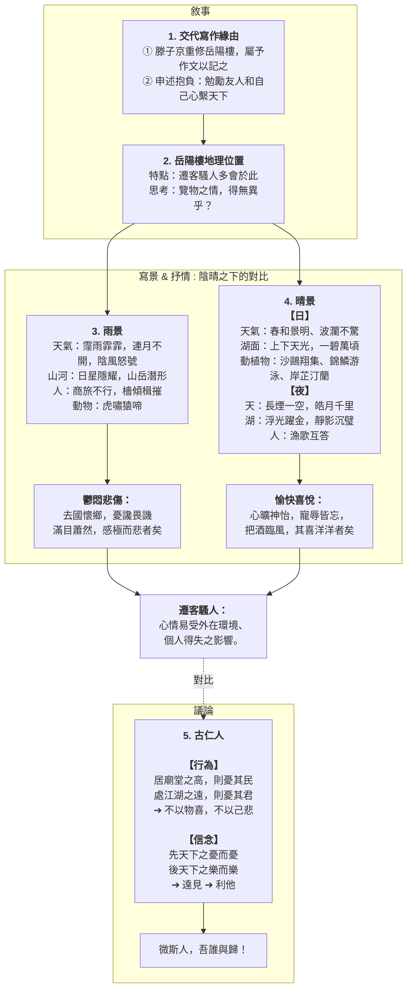

> [!NOTE]主旨  
> 作者受友人所託為岳陽樓作記，藉描寫岳陽樓上所見不同天氣的景觀變化，以及觸景而產生或悲或喜的情感，說明仁人志士不因外在環境和個人榮辱而改變抱負，而是以天下為己任。

## 原文

慶曆四年春，滕子京謫守巴陵郡。越明年，政通人和，百廢具興。乃重修岳陽樓，增其舊制，刻唐賢、今人詩賦於其上；屬予作文以記之。

> 慶曆四年的春天，滕子京被貶謫到巴陵郡做太守。到了第二年，政事順利，百姓和樂，各種荒廢了的事業都興辦起來了。於是重新修建岳陽樓，擴大它原有的規模，把唐代名家和當代人的詩賦刻在上面；並囑托我寫一篇文章來記述這件事。

予觀夫巴陵勝狀，在洞庭一湖。銜遠山，吞長江，浩浩湯湯，橫無際涯；朝暉夕陰，氣象萬千。此則岳陽樓之大觀也，前人之述備矣。然則北通巫峽，南極瀟湘，遷客騷人，多會於此，<mark>覽物之情，得無異乎？</mark>

> 我看那巴陵郡的美景，全在洞庭湖上。它連接遠處的山脈，吞吐著長江的流水，水勢浩大，寬闊無邊；清晨陽光燦爛，傍晚暮色沉沉，氣象千變萬化。這就是岳陽樓的雄偉景象，前人的記述已經很詳盡了。雖然如此，那麼向北面通到巫峽，向南面直到瀟水和湘水，被貶謫的官員和詩人，大多會聚在這裏，他們觀賞景物時的心情，能沒有不同嗎？

若夫霪雨霏霏，連月不開；陰風怒號，濁浪排空；日星隱耀，山岳潛形；商旅不行，檣傾楫摧；薄暮冥冥，虎嘯猿啼。<mark>登斯樓也，則有去國懷鄉，憂讒畏譏，滿目蕭然，感極而悲者矣。</mark>

> 像那連綿細雨紛紛而下，整個月都不放晴；陰冷的風怒吼，渾濁的波浪衝向天空；太陽和星星隱藏了光輝，山岳也隱沒了形體；商人和旅客無法通行，桅杆倒下，船槳折斷；傍晚時分天色昏暗，聽到老虎的吼叫和猿猴的哀啼。這時登上這座樓，就會產生離開國都、懷念家鄉，擔心遭到誹謗和譏諷的心情，滿眼都是蕭條的景象，感慨到了極點而悲傷了。

至若春和景明，波瀾不驚，上下天光，一碧萬頃；沙鷗翔集，錦鱗游泳，岸芷汀蘭，郁郁青青。而或長煙一空，皓月千里，浮光躍金，靜影沉璧；漁歌互答，此樂何極﹗登斯樓也，<mark>則有心曠神怡，寵辱皆忘，把酒臨風，其喜洋洋者矣。</mark>

> 至於春風和煦，陽光明媚的日子，湖面風平浪靜，天色與湖光相接，一片碧綠，廣闊無際；沙洲上的白鷗時而飛翔，時而停歇，美麗的魚兒在水中游來游去，岸上的香草和小洲上的蘭花，香氣濃郁，顏色青蔥。有時大片煙霧完全消散，皎潔的月光照耀千里，浮動的水光閃爍著金光，靜靜的月影好似沉入水中的璧玉；漁夫的歌聲互相唱和，這種快樂哪有窮盡！這時登上這座樓，就會感到胸懷開闊，精神愉快，榮耀和屈辱都忘記了，迎著清風舉起酒杯，那是滿心歡喜的啊。

| 嗟夫！予嘗求古仁人之心，或異二者之為。何哉？不以物喜，不以己悲。<mark>居廟堂之高，則憂其民；處江湖之遠，則憂其君</mark>。是進亦憂，退亦憂，然則何時而樂耶？其必曰：「<mark>先天下之憂而憂，後天下之樂而樂</mark>」歟！噫！微斯人，吾誰與歸﹗ |
| :------------------------------------------------------------------------------------------------------------------------------------------------------------------------------------------------------------------------------------------- |

> 唉！我曾經探求過古代品德高尚的人的心境，或許和上面兩種人的表現有所不同。為甚麼呢？他們不因為外物的好壞和自己的得失而或喜或悲。在朝廷做高官，就為百姓擔憂；退處偏遠的江湖（不在朝廷做官），就為君主擔憂。這樣進朝做官也擔憂，退處江湖也擔憂，那麼甚麼時候才快樂呢？他們一定會說：「在天下人擔憂之前先擔憂，在天下人快樂之後才快樂」吧！唉！如果沒有這種人，我同誰一道呢？

## 分析

> [!TIP]原文  
> 慶曆四年春，滕子京謫守巴陵郡。越明年，政通人和，百廢具興。乃重修岳陽樓，增其舊制，刻唐賢、今人詩賦於其上；屬予作文以記之。

- 語譯：  
  慶曆四年的春天，滕子京被貶謫到巴陵郡做太守。到了第二年，政事順利，百姓和樂，各種荒廢了的事業都興辦起來了。於是重新修建岳陽樓，擴大它原有的規模，把唐代名家和當代人的詩賦刻在上面；並囑托我寫一篇文章來記述這件事。
- 分析：
  - 交代作記的緣由和背景。
  - 「謫守」二字點明滕子京當時被貶官的處境，暗伏下文「遷客騷人」及「悲」、「喜」之情。
  - 「政通人和，百廢具興」高度概括並讚揚滕子京的政績，為其被貶鳴不平，也為篇末點出「古仁人之心」作鋪墊。

---

> [!TIP]原文  
> 予觀夫巴陵勝狀，在洞庭一湖。銜遠山，吞長江，浩浩湯湯，橫無際涯；朝暉夕陰，氣象萬千。此則岳陽樓之大觀也，前人之述備矣。然則北通巫峽，南極瀟湘，遷客騷人，多會於此，<mark>覽物之情，得無異乎？</mark>

- 語譯：  
  我看那巴陵郡的美景，全在洞庭湖上。它連接遠處的山脈，吞吐著長江的流水，水勢浩大，寬闊無邊；清晨陽光燦爛，傍晚暮色沉沉，氣象千變萬化。這就是岳陽樓的雄偉景象，前人的記述已經很詳盡了。雖然如此，那麼向北面通到巫峽，向南面直到瀟水和湘水，被貶謫的官員和詩人，大多會聚在這裏，他們觀賞景物時的心情，能沒有不同嗎？
- 分析：
  - 概寫洞庭湖的壯闊景色。「銜」、「吞」二字運用擬人手法，極具動感與氣勢，把洞庭湖寫得極為壯闊。
  - 以「前人之述備矣」一筆帶過具體景物的描繪，巧妙過渡，避免與前人重複。
  - 「覽物之情，得無異乎？」為全篇承上啟下的過渡句，由「寫景」自然轉入「抒情」，引出下文一悲一喜的兩種情境。

---

> [!TIP]原文  
> 若夫霪雨霏霏，連月不開；陰風怒號，濁浪排空；日星隱耀，山岳潛形；商旅不行，檣傾楫摧；薄暮冥冥，虎嘯猿啼。<mark>登斯樓也，則有去國懷鄉，憂讒畏譏，滿目蕭然，感極而悲者矣。</mark>

- 語譯：  
  像那連綿細雨紛紛而下，整個月都不放晴；陰冷的風怒吼，渾濁的波浪衝向天空；太陽和星星隱藏了光輝，山岳也隱沒了形體；商人和旅客無法通行，桅杆倒下，船槳折斷；傍晚時分天色昏暗，聽到老虎的吼叫和猿猴的哀啼。這時登上這座樓，就會產生離開國都、懷念家鄉，擔心遭到誹謗和譏諷的心情，滿眼都是蕭條的景象，感慨到了極點而悲傷了。
- 分析：
  - 描寫洞庭湖惡劣天氣下的陰暗悲涼之景（暗景/雨悲圖）。
  - 運用誇張、對偶等修辭（如「陰風怒號，濁浪排空」），從聽覺與視覺渲染出淒涼、驚險的氣氛。
  - 觸景生情，寫「遷客騷人」因外物悲涼和自身際遇坎坷而引發的「悲」情，即「以物悲、以己悲」。

---

> [!TIP]原文  
> 至若春和景明，波瀾不驚，上下天光，一碧萬頃；沙鷗翔集，錦鱗游泳，岸芷汀蘭，郁郁青青。而或長煙一空，皓月千里，浮光躍金，靜影沉璧；漁歌互答，此樂何極﹗登斯樓也，<mark>則有心曠神怡，寵辱皆忘，把酒臨風，其喜洋洋者矣。</mark>

- 語譯：  
  至於春風和煦，陽光明媚的日子，湖面風平浪靜，天色與湖光相接，一片碧綠，廣闊無際；沙洲上的白鷗時而飛翔，時而停歇，美麗的魚兒在水中游來游去，岸上的香草和小洲上的蘭花，香氣濃郁，顏色青蔥。有時大片煙霧完全消散，皎潔的月光照耀千里，浮動的水光閃爍著金光，靜靜的月影好似沉入水中的璧玉；漁夫的歌聲互相唱和，這種快樂哪有窮盡！這時登上這座樓，就會感到胸懷開闊，精神愉快，榮耀和屈辱都忘記了，迎著清風舉起酒杯，那是滿心歡喜的啊。
- 分析：
  - 描寫洞庭湖春日晴朗時的明媚之景（明景/晴喜圖）。
  - 從動靜（翔集、游泳）、日夜（春和景明、皓月千里）等多角度描寫，色彩明麗，充滿生機。
  - 寫「遷客騷人」因景色優美而忘卻世俗煩惱的「喜」情，即「以物喜」。與上一段形成鮮明對比。

---

> [!TIP]原文  
> 嗟夫！予嘗求古仁人之心，或異二者之為。何哉？不以物喜，不以己悲。<mark>居廟堂之高，則憂其民；處江湖之遠，則憂其君</mark>。是進亦憂，退亦憂，然則何時而樂耶？其必曰：「<mark>先天下之憂而憂，後天下之樂而樂</mark>」歟！噫！微斯人，吾誰與歸﹗

- 語譯：  
  唉！我曾經探求過古代品德高尚的人的心境，或許和上面兩種人的表現有所不同。為甚麼呢？他們不因為外物的好壞和自己的得失而或喜或悲。在朝廷做高官，就為百姓擔憂；退處偏遠的江湖（不在朝廷做官），就為君主擔憂。這樣進朝做官也擔憂，退處江湖也擔憂，那麼甚麼時候才快樂呢？他們一定會說：「在天下人擔憂之前先擔憂，在天下人快樂之後才快樂」吧！唉！如果沒有這種人，我同誰一道呢？
- 分析：
  - 點明主旨，是全篇的核心思想所在。文章由寫景、抒情自然昇華到哲理議論。
  - 提出「不以物喜，不以己悲」的豁達胸襟，否定了前文「遷客騷人」容易受外在環境和個人得失影響的悲喜觀。
  - 展現了「先天下之憂而憂，後天下之樂而樂」的偉大政治抱負和崇高境界，將個人榮辱置之度外。
  - 最後以「微斯人，吾誰與歸」作結，既是勉勵同遭貶謫的知己滕子京，也是作者的自我期許，言有盡而意無窮。

## 課文結構圖

## 寫作手法表

### 1. 融情入景

將個人情感融入自然景色之中。

- **雨天景色與憂傷：**
  - 原文：陰風**怒號**，濁浪**排空**；日星**隱曜**，山岳**潛形**；商旅**不行**，檣傾**楫摧**；薄暮**冥冥**，虎**嘯**猿**啼**。
  - **分析：** 以將帶有個人情感的**貶義詞**，融入雨天景色當中，抒發「去國懷鄉，憂讒畏譏」的憂傷。
- **晴天景色與開懷：**
  - 原文：波瀾**不驚**，上下天**光**，一碧萬**頃**；沙鷗**翔集**，錦鱗**游泳**，岸芷汀蘭，**郁郁青青**。而或長煙一空，**皓**月千里，浮光**躍**金，**靜**影沉璧；漁歌互答，此樂何**極**！
  - **分析：** 以將帶有個人情感的**褒義詞**，融入晴天景色當中，抒發「心曠神怡，寵辱皆忘」的開懷。

---

### 2. 駢散結合

夾雜駢文特色，讀起來節奏跌宕、聲調鏗鏘。

- **偶句：**
  - 銜遠山，吞長江。
  - 北通巫峽，南極瀟湘。
  - 日星隱曜，山岳潛形。
  - 去國懷鄉，憂讒畏譏。
  - 浮光躍金，靜影沉璧。
  - 先天下之憂而憂，後天下之樂而樂。
- **排比：**
  - 居廟堂之高，則憂其民；處江湖之遠，則憂其君。
- **押韻：**
  - 至若春和景**明**，波瀾不**驚**，上下天光，一碧萬**頃**。
  - 沙鷗翔**集**，錦鱗遊**泳**；岸芷汀蘭，郁郁青**青**。
  - 浮光躍**金**，靜影沉**璧**；漁歌互答，此樂何**極**！

---

### 3. 結構嚴謹

善用過渡句，使前後文過渡自然。

- 過渡句一：
  - 「遷客騷人，多會於此，覽物之情，得無異乎？」
  - 分析： 前半句上承岳陽樓的景色及地理描述；後半句下啟後文分述陰晴時的景色和情懷。
- 過渡句二：
  - 「予嘗求古仁人之心，或異二者之為。」
  - 分析： 上承前文有關不同天氣和相關心情的內容，下啟古仁人「不以物喜，不以己悲」的心態。

---

### 4. 動態 & 靜態描寫

- **動態描寫：** 沙鷗翔集 / 錦鱗游泳
- **靜態描寫：** 岸芷汀蘭 / 靜影沉璧

## 篇章手法表

### 1. 對比

- **內容：**
  - 若夫淫雨霏霏……感極而悲者矣。
  - 至若春和景明……其喜洋洋者矣。
- **分析：** 通過對比遷客騷人在雨天則悲，晴天則喜的心態，突顯其「以物喜，以己悲」的心態。

### 2. 對偶

- **內容：**
  1.  日星隱曜，山岳潛形。
  2.  浮光躍金，靜影沉璧。
  3.  北通巫峽，南極瀟湘。
  4.  銜遠山，吞長江。
  5.  先天下之憂而憂，後天下之樂而樂。
  6.  居廟堂之高，則憂其民；處江湖之遠，則憂其君。

- **分析：** 把兩個結構相同，意思相關，詞性相對，字數相等的短語或句子對稱地排列在一起。其作用在於增強文章的節奏感，令句子更見整齊，朗讀時有瑯瑯上口之感。

### 3. 借代

- 「錦鱗」借代魚。
- 「廟堂」借代朝廷。
- 「江湖」借代民間。

### 4. 擬人

- **內容：** 「銜遠山，吞長江。」
- **分析：** 把洞庭湖當成人一樣，賦予「銜」和「吞」的人類行為。

### 5. 反問

1. 覽物之情，得無異乎？
2. 微斯人，吾誰與歸！

### 6. 設問

1. 予嘗求古仁人之心，或異二者之為。何哉？不以物喜，不以己悲。
2. 然則何時而樂耶？其必曰：「先天下之憂而憂，後天下之樂而樂。」

### 7. 誇張

浩浩湯湯，橫無際涯 / 濁浪排空 / 上下天光，一碧萬頃 / 皓月千里。

### 8. 互文

- **內容：** 「不以物喜，不以己悲」= 不以物喜悲，不以己喜悲。
- **分析：** 把上下文意思相互交錯、滲透及補充，解釋時要把上下復的意思互相補足。

---

## 可混搭出題的篇章

### 貶謫

- **本文：** 作者好友滕子京被貶，勤於政事，使人民生活和樂。
- **相關篇章：** 《始得西山宴遊記》柳宗元：未得西山前「恒惴慄」，時刻擔憂。

### 憂樂觀

- **本文：** 「古仁人」不以物喜，不以己悲；先天下之憂而憂，後天下之樂而樂。
- **相關篇章：** 《論仁、論孝、論君子》：「不憂不懼，內省不疚」。

### 志士仁人

- **本文：** 「古仁人」心繫天下蒼生。
- **相關篇章：** 《論仁、論孝、論君子》：「志士仁人」。
