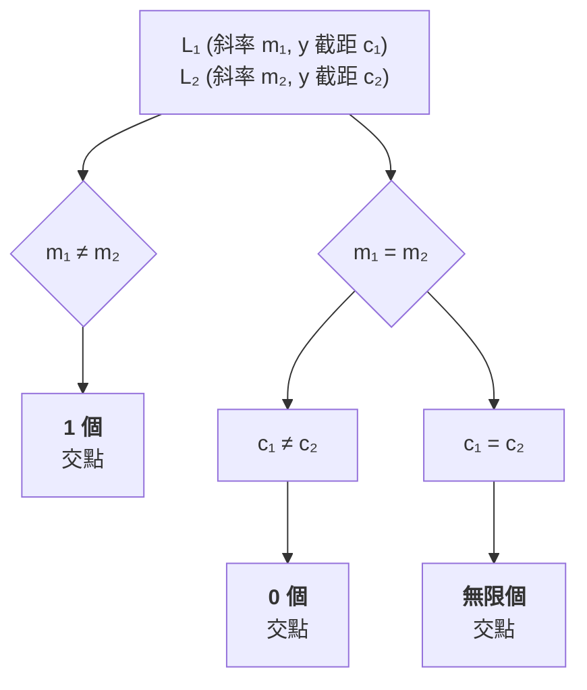

$$ y-y_1 = (\text{斜率})(x-x_1) $$
$$ \text{替換}\ y_1\ \&\ x_1 $$

## 結果 (一般式):

$$ Ax+By+C = 0 $$

## 斜率:

$$-\frac{A}{B}$$

## 兩條直線的交點數目:

```mermaid
graph TD
    Root["L₁ (斜率 m₁, y 截距 c₁) <br> L₂ (斜率 m₂, y 截距 c₂)"]

    Root --> Cond1{"m₁ ≠ m₂"}
    Cond1 --> Res1["<b>1 個</b><br>交點"]

    Root --> Cond2{"m₁ = m₂"}

    Cond2 --> Sub1["c₁ ≠ c₂"]
    Sub1 --> Res2["<b>0 個</b><br>交點"]

    Cond2 --> Sub2["c₁ = c₂"]
    Sub2 --> Res3["<b>無限個</b><br>交點"]
```
