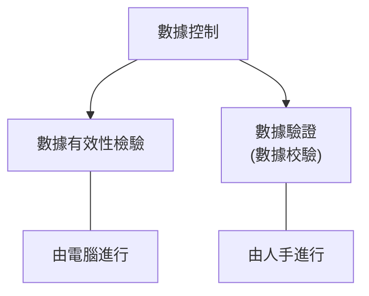
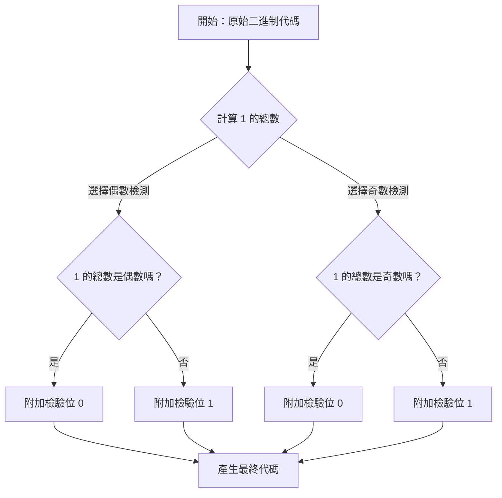

## 數據分級

$$ \text{數據庫} $$  
$$ \downarrow $$  
$$ \text{數據表} $$  
$$ \downarrow $$  
$$ \text{行與列} $$  
$$ \downarrow $$  
$$ \text{欄位} $$

## 無用輸入，無用輸出

### 常見錯誤列表

1. 數據來源錯誤

   - 說明：數據來源提供了不正確的數據。
   - 例子：用戶錯誤地提供了一個不存在的電子郵件地址。
   - 解決方法：向用戶提供的電子郵件地址發送認證碼，然後要求用戶輸入該該碼。

2. 轉錄錯誤

   - 說明：數據被誤讀、誤聽或誤植。
   - 例子：
     - 光符識別 (OCR) 程式將大楷字母「I」誤讀為小楷字母「l」或數字「1」。
     - 打字員將「冶」打錯為「治」。
   - 解決方法：
     - 通過檢查單詞的拼寫來檢驗數據的有效性。
     - 要求用戶再次輸入數據來驗證數據。
     - 校對數據。

3. 換位錯誤
   - 說明：數據位置不正確。
   - 例子：
     - 蘋果的價格被儲存為西瓜的價格。
     - 某人於記錄一項交易時將兩個相鄰數字調轉，令「\$15」變成「\$51」。
   - 解決方法：
     - 通過檢查單詞的拼寫來檢驗數據的有效性。
     - 要求用戶再次輸入數據來驗證數據。
     - 校對數據。

## 數據控制的兩種方式

## 數據驗證 (人手進行)

- **輸入數據兩次**
  - 操作員須輸入相同的數據兩次。
  - 比較所輸入數據的兩份複本，以檢視兩者是否相同。
- **雙重數據輸入**
  - 由兩位操作員分別輸入相同的數據。
  - 比較所輸入數據的兩份複本，以檢視兩者是否相同。
- **校對數據**
  - 由另一位操作員來比較所輸入之數據和原始檔案。

## 數據有效性檢驗方法 (電腦進行)

1. 完整性檢查

   - 確保必填欄位中有數據。
   - e.g. 申請人必須提供姓名。

2. 固定值檢查

   - 確保數據只能來自一系列特定的值。
   - e.g. 申請人的性別必須是「M」或「F」。

3. 類型檢查

   - 確保數據必須為特定類型。
   - e.g. 申請人的年齡必須是數字。

4. 範圍檢查

   - 確保數據必須位於指定範圍內。
   - e.g. 申請人的年齡必須大於 12 歲。

5. 長度檢查

   - 確保數據的字符數必須在指定範圍內。
   - e.g. 申請人必須提供 8 個位的電話號碼。

6. 格式檢查

   - 確保數據必須採用特定格式。
   - e.g. 申請人的電郵地址必須包含「@」符號。

7. 一致性檢查

   - 確保數據與其他欄位的數據相比沒有不合理之處。
   - e.g. 申請人提供的結束日期必須在開始日期之後。

8. 唯一性檢查
   - 該欄位的數據必須是獨一無二的。
   - e.g. 由於每位學生只能申請一次，申請人中的學生 ID 不應重複。
9. 檢查數位

   - 透過對一組數據進行特定數學運算後得出一個額外的數位，用於驗證數據在輸入或傳輸過程中是否出錯。
   - e.g. 香港身份證號碼括號內的數字，或是產品條形碼的最後一位，均用於確保整組號碼的準確性。

10. 奇偶檢測  
     [奇偶檢測詳情](#奇偶檢測)

## 用戶界面 (UI) 設計與有效性檢驗

系統常使用不同的用戶界面設計（如下拉式選單、日期選擇器等）來使有效性檢驗更容易。

### 用戶界面設計一覽

1. 下拉式選單

   - 有效性檢驗：  
      **固定值檢查**：只可輸入其中一個特定值。
   - 例子說明：  
     性別選擇：M / F

2. 單選按鈕

   - 有效性檢驗：  
     **固定值檢查**：只可輸入其中一個特定值。
   - 例子說明：  
     欲參與活動：海灘清理 / 半日植樹 / 義教服務 (三選一)

3. 複選框

   - 有效性檢驗：  
     **固定值檢查**：只可輸入特定值，可選取多個值。
   - 例子說明：  
     欲參與活動：可同時勾選海灘清理、義教服務等。

4. 日期選擇器
   - 有效性檢驗：
     - 類型檢查：只可輸入日期。用戶不能選擇像「32/08/2025」這樣的無效日期。
     - 格式檢查：日期必須為特定格式，如「DD/MM/YYYY」。
   - 例子說明：日曆選單，防止手打錯誤。

## 奇偶檢測

### 奇偶檢測類別與範例

以下列出不同原始代碼在兩種檢測類型下的處理方式：

- **範例 1**
  - 原始二進制代碼：`0000 000`
  - 1 的總數：0
  - **偶數檢測結果**：`0000 0000` (末尾加 0，保持 1 的總數為偶數 0)
  - **奇數檢測結果**：`0000 0001` (末尾加 1，使 1 的總數變為奇數 1)
- **範例 2**
  - 原始二進制代碼：`1010 101`
  - 1 的總數：4
  - **偶數檢測結果**：`1010 1010` (末尾加 0，保持 1 的總數為偶數 4)
  - **奇數檢測結果**：`1010 1011` (末尾加 1，使 1 的總數變為奇數 5)
- **範例 3**
  - 原始二進制代碼：`0100 101`
  - 1 的總數：3
  - **偶數檢測結果**：`0100 1011` (末尾加 1，使 1 的總數變為偶數 4)
  - **奇數檢測結果**：`0100 1010` (末尾加 0，保持 1 的總數為奇數 3)
- **範例 4**
  - 原始二進制代碼：`1110 011`
  - 1 的總數：5
  - **偶數檢測結果**：`1110 0111` (末尾加 1，使 1 的總數變為偶數 6)
  - **奇數檢測結果**：`1110 0110` (末尾加 0，保持 1 的總數為奇數 5)

### 奇偶檢測邏輯流程圖

