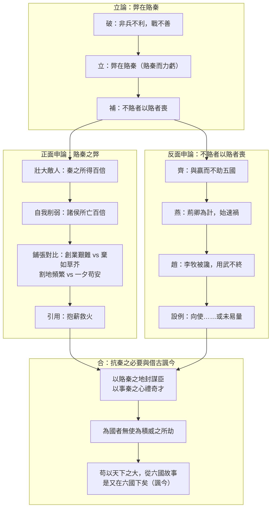

## 目錄



>[!NOTE]主旨
>本文藉着論述六國破滅的原因（<mark>弊在賂秦</mark>），借題發揮、<mark>借古諷今</mark>，諷諭北宋當權者應善用有利的條件對抗外敵（契丹、西夏），不要為外族積威所劫，避免重蹈六國滅亡的覆轍。

# 原文

六國破滅，非兵不利，戰不善，弊在賂秦。賂秦而力虧，破滅之道也。或曰：「六國互喪，率賂秦耶？」曰：「不賂者以賂者喪。蓋失強援，不能獨完，故曰『弊在賂秦』也。」
>六國滅亡，不是兵器不鋒利，作戰不得法，弊病在於賄賂秦國。賄賂秦國而使國力虧損，這就是滅亡的途徑。有人說：「六國相繼滅亡，都是因為賄賂秦國嗎？」回答說：「不賄賂秦國的國家因為賄賂的國家而滅亡。因為失去了強大的支援，不能單獨保全，所以說『弊病在於賄賂秦國』啊。」

秦以攻取之外，小則獲邑，大則得城，較秦之所得與戰勝而得者，其實百倍；諸侯之所亡與戰敗而亡者，其實亦百倍。則秦之所大欲，諸侯之所大患，固不在戰矣。思厥先祖父，暴霜露，斬荊棘，以有尺寸之地。子孫視之不甚惜，舉以予人，如棄草芥。今日割五城，明日割十城，然後得一夕安寢，起視四境，而秦兵又至矣。然則諸侯之地有限，暴秦之欲無厭，奉之彌繁，侵之愈急，故不戰而強弱勝負已判矣。至於顛覆，理固宜然。古人云：「以地事秦，猶抱薪救火，薪不盡，火不滅。」此言得之。
>秦國除了用攻戰奪取土地之外，還因諸侯賄賂而得到土地，小則獲得城邑，大則獲得城池。比較秦國因受賂而得到的土地與因戰勝而得到的土地，前者實際上是後者的百倍；諸侯因賄賂而失去的土地與因戰敗而失去的土地，前者實際上也多百倍。那麼秦國最想得到的、諸侯最害怕的，本來就不在戰爭上了。回想他們的祖先，冒着風霜雨露，斬除荊棘，才有了尺寸的土地。子孫卻不珍惜，拿來送給別人，像丟棄小草一樣。今天割讓五座城，明天割讓十座城，然後換來一夜安睡，起來看看四周圍的邊境，秦兵又到了。既然諸侯的土地有限，強暴的秦國慾望沒有滿足，奉送得越頻繁，侵犯得越急迫，所以不用作戰，強弱勝負已經分明了。到了滅亡的地步，按理本來就是這樣。古人說：「用土地侍奉秦國，就像抱着柴草救火，柴草不燒完，火就不會熄滅。」這話說出了其中的道理。

齊人未嘗賂秦，終繼五國遷滅，何哉？與嬴而不助五國也。五國既喪，齊亦不免矣。燕趙之君，始有遠略，能守其土，義不賂秦。是故燕雖小國而後亡，斯用兵之效也。至丹以荊卿為計，始速禍焉。趙嘗五戰于秦，二敗而三勝，後秦擊趙者再，李牧連卻之。洎牧以讒誅，邯鄲為郡，惜其用武而不終也。且燕趙處秦革滅殆盡之際，可謂智力孤危，戰敗而亡，誠不得已。向使三國各愛其地，齊人勿附於秦，刺客不行，良將猶在，則勝負之數，存亡之理，當與秦相較，或未易量。
>齊國人不曾賄賂秦國，最終也繼五國之後滅亡，為什麼呢？因為它親附秦國而不幫助五國。五國滅亡之後，齊國也免不了滅亡。燕國、趙國的君主，開始時有長遠的謀略，能守住自己的土地，堅守正義，不賄賂秦國。所以燕國雖是小國卻最後滅亡，這是用兵的成效。到了燕太子丹用荊軻行刺作為計策，才加速了禍患的到來。趙國曾經與秦國五次作戰，兩敗三勝，後來秦國兩次攻打趙國，李牧接連擊退秦軍。等到李牧因讒言被殺，邯鄲就成為秦國的一個郡，可惜它用武力對抗卻不能堅持到底。況且燕國、趙國處在秦國幾乎消滅所有國家的時候，可以說是智謀力量孤單危急，戰敗而亡，實在是不得已。假使韓、魏、楚三國各愛惜自己的土地，齊國人不依附秦國，燕國不行刺秦王的計策，趙國良將還在，那麼勝負的命運、存亡的道理，與秦國相較量，或許還不容易估量呢。

嗚呼！以賂秦之地，封天下之謀臣；以事秦之心，禮天下之奇才；幷力西嚮，則吾恐秦人食之不得下嚥也。悲夫！有如此之勢，而為秦人積威之所劫，日削月割，以趨於亡。為國者無使為積威之所劫哉！
>唉！如果用賄賂秦國的土地，分封天下的謀臣；用侍奉秦國的心意，禮遇天下的奇才；合力向西對付秦國，那麼我恐怕秦國人連飯都吃不下去了。可悲啊！有這樣好的形勢，卻被秦國積久的威勢所脅迫，一天天割地，一月月削減，以至於走向滅亡。治理國家的人不要被積久的威勢所脅迫啊！

夫六國與秦皆諸侯，其勢弱於秦，而猶有可以不賂而勝之之勢；茍以天下之大，而從六國破亡之故事，是又在六國下矣！
>六國與秦國都是諸侯國，六國的勢力雖弱於秦國，卻還有可以不賄賂而戰勝它的形勢；如果憑着天下這樣大的國家，卻重蹈六國滅亡的覆轍，那就又在六國之下了！

# 分析

>[!TIP]原文
>六國破滅，非兵不利，戰不善，弊在賂秦。賂秦而力虧，破滅之道也。或曰：「六國互喪，率賂秦耶？」曰：「不賂者以賂者喪。蓋失強援，不能獨完，故曰『弊在賂秦』也。」

- 語譯：六國滅亡，弊病在於賄賂秦國；不賂的國家也因賂者而喪，失去強援，不能獨自保全。
- 分析：
	- 開門見山，以「破」立法起筆：先否定一般人「兵不利、戰不善」的看法，提出獨特論點——「弊在賂秦」，立意新穎。
	- 巧用設問「六國互喪，率賂秦耶？」，引出「不賂者以賂者喪」的補充論點，管領以下兩段（韓魏楚賂秦而亡、齊燕趙受牽連而亡），立論周密。

---

>[!TIP]原文
>秦以攻取之外……則秦之所大欲，諸侯之所大患，固不在戰矣。

- 語譯：秦國受賂所得比戰勝所得多百倍，諸侯賂秦所失比戰敗所失也多百倍，可見秦之所欲、諸侯之患都不在戰爭。
- 分析：
	- 以「較秦之所得與戰勝而得者，其實百倍」兩組對偶句，指出賂秦之弊有二：一曰壯大敵人，二曰自我削弱，正面申論「賂秦而力虧」。

---

>[!TIP]原文
>思厥先祖父，暴霜露，斬荊棘，以有尺寸之地。子孫視之不甚惜，舉以予人，如棄草芥。今日割五城，明日割十城，然後得一夕安寢，起視四境，而秦兵又至矣。然則諸侯之地有限，暴秦之欲無厭，奉之彌繁，侵之愈急，故不戰而強弱勝負已判矣。……古人云：「以地事秦，猶抱薪救火，薪不盡，火不滅。」此言得之。

- 語譯：祖先創業艱難，子孫卻棄地如草芥，今日割五城、明日割十城，只換得一夕安睡；諸侯之地有限，暴秦之欲無厭，奉之彌繁，侵之愈急。古人說「以地事秦，猶抱薪救火」，正是此理。
- 分析：
	- 以<mark>對比鋪張</mark>寫六國後人的愚昧：「暴霜露，斬荊棘」的創業艱難 vs 「舉以予人，如棄草芥」的敗家；割地之頻（今日割五城，明日割十城）vs 苟安之短（得一夕安寢，起視四境，秦兵又至）。
	- 歸結「諸侯之地有限，暴秦之欲無厭，奉之彌繁，侵之愈急」，回應首段「賂秦而力虧」之論。
	- 引用古人「抱薪救火」之喻，形象化重申賂秦之弊，鎖住全段，言之有據。

---

>[!TIP]原文
>齊人未嘗賂秦，終繼五國遷滅，何哉？與嬴而不助五國也。……燕趙之君，始有遠略，能守其土，義不賂秦。是故燕雖小國而後亡，斯用兵之效也。至丹以荊卿為計，始速禍焉。……洎牧以讒誅，邯鄲為郡，惜其用武而不終也。……向使三國各愛其地，齊人勿附於秦，刺客不行，良將猶在，則勝負之數，存亡之理，當與秦相較，或未易量。

- 語譯：齊親秦而不助五國，終亦滅亡；燕用荊軻刺秦而速禍；趙因讒殺李牧而亡，惜其用武不終。假使三國各愛其地、齊不附秦、刺客不行、良將猶在，勝負存亡或許未易估量。
- 分析：
	- 從<mark>反面申論</mark>「不賂者以賂者喪」：齊、燕、趙三國各有破滅原因（齊親秦、燕行刺、趙殺良將），又因賂秦者壯大了秦國，致燕趙勢孤力弱、欲戰不能。
	- 以<mark>設例（假設論證）</mark>推論：若「向使三國各愛其地……」，勝負或未易量，反證賂秦之弊。
	- 本段為全文之轉折：承上文賂秦而來，開下文抗秦之論。

---

>[!TIP]原文
>嗚呼！以賂秦之地，封天下之謀臣；以事秦之心，禮天下之奇才；幷力西嚮，則吾恐秦人食之不得下嚥也。悲夫！有如此之勢，而為秦人積威之所劫，日削月割，以趨於亡。為國者無使為積威之所劫哉！

- 語譯：若以賂秦之地封謀臣、以事秦之心禮奇才，合力抗秦，秦人將寢食難安；可惜六國有可勝之勢卻被秦的積威脅迫，日削月割而亡。治理國家的人不要被積威脅迫啊！
- 分析：
	- 以對偶句「以賂秦之地，封天下之謀臣；以事秦之心，禮天下之奇才」綜括抗秦之法。
	- 「嗚呼」、「悲夫」感歎連用，先慨六國賂秦致亡，再悲六國本可勝秦卻為積威所劫，感情色彩豐富。
	- 「為國者無使為積威之所劫哉」一語雙關：既指六國，也泛指治國者，<mark>借古諷今</mark>之意呼之欲出，並預開下文。

---

>[!TIP]原文
>夫六國與秦皆諸侯，其勢弱於秦，而猶有可以不賂而勝之之勢；茍以天下之大，而從六國破亡之故事，是又在六國下矣！

- 語譯：六國勢弱於秦猶有可勝之勢；如果憑天下之大而重蹈六國覆轍，就又在六國之下了。
- 分析：
	- 借古事諷諭時事，點出文章作意：六國勢弱仍有戰勝之道，北宋為天下共主、海內統一，若再蹈六國覆轍（以歲幣賂契丹、西夏），則連六國也不如。
	- 措辭婉轉，文意卻清晰明確，收結有力，令諷諭之旨具體傳達。

---

# 課文結構圖

# 寫作手法表

## 1. 立論明確，論據充分

- 內容：落筆即提出「六國破滅，弊在賂秦」，再以「不賂者以賂者喪」補足論點；正文從正、反兩面舉例論證，最後以設例反證。
- 分析：全篇論點清晰，結構井然：立論→正論→反論→結論，層層推進，文意暢達，題旨突出。

## 2. 借古諷今，主題鮮明

- 內容：借六國賂秦而亡的史事，諷諭北宋以歲幣賂契丹、西夏之失。
- 分析：文章並非探討歷史，而是借題發揮——「為國者無使為積威之所劫」既責六國，亦警北宋；末段「是又在六國下矣」一語收結，諷諭之旨呼之欲出。

## 3. 論證多樣

- 內容：舉例論證（齊、燕、趙滅亡的史實）、正反對比論證（賂秦者 vs 不賂者）、假設論證（「向使三國各愛其地……」）、比喻論證（抱薪救火）。
- 分析：多種論證互相配合，令立論立於不敗之地。

## 4. 鋪張渲染，感情強烈

- 內容：「思厥先祖父」一段以「暴霜露，斬荊棘」寫創業艱辛、「舉以予人，如棄草芥」寫子孫敗國、「今日割五城，明日割十城」寫獻地頻繁；「嗚呼」、「悲夫」等感歎詞連用。
- 分析：鋪張其事，具體呈現六國子孫之不肖，暗責六國與北宋後人不珍惜祖先創業的艱辛；感情色彩豐富，甚具感染力。

# 篇章手法表

## 1. 比喻

- 內容：「以地事秦，猶抱薪救火，薪不盡，火不滅」；「舉以予人，如棄草芥」。
- 分析：以抱薪救火喻賂秦之害，薪不盡火不滅，形象說明割地求和只會助長敵焰；以棄草芥喻不珍惜祖先土地，生動傳神。

## 2. 對比

- 內容：秦之所得百倍 vs 諸侯所亡百倍；祖先創業之艱難 vs 子孫棄地如草芥；割地之頻繁 vs 苟安之短暫；賂秦者 vs 不賂者（齊燕趙）的結局。
- 分析：正反對照，突出賂秦之弊，加強論證。

## 3. 設問

- 內容：「六國互喪，率賂秦耶？」「齊人未嘗賂秦，終繼五國遷滅，何哉？」
- 分析：自問自答，先提出讀者可能的疑問再解釋，使論證更周密，引人思考。

## 4. 對偶、排比

- 內容：「較秦之所得與戰勝而得者，其實百倍；諸侯之所亡與戰敗而亡者，其實亦百倍」；「以賂秦之地，封天下之謀臣；以事秦之心，禮天下之奇才」。
- 分析：句式整齊，節奏鏗鏘，增強說理氣勢。

## 5. 借代

- 內容：「非兵不利」（兵借代軍隊）；「與嬴而不助五國」（嬴借代秦國）；「思厥先祖父」（祖父借代祖先）。
- 分析：以具體代抽象，語言精煉。

# 文言知識

- 一字多義：
	- 得：此言得之（說得出其中道理）／秦以攻取之外，小則獲邑，大則得城（得到）／誠不得已（能夠）。
- 通假字：
	- 「暴秦之欲無厭」：厭，通「饜」，滿足。
	- 「幷力西嚮」：嚮，通「向」。
	- 「秦人食之不得下嚥」：嚥，通「咽」。
- 古今異義：
	- 祖父：今指父親的父親；文中指祖輩和父輩，泛指祖先。
	- 智力：今指智慧能力；文中指智謀和力量。
	- 不行：今指不可以；文中指不實行、不用（刺客不行）。
	- 故事：今指敘事性文學作品；文中指舊事、前例（從六國破亡之故事）。
- 詞類活用：
	- 與嬴而不助五國也（與，動詞，幫助、親附）；以事秦之心，禮天下之奇才（禮，名詞作動詞，禮遇）。

# 可混搭出題的篇章

## 借古諷今／以史論政

- **本文：** 蘇洵借六國賂秦而亡諷諭北宋當權者勿重蹈覆轍。
- **相關篇章：** 《出師表》：諸葛亮以先漢興隆、後漢傾頹的史事對比，勸勉後主親賢遠佞；《師說》：韓愈針對「恥學於師」的時弊而作——三篇同屬針砭時弊、以文論政之作，可比較其論證手法與進言對象。

## 抗敵／愛國

- **本文：** 六國與秦皆諸侯，其勢弱於秦，猶有可以不賂而勝之之勢。
- **相關篇章：** 《廉頗藺相如列傳》：趙國在秦強趙弱下，藺相如完璧歸趙、澠池之會不辱國體，廉頗盛設兵以待秦——同是弱國抗秦的歷史題材，一論史、一敘事，可互相參照。

## 論證手法

- **本文：** 舉例論證、正反對比、假設論證（「向使三國各愛其地……」）、比喻論證並用。
- **相關篇章：** 《魚我所欲也》：類比論證、正反論證、假設論證（「如使人之所欲莫甚於生……」）——兩篇皆論證嚴密，可比較其推論方式。
