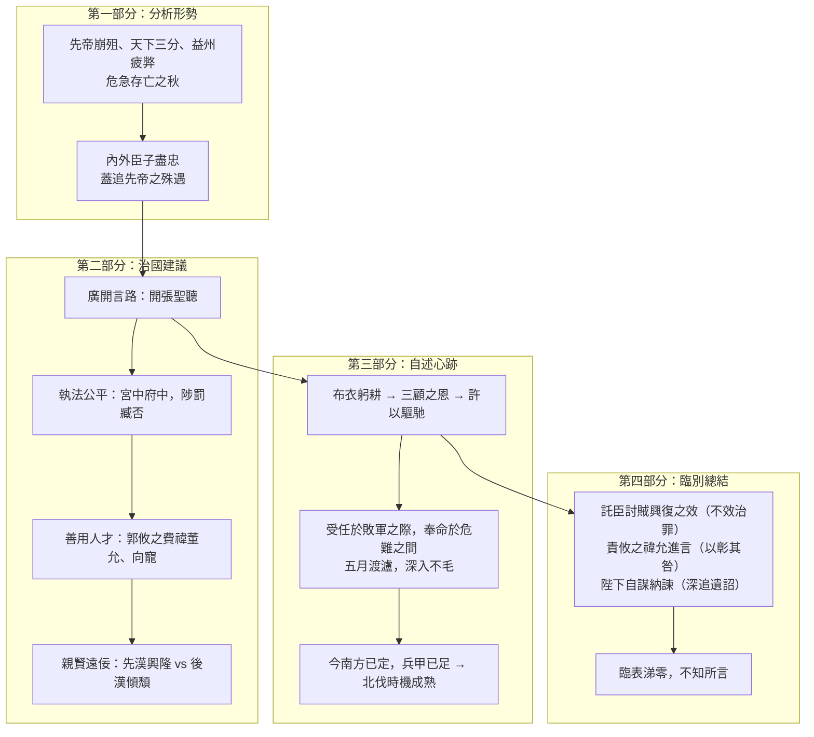

>[!NOTE]主旨
>諸葛亮出師北伐曹魏前上表後主劉禪，先分析蜀漢<mark>危急存亡的形勢</mark>，指出北伐是興復漢室的唯一出路；繼而勸勉後主<mark>親賢臣、遠小人、虛懷納諫、執法公平</mark>；並表白自己<mark>忠心為國、興復漢室</mark>，以報答先帝知遇之恩的心跡。

# 原文

先帝創業未半，而中道崩殂，今天下三分，益州疲弊，此誠危急存亡之秋也。然侍衞之臣，不懈於內；忠志之士，忘身於外者，蓋追先帝之殊遇，欲報之於陛下也。
>先帝創立大業還沒有完成一半，就中途去世了。如今天下分成三國，益州困乏衰弱，這實在是危急存亡的關鍵時刻啊。然而侍衛的臣子，在朝廷內毫不懈怠；忠誠的將士，在戰場上奮不顧身，這都是因為追念先帝特別的厚待，想報答給陛下啊。

誠宜開張聖聽，以光先帝遺德，恢弘志士之氣；不宜妄自菲薄，引喻失義，以塞忠諫之路也。
>（陛下）實在應該廣泛聽取群臣的意見，來發揚先帝遺留下來的美德，振奮志士的氣節；不應該胡亂看輕自己，說話不合道理，以致堵塞了忠心進諫的道路。

宮中、府中，俱為一體，陟罰臧否，不宜異同。若有作姦犯科，及為忠善者，宜付有司，論其刑賞，以昭陛下平明之治；不宜偏私，使內外異法也。
>皇宮和丞相府，都是一個整體，賞善罰惡，不應該有差別。如果有作惡犯法的人，以及盡忠行善的人，都應該交給主管官員，判定他們的刑罰和獎賞，來彰顯陛下公正嚴明的治理；不應該偏袒徇私，使宮內宮外執法不同。

侍中、侍郎郭攸之、費禕、董允等，此皆良實，志慮忠純，是以先帝簡拔以遺陛下。愚以為宮中之事，事無大小，悉以咨之，然後施行，必能裨補闕漏，有所廣益。將軍向寵，性行淑均，曉暢軍事，試用於昔日，先帝稱之曰「能」，是以眾議舉寵為督。愚以為營中之事，悉以咨之，必能使行陣和睦，優劣得所。
>侍中、侍郎郭攸之、費禕、董允等人，都是善良忠實、志向心思忠誠純正的人，所以先帝選拔他們留給陛下。我認為宮中的事情，無論大小，都應徵詢他們的意見，然後施行，一定能彌補缺漏，有更多益處。將軍向寵，性格和善，為人公正，通曉軍事，從前曾經試用，先帝稱讚他能幹，所以眾人商議推舉他做都督。我認為軍營中的事情，都應徵詢他，一定能使軍隊和睦，才能高低不同的人都得到適當的安排。

親賢臣，遠小人，此先漢所以興隆也；親小人，遠賢臣，此後漢所以傾頹也。先帝在時，每與臣論此事，未嘗不歎息痛恨於桓、靈也！侍中、尚書、長史、參軍，此悉貞良死節之臣，願陛下親之、信之，則漢室之隆，可計日而待也。
>親近賢臣，疏遠小人，這是前漢興盛的原因；親近小人，疏遠賢臣，這是後漢衰敗的原因。先帝在世時，每次和我談論這些事，沒有不對桓帝、靈帝嘆息痛恨的！侍中、尚書、長史、參軍，這些都是忠貞賢良、能以死守節的臣子，希望陛下親近他們、信任他們，那麼漢室的興隆，就可以數着日子等待了。

臣本布衣，躬耕於南陽，苟全性命於亂世，不求聞達於諸侯。先帝不以臣卑鄙，猥自枉屈，三顧臣於草廬之中，諮臣以當世之事，由是感激，遂許先帝以驅馳。後值傾覆，受任於敗軍之際，奉命於危難之間，爾來二十有一年矣。先帝知臣謹慎，故臨崩寄臣以大事也。受命以來，夙夜憂歎，恐託付不效，以傷先帝之明。故五月渡瀘，深入不毛。今南方已定，兵甲已足，當獎率三軍，北定中原，庶竭駑鈍，攘除姦凶，興復漢室，還於舊都。此臣所以報先帝而忠陛下之職分也。至於斟酌損益，進盡忠言，則攸之、禕、允之任也。
>我本來是平民，在南陽親自耕種，只求在亂世中苟全性命，不希求在諸侯間揚名顯達。先帝不嫌棄我地位低微、見識鄙陋，委屈自己，三次到草廬中探望我，拿當世的大事來詢問我，我因此感動奮發，於是答應為先帝奔走效勞。後來遭遇兵敗，我在兵敗之時接受重任，在危難之間奉命出使，從那時到現在已經二十一年了。先帝知道我謹慎，所以臨終時把國家大事託付給我。接受遺命以來，我日夜憂慮嘆息，恐怕託付的事情沒有成效，損害了先帝的知人之明。所以五月渡過瀘水，深入不毛之地。如今南方已經平定，兵甲已經充足，應當獎勵率領三軍，北伐平定中原，希望竭盡我平庸的才能，剷除奸險凶惡的勢力，復興漢室，回到舊都。這是我用來報答先帝、盡忠陛下的職分啊。至於權衡利弊得失，進獻忠言，那就是郭攸之、費禕、董允的責任了。

願陛下託臣以討賊興復之效；不效，則治臣之罪，以告先帝之靈。若無興德之言，則責攸之、禕、允等之慢，以彰其咎。陛下亦宜自謀，以諮諏善道，察納雅言，深追先帝遺詔。臣不勝受恩感激。今當遠離，臨表涕零，不知所言。
>希望陛下把討伐奸賊、興復漢室的成效託付給我；如果沒有成效，就治我的罪，來告慰先帝的在天之靈。如果沒有振興德政的言論，就責罰郭攸之、費禕、董允等人的怠慢，來彰顯他們的過失。陛下也應該自己謀劃，諮詢治國良策，明察採納正確的言論，深切追念先帝的遺詔。我感激不盡。如今即將遠離，臨上這份奏表時淚流滿面，不知說了些什麼。

# 分析

>[!TIP]原文
>先帝創業未半，而中道崩殂，今天下三分，益州疲弊，此誠危急存亡之秋也。然侍衞之臣，不懈於內；忠志之士，忘身於外者，蓋追先帝之殊遇，欲報之於陛下也。

- 語譯：先帝創業未半而中途去世，天下三分，益州困乏，這是危急存亡的時刻；但內外臣子都盡忠職守，因為追念先帝的厚待，想報答陛下。
- 分析：
	- 第一部分，為後主分析蜀國面對的形勢：先帝早逝、天下三分、益州疲弊，蜀漢勢孤力弱，情勢非常危急，使後主了解險境而知所振作。
	- 「然」字一轉，指出內外大臣、將士各盡其份，皆因追念先帝殊遇——言外之意是警醒後主：眾人效忠並非因其英明，須克紹箕裘，同時也使後主安心。

---

>[!TIP]原文
>誠宜開張聖聽，以光先帝遺德，恢弘志士之氣；不宜妄自菲薄，引喻失義，以塞忠諫之路也。宮中、府中，俱為一體，陟罰臧否，不宜異同。……親賢臣，遠小人，此先漢所以興隆也；親小人，遠賢臣，此後漢所以傾頹也。……願陛下親之、信之，則漢室之隆，可計日而待也。

- 語譯：第二部分是治國建議：廣開言路、執法公平（宮中府中賞罰一致）、善用人才（郭攸之、費禕、董允掌內政，向寵掌軍事）、親賢臣遠小人，以前漢興隆、後漢傾頹為鑑。
- 分析：
	- 提出四項治國建議：<mark>廣開言路、執法公平、善用人才、親賢遠佞</mark>，條理分明，面面俱到。
	- 「親賢臣，遠小人，此先漢所以興隆也；親小人，遠賢臣，此後漢所以傾頹也」以<mark>先漢、後漢興衰作對比</mark>，以史為證，寄望後主借古鑑今。
	- 提及桓、靈二帝寵信宦官致漢末大亂，是借史事警惕後主，用意深遠。

---

>[!TIP]原文
>臣本布衣，躬耕於南陽……先帝不以臣卑鄙，猥自枉屈，三顧臣於草廬之中，諮臣以當世之事，由是感激，遂許先帝以驅馳。後值傾覆，受任於敗軍之際，奉命於危難之間，爾來二十有一年矣。……此臣所以報先帝而忠陛下之職分也。

- 語譯：我本無意從政，因感激先帝三顧草廬的知遇之恩才出山；受命以來鞠躬盡瘁，如今南方已定，正是北伐的時機，這是我報答先帝、盡忠陛下的職分。
- 分析：
	- 第三部分為表明心跡的自白，情感至為深厚：自述由布衣躬耕到受三顧之恩出山，再由兵敗受任到五月渡瀘，二十年如一日的盡忠。
	- 由他人、由後主再說到自己的安排自然不過，緊接「親賢遠佞」而來，以自身為「賢臣」之例，表白心跡，使後主接納意見。
	- 「受任於敗軍之際，奉命於危難之間」以對偶句寫出臨危受命的艱難，感人至深。

---

>[!TIP]原文
>願陛下託臣以討賊興復之效；不效，則治臣之罪，以告先帝之靈。……陛下亦宜自謀，以諮諏善道，察納雅言，深追先帝遺詔。臣不勝受恩感激。今當遠離，臨表涕零，不知所言。

- 語譯：第四部分臨別總結：託付北伐之效，不效則治罪；眾臣須進興德之言；陛下要廣開言路、追念先帝遺詔；臨表涕零，不知所言。
- 分析：
	- 明確分工：自己負責討賊興復，郭攸之、費禕、董允等負責進言，後主負責自謀納諫，各盡其責。
	- 「不效，則治臣之罪」立下軍令狀，「臨表涕零，不知所言」真情流露，情理兼備，令後主難以推辭。

---

# 課文結構圖

# 寫作手法表

## 1. 議論、敘事、抒情三者結合

- 內容：分析形勢（議論）、自述生平（敘事）、表白忠忱（抒情）渾然一體。
- 分析：說理富於層次——先說之以理（分析蜀漢險境），後動之以情（自述三顧之恩、鞠躬盡瘁），情理兼備，既使後主知所振作，又使其難以推辭。

## 2. 說之以理，動之以情

- 內容：文中十三次提及「先帝」。
- 分析：屢提先帝有三重作用：一、以劉備嚴父的威望使後主願接納己見、自我警惕；二、勉勵後主繼承父志、復興漢室；三、暗示先帝創業艱辛，須謹慎守業。

## 3. 以史為證，正反對比

- 內容：「親賢臣，遠小人，此先漢所以興隆也；親小人，遠賢臣，此後漢所以傾頹也。」
- 分析：以先漢興隆、後漢傾頹的史事作正反對比，借古鑑今，論據有力，使後主易於接受。

## 4. 措辭得當，語氣得體

- 內容：「愚以為宮中之事，事無大小，悉以咨之」、「願陛下親之、信之」、「誠宜……不宜……」、「陛下亦宜自謀」。
- 分析：諸葛亮兼有「臣」與「父」兩種身份：進諫用「愚以為」、「願陛下」等謙辭，語氣恭敬委婉，不失君臣之禮；勸勉則用「誠宜」、「不宜」等語，如父輩叮嚀，親切誠懇，拿捏準確。

## 5. 文字淺白，不用典

- 內容：「臣本布衣，躬耕於南陽，苟全性命於亂世，不求聞達於諸侯」一段。
- 分析：所言皆真厚無隱的肺腑之言，毫無藻飾，樸素真率，如劉勰《文心雕龍》所評「志盡文暢」，為「表之英也」。

# 篇章手法表

## 1. 對比

- 內容：親賢臣遠小人，先漢興隆 vs 親小人遠賢臣，後漢傾頹。
- 分析：以兩漢興衰史事正反對照，證明親賢遠佞的治國要道，以史為鑑，說服力強。

## 2. 對偶

- 內容：侍衞之臣，不懈於內；忠志之士，忘身於外；受任於敗軍之際，奉命於危難之間；諮諏善道，察納雅言；獎率三軍，北定中原；庶竭駑鈍，攘除姦凶。
- 分析：散中有駢，詞藻樸素自然，不求雕飾，令文章整齊而不失真率。

## 3. 借代

- 內容：臣本布衣（布衣借代平民）。
- 分析：以服飾借代身份，簡潔生動。

# 文言知識

- 通假字：
	- 「悉以咨之」：咨，通「諮」，詢問。
	- 「爾來二十有一年矣」：有，通「又」。
	- 「作姦犯科」：姦，通「奸」。
- 古今異義：
	- 開張：今指商店開始營業；文中指廣泛擴大（開張聖聽）。
	- 卑鄙：今指品德惡劣；文中指地位低微、見識鄙陋。
	- 涕：今指鼻涕；文中指眼淚（臨表涕零）。
- 詞類活用：
	- 以光先帝遺德（光，名詞作動詞，發揚光大）；恢弘志士之氣（恢弘，形容詞作動詞，發揚、擴大）；遠小人（遠，形容詞作動詞，疏遠）。

# 可混搭出題的篇章

## 忠臣／報國

- **本文：** 諸葛亮鞠躬盡瘁，盡忠蜀漢，以報先帝知遇之恩；「受任於敗軍之際，奉命於危難之間」。
- **相關篇章：** 《廉頗藺相如列傳》：藺相如、廉頗赤誠為國，先國家之急而後私讎——同是忠臣盡忠報國的典範，可比較二人「報國」的具體表現。

## 憂國憂民／以天下為己任

- **本文：** 「此誠危急存亡之秋也」；「興復漢室，還於舊都」——時刻以國家存亡為念。
- **相關篇章：** 《岳陽樓記》：「居廟堂之高，則憂其民；處江湖之遠，則憂其君」；「先天下之憂而憂，後天下之樂而樂」——同是以天下為己任的胸襟抱負。

## 借古諷今／以史為鑑

- **本文：** 以先漢興隆、後漢傾頹的史事對比，勸勉後主親賢遠佞。
- **相關篇章：** 《六國論》：蘇洵借六國賂秦而亡諷諭北宋勿重蹈覆轍——同是以史事說理、針砭時政的篇章，可比較其論證手法。
