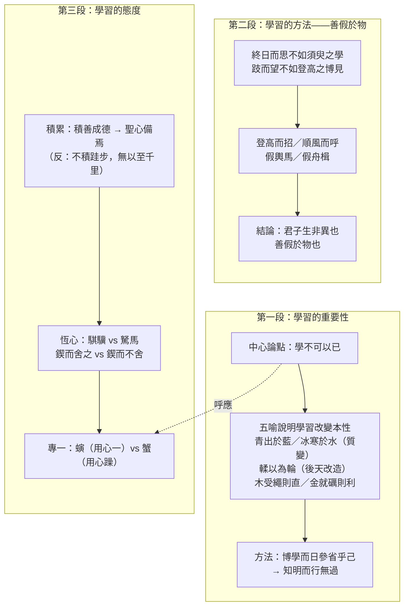

## 目錄



>[!NOTE]主旨  
>本文旨在勸勉讀者<mark>專心致志地不斷學習</mark>，既鑽研聖賢的學說，也學習禮樂教化，時刻自我反省，以明智的心思點點滴滴地<mark>積學與修德</mark>，達致完美的人格修養。荀子認為人可透過學習改變本性，並且要善於「假借外物」，秉持「鍥而不捨」、「用心專一」的態度。

## 原文

君子曰︰學不可以已。
>君子說：學習是不可以停止的。

青，取之於藍，而青於藍；冰，水為之，而寒於水。木直中繩，輮以為輪，其曲中規；雖有槁暴、不復挺者，輮使之然也。故木受繩則直，金就礪則利，君子博學而日參省乎己，則知明而行無過矣。
>靛青色是從藍草中提煉出來的，但顏色比藍草更深；冰是由水凝固而成的，但溫度比水更低。木材原本筆直得合乎墨線，用火烘烤彎曲成車輪，它的弧度便能符合圓規的標準；即使再經過乾燥曝曬，也不會恢復挺直，這是因為加工使它變成這樣。所以木材經過墨線校正才能筆直，金屬在磨刀石上磨過才會鋒利，君子廣博地學習並且每天檢討反省自己，就能智慧明達而行為沒有過錯了。

吾嘗終日而思矣，不如須臾之所學也；吾嘗跂而望矣，不如登高之博見也。登高而招，臂非加長也，而見者遠。順風而呼，聲非加疾也，而聞者彰。假輿馬者，非利足也，而致千里；假舟楫者，非能水也，而絕江河。君子生非異也，善假於物也。
>我曾經整天思考，卻比不上片刻學習的收穫；我曾經踮起腳跟遠望，卻比不上登上高處看得廣闊。登上高處招手，手臂沒有變長，但遠處的人也能看見；順着風呼喊，聲音沒有加大，但聽的人卻聽得更清楚。借助車馬的人，不是腳力特別好，卻能到達千里之外；借助舟船的人，不一定善於游泳，卻能橫渡江河。君子的天性與常人並無差異，只是善於借助外物罷了。

積土成山，風雨興焉；積水成淵，蛟龍生焉；積善成德，而神明自得，聖心備焉。故不積跬步，無以至千里；不積小流，無以成江海。騏驥一躍，不能十步；駑馬十駕，功在不舍。鍥而舍之，朽木不折；鍥而不舍，金石可鏤。螾無爪牙之利，筋骨之強，上食埃土，下飲黃泉，用心一也。蟹六跪而二螯，非蛇蟺之穴無可寄託者，用心躁也。
>堆積泥土成為高山，風雨便在此興起；匯聚水流成為深潭，蛟龍便在此生長；積累善行成為美德，自然會獲得智慧，聖人的精神境界也就具備了。所以不累積半步一步，就無法到達千里遠方；不匯聚細小水流，就無法形成江海。駿馬一躍，不能超過十步；劣馬持續走十天，其成功在於堅持不懈。雕刻幾下就放棄，腐朽的木頭也刻不斷；堅持雕刻不放棄，金屬石頭也能雕出花紋。蚯蚓沒有鋒利的爪牙、強健的筋骨，卻能向上吃泥土，向下飲泉水，是因為用心專一。螃蟹有六隻腳和兩隻螯，但沒有蛇或鱔魚的洞穴就無處寄居，是因為心思浮躁。

## 分析

>[!TIP]原文  
>君子曰︰學不可以已。

- 語譯：君子說：學習是不可以停止的。
- 分析：
	- 開宗明義，以「君子」立言提出全文中心論點——<mark>「學不可以已」</mark>：學習不可中斷，要持之以恆。
	- 首段以散句寫出，在全篇眾多對偶、排比句式中格外突出，巧妙地強調重點。

---

>[!TIP]原文  
>青，取之於藍，而青於藍；冰，水為之，而寒於水。木直中繩，輮以為輪，其曲中規；雖有槁暴、不復挺者，輮使之然也。故木受繩則直，金就礪則利，君子博學而日參省乎己，則知明而行無過矣。

- 語譯：靛青從藍草中提煉，顏色卻比藍草更深；冰由水凝成，溫度卻比水更低。木材筆直合於墨線，經烘烤彎成車輪，曬乾也不再挺直，這是加工使然。所以木材經墨線校正才直，金屬經磨刀石磨過才利，君子廣博學習而每天反省自己，就能智慧明達、行為無過。
- 分析：
	- 連用五個比喻說明學習足以改變本性：
		- 「青出於藍」、「冰寒於水」：共性是<mark>質變</mark>，說明學習能令內在潛質得以彰顯、成就高尚人格；
		- 「輮以為輪」：木材經後天加工而變形，說明學習可造就人才；
		- 「木受繩則直」、「金就礪則利」：說明「博學」與「修身」是改造人才的關鍵。
	- 由物及人，歸結到「<mark>博學而日參省乎己</mark>」→「知明而行無過」，指出學習加上每日反省，才能智慧明達、行為無過。

---

>[!TIP]原文  
>吾嘗終日而思矣，不如須臾之所學也；吾嘗跂而望矣，不如登高之博見也。登高而招，臂非加長也，而見者遠。順風而呼，聲非加疾也，而聞者彰。假輿馬者，非利足也，而致千里；假舟楫者，非能水也，而絕江河。君子生非異也，善假於物也。

- 語譯：我曾整天思考，比不上片刻學習的收穫；我曾踮腳遠望，比不上登高看得廣闊。登高招手，手臂沒有變長，遠處的人卻看得見；順風呼喊，聲音沒有加大，聽的人卻更清楚。借助車馬的人，腳力未必好，卻能到千里之外；借助舟船的人，未必善泳，卻能橫渡江河。君子本性與常人無異，只是善於借助外物。
- 分析：
	- 「終日而思不如須臾之學」，以「跂而望不如登高之博見」作比，指出學習比空想更有實效，要善假外物，不要單靠一己之力。
	- 以「登高而招」、「順風而呼」能達致「見者遠」、「聞者彰」，以及「假輿馬」、「假舟楫」能「致千里」、「絕江河」為例，說明借助外在條件可超越自身能力、擴大原有效能，好比人透過學習而成君子。
	- 「楫」借代為船，用字精煉。
	- 結句點明本段主旨：<mark>「君子生非異也，善假於物也」</mark>——君子並非天生異稟，只是懂得借助學習來求取知識、提升修養。

---

>[!TIP]原文  
>積土成山，風雨興焉；積水成淵，蛟龍生焉；積善成德，而神明自得，聖心備焉。故不積跬步，無以至千里；不積小流，無以成江海。

- 語譯：堆土成山，風雨就在那裏興起；積水成淵，蛟龍就在那裏生長；積善成德，自然獲得智慧，聖人的境界就具備了。所以不累積半步，無法到達千里；不匯聚小流，無法形成江海。
- 分析：
	- 先以「積土成山」、「積水成淵」從<mark>正面</mark>說明「積善成德」的道理：只要努力學習、不斷修鍊，就能心智澄明，達至聖人的精神境界。
	- 再以「不積跬步」、「不積小流」從<mark>反面</mark>指出：如不點滴積儲，就難學有所成。
	- 三個「積……焉」排比句式，層層推進，一瀉千里，氣勢充沛。

---

>[!TIP]原文  
>騏驥一躍，不能十步；駑馬十駕，功在不舍。鍥而舍之，朽木不折；鍥而不舍，金石可鏤。螾無爪牙之利，筋骨之強，上食埃土，下飲黃泉，用心一也。蟹六跪而二螯，非蛇蟺之穴無可寄託者，用心躁也。

- 語譯：駿馬一躍，不能超過十步；劣馬走十日，成功在於堅持不放棄。雕刻幾下就放棄，朽木也刻不斷；堅持雕刻，金石也能雕出花紋。蚯蚓沒有鋒利的爪牙、強健的筋骨，卻能上吃泥土、下飲泉水，是因為用心專一。螃蟹有六隻腳兩隻螯，沒有蛇鱔的洞穴就無處寄居，是因為心思浮躁。
- 分析：
	- 連用六個比喻、構成<mark>三組對比</mark>，說明對學習的看法：
		- 「騏驥」vs「駑馬」：知識累積不在於先天質素優劣，而在於後天努力多少；
		- 「鍥而舍之」vs「鍥而不舍」：持之以恆，方能有成；
		- 「螾」vs「蟹」：蚯蚓無爪牙之利而能上食埃土、下飲黃泉，螃蟹多足大螯卻只能寄居蛇蟺之穴，凸顯「用心一」與「用心躁」的分別，說明學習要專心致志。
	- 「無爪牙之利，筋骨之強」與「六跪而二螯」簡潔勾勒兩種動物形體強弱，再以「上食埃土，下飲黃泉」與「非蛇蟺之穴無可寄託」具體呈現活動空間的懸殊，觀物入微，描摹生動，一語道破「心一」與「心躁」的分別。
	- 末段呼應首段「學不可以已」：持之以恆、點滴積儲、鍥而不捨、專心致志，正是「不可以已」的具體實踐。

---

## 課文結構圖

## 寫作手法表

### 1. 聯類博喻

- 內容：通篇以日常生活的事物和經驗設喻——藍之變青、水之成冰、木之受繩受輮、金之就礪、登高招手、順風呼喊、車馬致千里、舟楫絕江河、積土成山、積水成淵、騏驥駑馬、蚯蚓螃蟹等。
- 分析：比喻既多且切，涵蓋物質變化、人的活動、自然景物、動物活動，卻始終緊扣「勸學」主題，具體地說明抽象道理，說理透闢，意趣盎然。

### 2. 正反對比

- 內容：積土成山、積水成淵（正面）vs 不積跬步、不積小流（反面）；騏驥一躍 vs 駑馬十駕；鍥而舍之 vs 鍥而不舍；螾用心一 vs 蟹用心躁。
- 分析：正反兩面互相映照，加強論證，令讀者更清楚明白學習應有的態度和方法。

### 3. 觀物入微，描摹生動

- 內容：「登高而招，臂非加長也，而見者遠」；「螾無爪牙之利……上食埃土，下飲黃泉」；「蟹六跪而二螯，非蛇蟺之穴無可寄託者」。
- 分析：善於觀察事物特徵，用「招臂」、「呼聲」具體呈現視聽之效；以形體與活動空間的反差，一語道破「心一」與「心躁」的分別，叫人恍然大悟。

### 4. 駢散結合，句式多變

- 內容：整齊互對的偶句（「木受繩則直，金就礪則利」、「鍥而舍之，朽木不折；鍥而不舍，金石可鏤」）、似對非對的句子（「螾無爪牙之利……用心躁也」）、排比（「積土成山……聖心備焉」），與散句（「學不可以已」、「君子生非異也，善假於物也」）交錯。
- 分析：句駢字偶，厚重典雅；句子意思成對而文字不兩兩相對，文氣跌宕多變；散句穿插其中，巧妙突出重點，造成鏗鏘的節奏美。

## 篇章手法表

### 1. 比喻

- 內容與分析：
	- 青出於藍、冰寒於水：喻學習可令潛質彰顯、成就人格（質變）。
	- 輮以為輪：喻後天學習改造本性。
	- 木受繩則直、金就礪則利：喻博學修身使人成才。
	- 登高而招、順風而呼、假輿馬、假舟楫：喻善假外物、借助學習。
	- 積土成山、積水成淵、不積跬步、不積小流：喻學習須點滴積累。
	- 騏驥、駑馬：喻成敗在努力不在資質。
	- 鍥而不舍、金石可鏤：喻持之以恆。
	- 螾、蟹：喻專一與浮躁的得失。

### 2. 對比

- 內容：正面積累 vs 反面不積；騏驥 vs 駑馬；鍥而舍之 vs 鍥而不舍；螾 vs 蟹。
- 分析：以相反事物對照，突出「積累」、「恆心」、「專一」的必要，正反對比，加強論證。

### 3. 排比

- 內容：積土成山，風雨興焉；積水成淵，蛟龍生焉；積善成德，而神明自得，聖心備焉。
- 分析：三句結構相同，層層推進，為文章帶來一瀉千里的氣勢。

### 4. 對偶

- 內容：木受繩則直，金就礪則利；鍥而舍之，朽木不折；鍥而不舍，金石可鏤。
- 分析：句駢字偶，句式整齊，朗讀時更具節奏感，厚重典雅。

### 5. 借代

- 內容：「假舟楫者」——以「楫」（船槳）借代船。
- 分析：以部分代全體，用字精煉。

## 文言知識

- 通假字：
	- 「雖有槁暴」：有，通「又」；暴，通「曝」，曬乾。
	- 「君子博學而日參省乎己」：參，一說通「三」，參省即「三省」（一說參為檢視、審察）。
	- 「則知明而行無過矣」：知，通「智」，智慧。
	- 「非能水也」：一說能，通「耐」，承受得住。
	- 「君子生非異也」：生，通「性」，天賦、本性。
	- 「功在不舍」：舍，通「捨」，放棄。
- 詞類活用：
	- 木直中繩（中，動詞，合於）；非能水也（水，動詞，游泳）；而絕江河（絕，動詞，橫渡）。

## 可混搭出題的篇章

### 學習

- **本文：** 學不可以已；博學而日參省乎己；君子生非異也，善假於物也。
- **相關篇章：** 《師說》：「古之學者必有師」，「道之所存，師之所存」——一論學習的態度方法，一論從師的必要，可合併論述儒家勸學傳統；《論仁、論孝、論君子》：「學則不固」，孔子同樣重視學習。

### 人性論

- **本文：** 荀子主張性惡，認為人須透過後天學習改造本性（「輮使之然也」），方能積善成德。
- **相關篇章：** 《魚我所欲也》：孟子主張性善，「非獨賢者有是心也，人皆有之」——性善與性惡兩種人性觀的比較，是經典考題方向。

### 借助外物／善用條件

- **本文：** 君子生非異也，善假於物也。
- **相關篇章：** 可與《師說》「聖人無常師……術業有專攻」對讀：一者強調借助學習與外物，一者強調向不同的人學習，都是「善假於物」的體現。

## 附錄：EDB 賞析  

教育局官方賞析 PDF（原文、注釋、作者簡介、背景資料、賞析重點）。  

  

官方頁面：[建議篇章配套資料 第四學習階段](https://www.edb.gov.hk/tc/curriculum-development/kla/chi-edu/key-stage4.html)  

最後檢查日期：02/09/2026（每月自動檢查更新）
