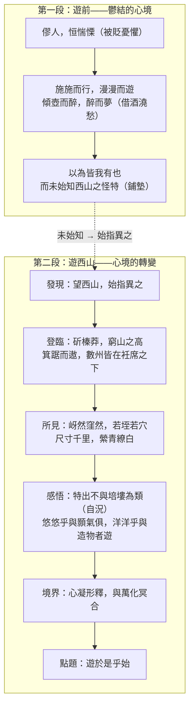

>[!NOTE]主旨
>本文記述作者（柳宗元）被貶永州後發現和遊覽西山的經過，以及藉西山景物<mark>紓解心中鬱悶憂懼</mark>、釋放心靈、忘卻自我、與大自然融合的體悟；同時，<mark>以西山自況</mark>，暗喻自己的特立和高潔。

# 原文

自余為僇人，居是州，恒惴慄。其隙也，則施施而行，漫漫而遊。日與其徒上高山，入深林，窮迴溪，幽泉怪石，無遠不到。到則披草而坐，傾壺而醉。醉則更相枕以卧，卧而夢。意有所極，夢亦同趣。覺而起，起而歸。以為凡是州之山有異態者，皆我有也，而未始知西山之怪特。
>自從我成為獲罪的人，居住在這州（永州），常常憂懼不安。在閒暇的時候，就緩緩地行走，隨意地遊玩。每天與意氣相投的朋友登上高山，進入深林，走遍曲折的溪流，清幽的泉水、奇特的石頭，沒有遠處不到的。到了就撥開草叢坐下，倒盡壺中的酒喝醉。醉了就互相枕着身體躺下，躺下就做夢。意趣到了極致，連夢境也意趣相投。醒了就起來，起來就回去。我以為凡是這個州有奇特形態的山，我都遊遍了，卻還不曾知道西山的奇特卓異。

今年九月二十八日，因坐法華西亭，望西山，始指異之。遂命僕過湘江，緣染溪，斫榛莽，焚茅茷，窮山之高而止。攀援而登，箕踞而遨，則凡數州之土壤，皆在衽席之下。其高下之勢，岈然窪然，若垤若穴，尺寸千里，攢蹙累積，莫得遯隱。縈青繚白，外與天際，四望如一。然後知是山之特出，不與培塿為類。悠悠乎與顥氣俱，而莫得其涯；洋洋乎與造物者遊，而不知其所窮。引觴滿酌，頹然就醉，不知日之入。蒼然暮色，自遠而至，至無所見，而猶不欲歸。心凝形釋，與萬化冥合。然後知吾嚮之未始遊，遊於是乎始，故為之文以志。是歲元和四年也。
>今年九月二十八日，因為坐在法華寺西亭，遠望西山，才開始指點着它，覺得它與眾不同。於是命令僕人渡過湘江，沿着染溪，砍伐雜亂的草木，焚燒茂密的茅草，一直走到山的最高處才停下來。攀着石頭登上山頂，隨意張開雙腿坐着，放眼四望，只見幾個州郡的土地，都在座席之下。那些高高低低的地勢，有的深邃，有的低窪，像蟻穴外的小土堆，又像小小的洞穴，尺寸之間彷彿有千里之遠，山勢緊迫聚集，層疊累積，沒有什麼能隱藏起來。青山白水縈繞，向外與天相接，四面望去都是一樣。然後才知道這座山的特別突出，不與一般的小土丘同類。悠悠然與天地間的大氣同在，卻看不到它的邊際；洋洋然與造物者同遊，卻不知道它的盡頭。拿起酒杯滿滿斟上，頹然喝醉，不知道太陽已經下山。蒼茫的暮色，從遠處慢慢逼近，直到什麼都看不見了，還是不想回去。心神凝聚，形體舒放，與萬物融合為一。然後才知道我從前的遊歷都不算真正的遊覽，真正的遊覽從這裡開始，所以寫下這篇文章來記述這件事。這一年是元和四年。

# 分析

>[!TIP]原文
>自余為僇人，居是州，恒惴慄。

- 語譯：自從我成為獲罪的人，居住在這州，常常憂懼不安。
- 分析：
	- 開篇交代被貶永州的背景和鬱結心境：「僇人」語帶自嘲和不忿——興利除弊的政治抱負未竟，卻落得帶罪閒置邊陲。
	- 「恒惴慄」三字直抒憂懼戰慄的心境，源於無辜被貶、好友王叔文被處決、自己不斷受誹謗攻擊，點出內心的蒼涼沉痛。

---

>[!TIP]原文
>其隙也，則施施而行，漫漫而遊。日與其徒上高山，入深林，窮迴溪，幽泉怪石，無遠不到。到則披草而坐，傾壺而醉。醉則更相枕以卧，卧而夢。意有所極，夢亦同趣。覺而起，起而歸。

- 語譯：閒暇時與朋友隨意遊山玩水，尋幽探勝，到處飲醉、同卧同夢，醒來就回去。
- 分析：
	- 寫貶謫期間藉遊歷山水抒發鬱結：與志趣相投者同醉同卧，醉與夢中同得樂趣。
	- 「施施而行，漫漫而遊」反映抱負落空、漫無目的地遊玩的境況；「覺而起，起而歸」暗指酒醒、夢醒後，心情又回到鬱悶憂懼的原狀。
	- 「傾壺而醉。醉則更相枕以卧，卧而夢……覺而起，起而歸」用<mark>頂真</mark>句，前句末字作後句開頭，句意環環相扣，文氣緊接，如歌謠般鏗鏘。

---

>[!TIP]原文
>以為凡是州之山有異態者，皆我有也，而未始知西山之怪特。

- 語譯：我以為永州奇特的山都遊遍了，卻還不知道西山的奇特卓異。
- 分析：
	- 先寫遍遊永州山水的自得，再以「未始知西山之怪特」一轉，引出正題，布局巧妙，為下文作鋪墊襯托。
	- 「未始知」對應下文的「始指異之」、「遊於是乎始」，以「始」字串聯全文，點題巧妙。

---

>[!TIP]原文
>今年九月二十八日，因坐法華西亭，望西山，始指異之。遂命僕過湘江，緣染溪，斫榛莽，焚茅茷，窮山之高而止。攀援而登，箕踞而遨，則凡數州之土壤，皆在衽席之下。

- 語譯：九月二十八日，在法華西亭望見西山，覺得它與眾不同；於是命僕人渡江、沿溪、砍伐草木，直到山頂，登上後放眼四望，數州土地都在座席之下。
- 分析：
	- 寫發現西山的經過：由「望」而「始指異之」，發現西山之與眾不同。
	- 細緻敘述開闢上山路徑的歷程（斫榛莽、焚茅茷、窮山之高），凸顯西山高崇幽遠、人跡罕至，彰顯柳宗元冒險犯難、登峰造極的決心，暗喻他對理想的追求。
	- 「箕踞而遨」寫輕鬆隨意、不拘禮節的坐姿，與首段「披草而坐」的拘謹對比，心境已見轉變。

---

>[!TIP]原文
>其高下之勢，岈然窪然，若垤若穴，尺寸千里，攢蹙累積，莫得遯隱。縈青繚白，外與天際，四望如一。然後知是山之特出，不與培塿為類。

- 語譯：俯視數州之地，高處深邃、低處窪陷，像小土堆、像洞穴；尺寸之間彷彿千里之遠，山勢聚攏堆疊，無所隱藏；青山白水縈繞，與天相接，四望如一。然後知道這座山特別出眾，不與小土丘同類。
- 分析：
	- 以<mark>俯視和環視</mark>兩個角度寫登西山所見，呈現山之高聳、視野廣闊、氣象恢宏。
	- 「若垤若穴」以貼切比喻描繪大地山巒幽谷；「尺寸千里」寥寥數字寫出千里之地在高山上看來只有尺寸之大（誇張，亦見莊子「小大之辯」之意）；「縈青繚白」以「青」借代山、「白」借代水，為山水增添色彩。
	- 「特出，不與培塿為類」直言西山與眾不同——西山高聳特出、與眾不同卻不為人知，正是<mark>以西山自況</mark>，暗喻自己才華出眾、胸懷大志卻被貶邊陲。

---

>[!TIP]原文
>悠悠乎與顥氣俱，而莫得其涯；洋洋乎與造物者遊，而不知其所窮。引觴滿酌，頹然就醉，不知日之入。蒼然暮色，自遠而至，至無所見，而猶不欲歸。心凝形釋，與萬化冥合。

- 語譯：悠悠然與天地大氣同在，看不到邊際；洋洋然與造物者同遊，不知盡頭。舉杯暢飲，頹然而醉，不知日落。暮色漸深，直到看不見東西仍不想回去。心神凝聚，形體舒放，與萬物融合為一。
- 分析：
	- 見天地之浩瀚，乃開懷暢飲，頹然就醉而不願歸——與首段「傾壺而醉」的借酒澆愁不同，今次是借酒助興，心境截然兩樣。
	- 「蒼然暮色，自遠而至，至無所見」寫暮色由遠而近、慢慢消失，他帶醉觀望，陶醉其中，正是「猶不欲歸」和「心凝形釋」的具體表現。
	- <mark>「心凝形釋，與萬化冥合」</mark>是全篇題旨所在：放下世俗的觀念，達至物我兩忘、與自然合一的自在境界。
	- 「與造物者遊」語出《莊子‧大宗師》，柳宗元受西山山水啟發而領悟先賢哲理，找到精神出路：相對於無窮的宇宙，個人的榮辱得失微不足道，故能釋懷。

---

>[!TIP]原文
>然後知吾嚮之未始遊，遊於是乎始，故為之文以志。是歲元和四年也。

- 語譯：然後知道我從前不曾真正遊覽，真正的遊覽從這裡開始，所以寫文章記述。這一年是元和四年。
- 分析：
	- 連續用兩個「始」字、兩個「遊」字，強調遊西山才是真正之遊——不是之前「漫漫而遊」的遊，而是與萬化冥合、與造物者同遊之遊。
	- 交代寫作原因及年份，點出題目「始得」二字，應題收結，首尾呼應。

---

# 課文結構圖

# 寫作手法表

## 1. 精心布局，記敘明潔

- 內容：文章重點是寫西山，落筆卻先寫自己遍遊永州山水，以為見盡異態，然後筆鋒一轉，以「未始知西山之怪特」引入正題。
- 分析：先泛寫後專寫，布局巧妙，饒有新意；全文以四個「始」字、四個「遊」字串聯，突出主題，脈絡清晰，首尾呼應。

## 2. 對比襯托，凸顯主題

- 內容：以永州山水襯托西山；「未始知西山之怪特」對「始指異之」；遊前「施施而行，漫漫而遊」對遊後「與造物者遊」；「披草而坐」對「箕踞而遨」；「傾壺而醉」對「引觴滿酌」；「覺而起，起而歸」對「猶不欲歸」。
- 分析：前後兩段處處遙相對應，凸顯西山之出眾、遊歷之得着、心境之轉變。

## 3. 情景交融，借物自況

- 內容：「悠悠乎與顥氣俱，而莫得其涯；洋洋乎與造物者遊，而不知其所窮」既是寫西山氣象，也是寫自己心境；西山之「特出，不與培塿為類」暗喻作者的特立高潔。
- 分析：景中有情，情因景生；以西山自況，託物言志，借物喻人。

## 4. 妙用頂真，一氣呵成

- 內容：「到則披草而坐，傾壺而醉。醉則更相枕以卧，卧而夢。意有所極，夢亦同趣。覺而起，起而歸。」
- 分析：前句結尾詞作後句開頭，句意環環相扣，文氣緊接，造就歌謠般的鏗鏘節奏。

## 5. 用詞清新，選字精妙

- 內容：「岈然窪然，若垤若穴」、「尺寸千里」、「攢蹙累積」、「縈青繚白」；疊字「悠悠」、「洋洋」。
- 分析：以準確清新的文詞精細寫山之高峻恢宏；長句與疊字帶出西山之飄渺廣闊，與短句（上高山，入深林，窮迴溪）寫出遊之輕快相配合，句式長短有致，駢散結合，氣韻流暢。

# 篇章手法表

## 1. 借代

- 內容：「縈青繚白」——以「青」借代山、「白」借代水。
- 分析：意思淺白，以色彩借代山水，帶來新鮮感，又為山水增添色彩。

## 2. 比喻

- 內容：「岈然窪然，若垤若穴」——高山像蟻穴外的小土堆，幽谷像小小的洞穴。
- 分析：貼切描繪山巔俯視大地、山巒與幽谷的形態。

## 3. 誇張

- 內容：「尺寸千里」。
- 分析：千里之地在高山上看來只有尺寸之大，極言西山之高峻，視野之廣闊。

## 4. 頂真

- 內容：「傾壺而醉。醉則更相枕以卧，卧而夢……覺而起，起而歸。」
- 分析：環環相扣，文氣緊接，節奏鏗鏘。

## 5. 疊字

- 內容：「悠悠乎與顥氣俱」、「洋洋乎與造物者遊」。
- 分析：以疊字帶出西山之飄渺與廣闊、自己心境之泰然，聲情並茂。

# 文言知識

- 通假字：
	- 「自余為僇人」：僇，同「戮」，刑戮。
	- 「夢亦同趣」：趣，一說通「趨」，前往。
	- 「莫得遯隱」：遯，通「遁」，隱藏。
	- 「然後知吾嚮之未始遊」：嚮，通「向」，從前。
	- 「故為之文以志」：志，通「誌」，記載。
- 詞類活用：
	- 窮迴溪（窮，形容詞作動詞，窮盡）；而不知其所窮（窮，形容詞作名詞，盡頭處）；醉則更相枕以卧（枕，名詞作動詞，以頭枕物）；始指異之（異，形容詞作動詞，感到奇異）；外與天際（際，名詞作動詞，相連、匯合）。

# 可混搭出題的篇章

## 貶謫

- **本文：** 柳宗元因「永貞革新」失敗被貶永州，「恒惴慄」，藉山水紓解鬱結。
- **相關篇章：** 《岳陽樓記》：滕子京被貶謫守巴陵郡，范仲淹亦遭貶謫；遷客騷人「去國懷鄉，憂讒畏譏」——同寫貶謫處境，可比較二人如何面對逆境（柳宗元寄情山水、物我兩忘 vs 古仁人「不以物喜，不以己悲」）。

## 精神境界／與自然融合

- **本文：** 心凝形釋，與萬化冥合；與造物者遊（語出《莊子》）；尺寸千里，領悟小大之辯。
- **相關篇章：** 《逍遙遊》：莊子「無用之用」、破除成心定見，達至逍遙自在之境——柳宗元登西山而物我兩忘，正是莊子式精神境界的實踐。

## 自甘淡泊／特立高潔

- **本文：** 西山特出，不與培塿為類——以西山自況，暗喻自己的特立與高潔。
- **相關篇章：** 《青玉案 元夕》：「那人卻在、燈火闌珊處」——不隨波逐流、自甘淡泊的形象，與西山自況的精神相通。
