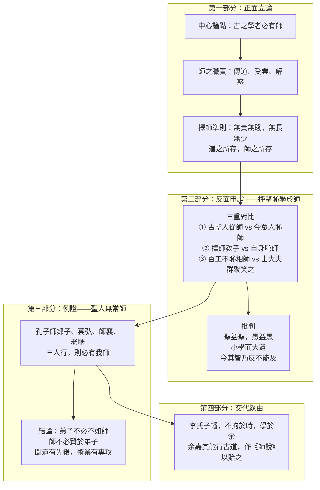

>[!NOTE]主旨
>本文說明老師的職責（傳道、受業、解惑）、從師的必要和擇師的準則（<mark>道之所存，師之所存</mark>），並以古之學者從師的行為與今之眾人恥於從師作對比，指出今人「恥學於師」的愚昧，帶出<mark>從師學習的重要性和應持的態度</mark>，提倡能者為師、不恥下問，以匡正時弊。

# 原文

古之學者必有師。師者，所以傳道、受業、解惑也。人非生而知之者，孰能無惑？惑而不從師，其為惑也終不解矣。
>古時候求學的人必定有老師。老師，是用來傳授道理、講授學業、解答疑惑的人。人不是生下來就懂得道理的，誰能沒有疑惑呢？有了疑惑卻不跟從老師學習，那些疑惑就始終無法解決了。

生乎吾前，其聞道也，固先乎吾，吾從而師之；生乎吾後，其聞道也，亦先乎吾，吾從而師之。吾師道也，夫庸知其年之先後生於吾乎？是故無貴無賤，無長無少，道之所存，師之所存也。
>出生在我之前的人，他聽聞道理本來就比我早，我跟從他，以他為師；出生在我之後的人，他聽聞道理如果也比我早，我也跟從他，以他為師。我學習的是道理，何必管他年齡比我大還是比我小呢？因此，不論地位高貴還是低賤，不論年長還是年少，道理存在的地方，就是老師存在的地方。

嗟乎！師道之不傳也久矣！欲人之無惑也難矣！古之聖人，其出人也遠矣，猶且從師而問焉；今之眾人，其下聖人也亦遠矣，而恥學於師。是故聖益聖，愚益愚，聖人之所以為聖，愚人之所以為愚，其皆出於此乎！
>唉！從師求學的風尚已經失傳很久了！想要人們沒有疑惑實在太難了！古代的聖人，他們超出一般人很遠，尚且跟從老師請教；現在的一般人，他們低於聖人也實在太遠了，卻以向老師學習為羞恥。因此，聖人就更加聖明，愚人就更加愚昧，聖人之所以成為聖人，愚人之所以成為愚人，大概都是出於這個原因吧！

愛其子，擇師而教之；於其身也，則恥師焉，惑矣！彼童子之師，授之書而習其句讀者，非吾所謂傳其道、解其惑者也。句讀之不知，惑之不解，或師焉，或不焉，小學而大遺，吾未見其明也。
>人們愛自己的孩子，選擇老師來教導他；對於自己本身，卻以從師為恥，真是糊塗啊！那些教導小孩的老師，只是教他們書本內容、學習斷句的人，並不是我所說傳授道理、解答疑惑的人。斷句不懂得，疑惑不能解決，前者願意從師學習，後者卻不願意，小的方面學習了，大的道理卻遺漏了，我看不出這種人明智的地方。

巫、醫、樂師、百工之人，不恥相師；士大夫之族，曰師、曰弟子云者，則羣聚而笑之。問之，則曰︰「彼與彼年相若也，道相似也。」位卑則足羞，官盛則近諛。嗚呼！師道之不復，可知矣。巫、醫、樂師、百工之人，君子不齒，今其智乃反不能及，其可怪也歟！
>巫師、醫師、樂師、各種工匠，不以互相學習為恥；士大夫這一類人，聽到有人稱呼「老師」、「弟子」等，就聚在一起嘲笑人家。問他們為什麼笑，就說：「某人和某人年紀差不多，學問也相近。」以地位低的人為師，就覺得很羞恥；以官位高的人為師，就覺得有諂媚的嫌疑。唉！從師學習的風尚不能恢復，由此可知了。巫師、醫師、樂師、各種工匠，士大夫們不屑與之同列，可是現在士大夫的才智竟然反而不及他們，這不是很奇怪嗎！

聖人無常師，孔子師郯子、萇弘、師襄、老聃。郯子之徒，其賢不及孔子。孔子曰︰「三人行，則必有我師。」是故弟子不必不如師，師不必賢於弟子；聞道有先後，術業有專攻，如是而已。
>聖人沒有固定的老師，孔子曾向郯子、萇弘、師襄、老聃學習。郯子這些人，他們的賢能比不上孔子。孔子說：「三個人一同走路，其中一定有可以作為我老師的人。」因此，學生不一定不如老師，老師也不一定比學生賢能；聽聞道理有先後之分，學問技藝各有專長，如此罷了。

李氏子蟠，年十七，好古文，六藝經傳，皆通習之，不拘於時，學於余。余嘉其能行古道，作《師說》以貽之。
>李家的孩子名叫蟠，年紀十七歲，喜好古文，六經的經文和傳注都通曉學習，不受當時不良風氣所拘束，來向我學習。我讚許他能實行古人從師之道，於是寫了這篇《師說》贈送給他。

# 分析

>[!TIP]原文
>古之學者必有師。師者，所以傳道、受業、解惑也。人非生而知之者，孰能無惑？惑而不從師，其為惑也終不解矣。

- 語譯：古時候求學的人必定有老師。老師，是用來傳授道理、講授學業、解答疑惑的人。人不是生下來就懂得道理的，誰能沒有疑惑呢？有了疑惑卻不跟從老師學習，那些疑惑就始終無法解決了。
- 分析：
	- 開宗明義提出全文中心論點——<mark>「古之學者必有師」</mark>。
	- 為老師的職責重新定位：<mark>傳道、受業、解惑</mark>（傳承儒家道統、講授儒家經典、解決求學及為人的困惑）。
	- 「人非生而知之者，孰能無惑」以反問帶出人皆有惑；「惑而不從師，其為惑也終不解矣」從反面說明從師的必要。
	- 「古之學者必有師。師者……」、「人非生而知之者，孰能無惑？惑而不從師……」兩組頂真句，文氣連貫，產生迴環往復之美。

---

>[!TIP]原文
>生乎吾前，其聞道也，固先乎吾，吾從而師之；生乎吾後，其聞道也，亦先乎吾，吾從而師之。吾師道也，夫庸知其年之先後生於吾乎？是故無貴無賤，無長無少，道之所存，師之所存也。

- 語譯：出生在我之前的人，聽聞道理本來就比我早，我跟從他，以他為師；出生在我之後的人，聽聞道理如果也比我早，我也跟從他，以他為師。我學習的是道理，何必管他年齡比我大還是比我小呢？因此，不論地位高貴還是低賤，不論年長還是年少，道理存在的地方，就是老師存在的地方。
- 分析：
	- 確立<mark>擇師的準則</mark>：以「聞道」先後為標準，與年紀、貴賤無關，歸結為「道之所存，師之所存」。
	- 「生乎吾前……生乎吾後……」一組對仗句，鋪排整齊；「夫庸知其年之先後生於吾乎」以反問加強語氣。

---

>[!TIP]原文
>嗟乎！師道之不傳也久矣！欲人之無惑也難矣！古之聖人，其出人也遠矣，猶且從師而問焉；今之眾人，其下聖人也亦遠矣，而恥學於師。是故聖益聖，愚益愚，聖人之所以為聖，愚人之所以為愚，其皆出於此乎！

- 語譯：唉！從師求學的風尚已經失傳很久了！想要人們沒有疑惑實在太難了！古代的聖人超出一般人很遠，尚且跟從老師請教；現在的一般人低於聖人也實在太遠了，卻以向老師學習為羞恥。因此聖人更加聖明，愚人更加愚昧，大概都是出於這個原因吧！
- 分析：
	- 慨歎師道不傳，轉入對今人恥學於師的批判，是全文由正面立論轉向反面申論的樞紐。
	- 第一重對比：<mark>古之聖人「從師而問」vs 今之眾人「恥學於師」</mark>，指出「聖益聖，愚益愚」的關鍵正在從師與否。
	- 「其皆出於此乎」以推斷語氣作結，引人深思。

---

>[!TIP]原文
>愛其子，擇師而教之；於其身也，則恥師焉，惑矣！彼童子之師，授之書而習其句讀者，非吾所謂傳其道、解其惑者也。句讀之不知，惑之不解，或師焉，或不焉，小學而大遺，吾未見其明也。

- 語譯：人們愛自己的孩子，選擇老師來教導他；對於自己本身，卻以從師為恥，真是糊塗啊！那些教導小孩的老師，只是教他們書本內容、學習斷句的人，並不是我所說傳授道理、解答疑惑的人。斷句不懂得，疑惑不能解決，前者願意從師學習，後者卻不願意，小的方面學習了，大的道理卻遺漏了，我看不出這種人明智的地方。
- 分析：
	- 第二重對比：<mark>擇師教子 vs 自身恥師</mark>，指出士大夫行為的矛盾，諷刺其「小學而大遺」的愚昧。
	- 將「童子之師」（授之書而習其句讀）與「吾所謂師」（傳其道、解其惑）區分，重新定義師的角色，把老師由普通層次提升到更高層次，立意高遠。
	- 「句讀之不知，惑之不解，或師焉，或不焉」是交錯句，句讀之不知則從師、惑之不解則不從師，兩事交錯對舉，句式奇特，出人意表，較平鋪直敘更見生動。

---

>[!TIP]原文
>巫、醫、樂師、百工之人，不恥相師；士大夫之族，曰師、曰弟子云者，則羣聚而笑之。問之，則曰︰「彼與彼年相若也，道相似也。」位卑則足羞，官盛則近諛。嗚呼！師道之不復，可知矣。巫、醫、樂師、百工之人，君子不齒，今其智乃反不能及，其可怪也歟！

- 語譯：巫師、醫師、樂師、各種工匠，不以互相學習為恥；士大夫這一類人，聽到有人稱呼「老師」、「弟子」等，就聚在一起嘲笑人家。問他們為什麼笑，就說：「某人和某人年紀差不多，學問也相近。」以地位低的人為師，就覺得很羞恥；以官位高的人為師，就覺得有諂媚的嫌疑。唉！從師學習的風尚不能恢復，由此可知了。士大夫們不屑與工匠同列，可是現在士大夫的才智竟然反而不及他們，這不是很奇怪嗎！
- 分析：
	- 第三重對比：<mark>巫、醫、樂師、百工「不恥相師」vs 士大夫「羣聚而笑之」</mark>。
	- 借士大夫之口揭出其心態：「位卑則足羞，官盛則近諛」——以地位高低決定可否從師，正是門第觀念的扭曲。
	- 「今其智乃反不能及，其可怪也歟」以驚詫語氣作結，諷刺士大夫才智反不及工匠，語氣辛辣。
	- 三重對比層次分明，以事實為根據，深刻有力地抨擊當世士大夫恥於從師的不良風氣。

---

>[!TIP]原文
>聖人無常師，孔子師郯子、萇弘、師襄、老聃。郯子之徒，其賢不及孔子。孔子曰︰「三人行，則必有我師。」是故弟子不必不如師，師不必賢於弟子；聞道有先後，術業有專攻，如是而已。

- 語譯：聖人沒有固定的老師，孔子曾向郯子、萇弘、師襄、老聃學習。郯子這些人，他們的賢能比不上孔子。孔子說：「三個人一同走路，其中一定有可以作為我老師的人。」因此，學生不一定不如老師，老師也不一定比學生賢能；聽聞道理有先後之分，學問技藝各有專長，如此罷了。
- 分析：
	- 以<mark>舉例論證</mark>：聖人孔子尚且「無常師」，師事賢能不及自己的郯子等人，證明擇師只問「聞道」，不問高下。
	- 引用孔子「三人行，則必有我師」作<mark>明引</mark>，加強說服力。
	- 歸結出「弟子不必不如師，師不必賢於弟子；聞道有先後，術業有專攻」——師生關係並非絕對，聞道先後、術業專攻才是關鍵，與「道之所存，師之所存」前後呼應。

---

>[!TIP]原文
>李氏子蟠，年十七，好古文，六藝經傳，皆通習之，不拘於時，學於余。余嘉其能行古道，作《師說》以貽之。

- 語譯：李家的孩子名叫蟠，年紀十七歲，喜好古文，六經的經文和傳注都通曉學習，不受當時不良風氣所拘束，來向我學習。我讚許他能實行古人從師之道，於是寫了這篇《師說》贈送給他。
- 分析：
	- 交代寫作緣由：以十七歲少年李蟠「不拘於時，學於余」為例，讚揚其好學尊師、能行古道。
	- 韓愈以李蟠為證，表明自己正是躬行師道者，重申師道之重要，照應文首，收結全篇。

---

# 課文結構圖

# 寫作手法表

## 1. 議論嚴謹，章法縝密

- 內容：全文四部分環環緊扣——第一部分正面指出從師的重要、師的作用和擇師準則（總綱）；第二部分從反面抨擊眾人及士大夫不從師的歪風；第三部分以孔子言行論證「弟子不必不如師」；第四部分以李蟠例證，照應文首，收結全篇。
- 分析：立論、申論、例證、收結，層層推進，結構嚴謹，中心突出。

## 2. 正反申論，善用對比

- 內容：三重對比——古之聖人「從師而問」vs 今之眾人「恥學於師」；愛子「擇師而教」vs 自身「恥師」；巫醫樂師百工「不恥相師」vs 士大夫「羣聚而笑之」。
- 分析：以事實為根據，正反對照，層次分明，深刻有力地抨擊當世士大夫恥於從師的不良風氣。

## 3. 引用古語，說服力強

- 內容：明引孔子「三人行，則必有我師」；暗引「人非生而知之者」（出自《論語·述而》「吾非生而知之者」）、「聖人無常師」（出自《論語·子張》「夫子焉不學，而亦何常師之有」）。
- 分析：無論明引或暗引，都使文章內涵更豐富，論證更有力。

## 4. 句式多變，文氣跌宕

- 內容：感歎句（「嗟乎！師道之不傳也久矣」）、推斷語氣（「其皆出於此乎」）、肯定語氣（「吾未見其明也」）、驚詫語氣（「其可怪也歟」）、交錯句（「句讀之不知，惑之不解，或師焉，或不焉」）、頂真句（「古之學者必有師。師者……」「孰能無惑？惑而不從師……」）、對仗句（「生乎吾前……生乎吾後……」「位卑則足羞，官盛則近諛」）、反問句（「孰能無惑」「夫庸知其年之先後生於吾乎」）。
- 分析：不同的句式和語調各具特點，使文章富有節奏感，增強抒情和說理的效果，盡顯作者對當世恥於從師的不滿。

# 篇章手法表

## 1. 對比

- 內容與分析：
	- 古之聖人從師而問 vs 今之眾人恥學於師：指出「聖益聖，愚益愚」的關鍵。
	- 擇師教子 vs 自身恥師：諷刺士大夫「小學而大遺」的愚昧。
	- 巫醫樂師百工不恥相師 vs 士大夫羣聚而笑之：批評士大夫才智反不及百工。
	- 三重對比，一層深於一層，從不同角度證明從師之必要與不從師之愚昧。

## 2. 引用

- 內容：明引孔子「三人行，則必有我師」；暗引「人非生而知之者」、「聖人無常師」。
- 分析：借聖人之言作證，權威性強，令論點立於不敗之地。

## 3. 頂真

- 內容：「古之學者必有師。師者，所以傳道、受業、解惑也」；「人非生而知之者，孰能無惑？惑而不從師，其為惑也終不解矣」。
- 分析：前句末字（詞）作後句開頭，文氣連貫，產生迴環往復之美。

## 4. 反問

- 內容：「人非生而知之者，孰能無惑？」「夫庸知其年之先後生於吾乎？」
- 分析：以疑問形式表達肯定意思，使感情強烈，重點突出。

## 5. 對偶

- 內容：「生乎吾前，其聞道也，固先乎吾，吾從而師之；生乎吾後，其聞道也，亦先乎吾，吾從而師之」；「位卑則足羞，官盛則近諛」；「無貴無賤，無長無少」。
- 分析：句式工整勻稱，朗讀時更具節奏感，富有氣勢。

# 文言知識

- 通假字：
	- 「受業」：受，通「授」，講授。
	- 「或不焉」：不，通「否」。
- 文言虛詞：
	- 也：師者，所以傳道、受業、解惑也（語氣助詞，多用於句末，表達肯定語氣）／師道之不傳也久矣（助詞，多用於句中，表達語氣停頓，無義）。
	- 乎：生乎吾前，其聞道也，固先乎吾（介詞，相當於「於」）／夫庸知其年之先後生於吾乎（語氣助詞，多用於句末，表達疑問，相當於「呢」）／其皆出於此乎（語氣助詞，表達推斷語氣，相當於「吧」）。

# 可混搭出題的篇章

## 學習／從師

- **本文：** 古之學者必有師；道之所存，師之所存；聞道有先後，術業有專攻。
- **相關篇章：** 《勸學》：「學不可以已」，「君子生非異也，善假於物也」——從師學習正是「善假於物」的體現，兩篇同屬儒家勸學傳統，可互相闡發。

## 聖人／不恥下問

- **本文：** 聖人無常師，孔子師郯子、萇弘、師襄、老聃；三人行，則必有我師。
- **相關篇章：** 《論仁、論孝、論君子》：「君子病無能焉，不病人之不己知也」——儒家謙虛好學、不恥下問的精神一脈相承。

## 尊師重道（文化傳統）

- **本文：** 以「傳道、受業、解惑」重新定義老師的職責，提倡尊師重道，匡正「恥學於師」的時弊。
- **相關篇章：** 可聯繫《勸學》「青，取之於藍，而青於藍」——學生可以超越老師，與「弟子不必不如師，師不必賢於弟子」互相呼應。

## 批判時弊／為文用意

- **本文：** 針對唐代士大夫「位卑則足羞，官盛則近諛」的門第風氣而作，借古諷今、匡正時弊。
- **相關篇章：** 《六國論》：蘇洵借六國破滅諷諭北宋當權者——同是以文論政、針砭時弊的篇章，可比較其論證手法。
