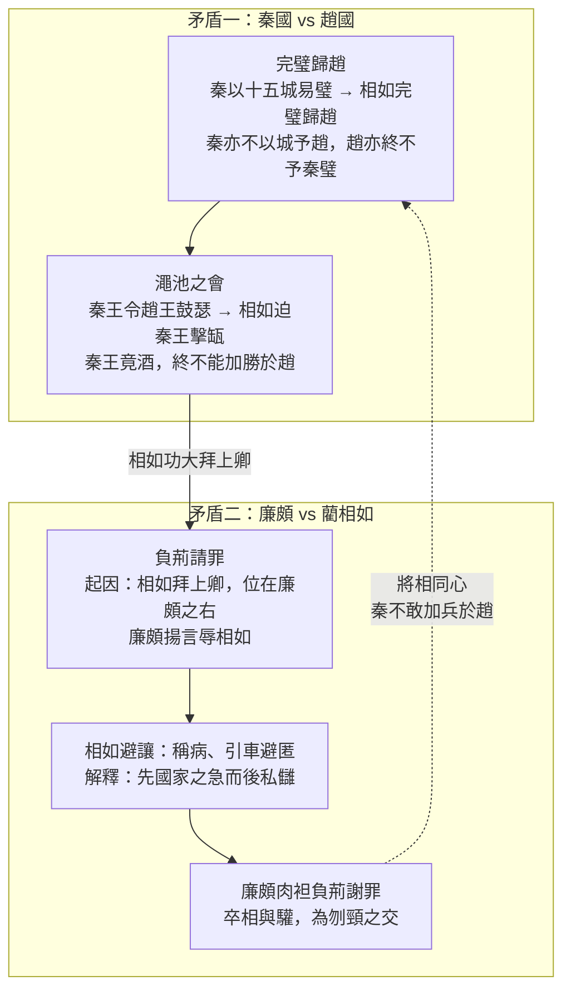

## 目錄



>[!NOTE]主旨
>本文記述「<mark>完璧歸趙</mark>」、「<mark>澠池之會</mark>」與「<mark>負荊請罪</mark>」三個故事，刻劃藺相如<mark>機智勇敢、寬宏大量、赤誠為國</mark>的忠臣形象，以及廉頗<mark>勇於改過</mark>的胸懷，表揚二人以國家為重、先公後私的愛國情操。

# 原文

## 完璧歸趙

廉頗者，趙之良將也。趙惠文王十六年，廉頗為趙將伐齊，大破之，取陽晉，拜為上卿，以勇氣聞於諸侯。藺相如者，趙人也，為趙宦者令繆賢舍人。
>廉頗，是趙國的一位優秀將領。趙惠文王十六年時，廉頗擔任趙國的將軍攻打齊國，大敗齊軍，佔領了陽晉，被封為上卿，他的勇氣在諸侯各國之間都很有名。藺相如，是趙國人，擔任趙國宦者令（管理宦官的官員）繆賢的門客。

趙惠文王時，得楚和氏璧。秦昭王聞之，使人遺趙王書，願以十五城請易璧。趙王與大將軍廉頗諸大臣謀：欲予秦，秦城恐不可得，徒見欺；欲勿予，即患秦兵之來。計未定，求人可使報秦者，未得。
>趙惠文王在位的時候，得到了楚國的「和氏璧」。秦昭王聽說了這件事，就派人送了一封信給趙王，表示願意用十五座城池來交換這塊和氏璧。趙王與大將軍廉頗及各位大臣商議這件事：如果把和氏璧給秦國，恐怕秦國的城池得不到，只是白白被欺騙；如果不給，又擔心秦國的軍隊會攻打過來。計策還沒決定，想找一個可以出使回覆秦國的人，卻沒有找到。

宦者令繆賢曰：「臣舍人藺相如可使。」王問：「何以知之？」對曰：「臣嘗有罪，竊計欲亡走燕，臣舍人相如止臣，曰：『君何以知燕王？』臣語曰：『臣嘗從大王與燕王會境上，燕王私握臣手，曰：「願結友。」以此知之，故欲往。』相如謂臣曰：『夫趙彊而燕弱，而君幸於趙王，故燕王欲結於君。今君乃亡趙走燕，燕畏趙，其勢必不敢留君，而束君歸趙矣。君不如肉袒伏斧質請罪，則幸得脫矣。』臣從其計，大王亦幸赦臣。臣竊以為其人勇士，有智謀，宜可使。」
>宦者令繆賢回答說：「我的門客藺相如可以派去。」趙王問：「你怎麼知道他可以呢？」繆賢回答說：「我曾經犯了罪，私下打算逃亡到燕國去。我的門客藺相如阻止我說：『您是憑什麼了解燕王的呢？』我告訴他說：『我曾跟隨大王在邊境上與燕王會面，燕王私下握著我的手說：「願意和您交個朋友。」我因此了解他，所以想去投靠他。』相如對我說：『趙國強大而燕國弱小，而且您又受到趙王的寵信，所以燕王才想和您結交。現在您竟然要從趙國逃到燕國去，燕國害怕趙國，情勢上必然不敢收留您，反而會把您捆綁起來送回趙國。您不如脫去上衣，趴在刑具上向大王請罪，這樣或許還有機會僥倖被赦免。』我聽從了他的計策，大王也僥倖地赦免了我。我私下認為這個人是個勇士，又有智謀，應該可以派他出使。」

於是王召見，問藺相如曰：「秦王以十五城請易寡人之璧，可予不？」相如曰：「秦彊而趙弱，不可不許。」王曰：「取吾璧，不予我城，奈何？」相如曰：「秦以城求璧而趙不許，曲在趙；趙予璧而秦不予趙城，曲在秦。均之二策，寧許以負秦曲。」王曰：「誰可使者？」相如曰：「王必無人，臣願奉璧往使。城入趙而璧留秦；城不入，臣請完璧歸趙。」趙王於是遂遣相如奉璧西入秦。
>於是趙王召見藺相如，問他說：「秦王想用十五座城來換我的和氏璧，可以給他嗎？」藺相如說：「秦國強大而趙國弱小，不能不答應。」趙王說：「他拿了我的璧，卻不給我城池，那該怎麼辦？」藺相如說：「秦國用城池來換和氏璧，而趙國不答應，那麼理虧的是趙國；趙國給了和氏璧，而秦國不給城池，那麼理虧的就是秦國。衡量這兩種策略，我們寧可答應，讓秦國去承擔理虧的責任。」趙王問：「可以派誰去呢？」藺相如回答：「如果大王實在沒有合適的人選，我願意捧著和氏璧前往。如果城池劃歸趙國，璧就留在秦國；如果城池不給趙國，我保證將和氏璧完好無缺地帶回趙國。」趙王於是就派遣藺相如捧著和氏璧向西前往秦國。

秦王坐章臺見相如，相如奉璧奏秦王。秦王大喜，傳以示美人及左右，左右皆呼萬歲。相如視秦王無意償趙城，乃前曰：「璧有瑕，請指示王。」王授璧，相如因持璧卻立，倚柱，怒髮上衝冠，謂秦王曰：「大王欲得璧，使人發書至趙王，趙王悉召羣臣議，皆曰：『秦貪，負其彊，以空言求璧，償城恐不可得。』議不欲予秦璧。臣以為布衣之交尚不相欺，況大國乎！且以一璧之故逆彊秦之驩，不可。於是趙王乃齋戒五日，使臣奉璧，拜送書於庭。何者？嚴大國之威以修敬也。今臣至，大王見臣列觀，禮節甚倨；得璧，傳之美人，以戲弄臣。臣觀大王無意償趙王城邑，故臣復取璧。大王必欲急臣，臣頭今與璧俱碎於柱矣！」
>秦王在章臺宮接見藺相如，相如捧著和氏璧獻給秦王。秦王非常高興，把璧傳給嬪妃及身邊的侍臣觀看，侍臣們都高喊「萬歲」。藺相如觀察秦王沒有交出城池的誠意，便上前說：「這塊璧上有個小瑕疵，請讓我指給大王看。」秦王便把璧交給他。藺相如於是拿著璧，退後幾步站著，靠著柱子，氣得頭髮豎立，幾乎要把帽子頂起來。他對秦王說：「大王您想得到這塊璧，派人送信給趙王。趙王召集了所有大臣商議，大家都說：『秦國貪婪，仗著自己強大，用空話來換取和氏璧，恐怕得不到他們承諾的城池。』因此商議的結果是不把璧給秦國。但我認為，即使是平民百姓之間的交往，都講求不互相欺騙，何況是堂堂大國呢！而且，怎麼可以為了一塊璧的緣故，去得罪強大的秦國呢？於是趙王便齋戒了五天，派我捧著和氏璧，在朝廷上行跪拜大禮，恭敬地送上國書。這是為什麼呢？是為了尊重您大國的威嚴，以表達我們的敬意啊。如今我到了秦國，大王您卻在普通的宮殿接見我，禮節非常傲慢；拿到璧以後，又傳給嬪妃們觀看，以此來戲弄我。我看大王您根本沒有誠意要補償趙王城池，所以我才把璧拿了回來。如果大王一定要逼迫我，我的頭現在就和這塊璧一起在柱子上撞個粉碎！」

相如持其璧睨柱，欲以擊柱。秦王恐其破璧，乃辭謝固請，召有司案圖，指從此以往十五都予趙。相如度秦王特以詐佯為予趙城，實不可得，乃謂秦王曰：「和氏璧，天下所共傳寶也。趙王恐，不敢不獻。趙王送璧時，齋戒五日，今大王亦宜齋戒五日，設九賓於廷，臣乃敢上璧。」秦王度之，終不可彊奪，遂許齋五日，舍相如廣成傳。相如度秦王雖齋，決負約不償城，乃使其從者衣褐，懷其璧，從徑道亡，歸璧於趙。
>藺相如拿著璧，斜眼看著柱子，作勢要往柱子上砸去。秦王怕他真的把璧撞破，於是連忙道歉，再三懇求他不要這麼做，並叫來主管官員查看地圖，指著地圖說要把這十五座都城劃給趙國。藺相如推測秦王只是用欺騙的手段假裝要給趙國城池，實際上是不可能得到的，於是對秦王說：「和氏璧是天下公認的寶物。趙王因為害怕，所以不敢不獻上。趙王在送出和氏璧的時候，齋戒了五天。現在大王您也應該齋戒五天，在朝廷上舉行九賓之禮（最隆重的外交禮儀），我才敢把和氏璧獻上。」秦王估量了一下，終究不能強行搶奪，於是答應齋戒五天，將藺相如安置在廣成傳賓館。藺相如料定秦王雖然答應齋戒，但最終必定會違背約定，不肯交出城池，於是就讓他的隨從穿上平民的粗布衣服，將和氏璧藏在懷裡，從隱密的小路逃走，把璧送回了趙國。

秦王齋五日後，乃設九賓禮於廷，引趙使者藺相如。相如至，謂秦王曰：「秦自繆公以來二十餘君，未嘗有堅明約束者也。臣誠恐見欺於王而負趙，故令人持璧歸，間至趙矣。且秦彊而趙弱，大王遣一介之使至趙，趙立奉璧來；今以秦之彊而先割十五都予趙，趙豈敢留璧而得罪於大王乎？臣知欺大王之罪當誅，臣請就湯鑊。唯大王與羣臣孰計議之！」秦王與羣臣相視而嘻。左右或欲引相如去，秦王因曰：「今殺相如，終不能得璧也，而絕秦趙之驩，不如因而厚遇之，使歸趙，趙王豈以一璧之故欺秦邪！」卒廷見相如，畢禮而歸之。
>秦王齋戒了五天後，便在朝廷上準備了最隆重的九賓之禮，派人邀請趙國的使者藺相如。藺相如抵達後，對秦王說：「秦國從秦繆公以來的二十多位君主，從來沒有一位是能堅守信約的。我實在是害怕被大王欺騙而辜負了趙國，所以已經派人拿著和氏璧，從祕密的小路回到趙國了。再說，秦國強大而趙國弱小，只要大王派遣一位使者到趙國去，趙國必定立刻就把和氏璧送來；現在憑藉秦國的強大，如果能先將十五座都城割讓給趙國，趙國又怎麼敢扣留和氏璧而得罪大王您呢？我知道欺騙大王的罪行理當被處死，我請求接受烹煮的酷刑。只希望大王和各位大臣仔細商議這件事！」秦王和大臣們面面相覷，都發出了驚訝又憤怒的聲音。旁邊的侍衛有人想把藺相如拉下去處斬，秦王於是說：「現在殺了藺相如，終究還是得不到和氏璧，反而斷絕了秦、趙兩國的友好關係。不如藉此機會好好款待他，讓他回到趙國去。趙王難道會為了一塊璧的緣故而欺騙秦國嗎？」最終，秦王還是在朝廷上接見了藺相如，完成了外交禮儀，然後讓他回國了。

相如既歸，趙王以為賢大夫，使不辱於諸侯，拜相如為上大夫。秦亦不以城予趙，趙亦終不予秦璧。
>藺相如回到趙國後，趙王認為他是一位賢能的大夫，出使到諸侯國之間沒有辱沒國君的使命，便任命他為上大夫。之後，秦國沒有把城池給趙國，趙國最終也沒有把和氏璧給秦國。

## 澠池之會

其後秦伐趙，拔石城。明年，復攻趙，殺二萬人。秦王使使者告趙王，欲與王為好會於西河外澠池。趙王畏秦，欲毋行。廉頗、藺相如計曰：「王不行，示趙弱且怯也。」趙王遂行，相如從。廉頗送至境，與王訣曰：「王行，度道里會遇之禮畢，還，不過三十日。三十日不還，則請立太子為王，以絕秦望。」王許之，遂與秦王會澠池。
>在這之後，秦國攻打趙國，攻下了石城。第二年，秦國再次攻打趙國，殺了兩萬人。秦王派使者告訴趙王，表示想和趙王在西河外的澠池舉行一場友好的會面。趙王害怕秦國，不想前往。廉頗和藺相如商議後說：「大王如果不去，這就向秦國顯示了趙國的軟弱和膽怯。」於是趙王決定動身前往，由藺相如陪同。廉頗送他們到邊境，向趙王告別時說：「大王這次出發，估計路程和會面禮儀完成後回來，不會超過三十天。如果三十天後您還沒回來，那就請讓我們冊立太子為王，以斷絕秦國想藉此要脅的念頭。」趙王答應了，便前往澠池與秦王會面。

秦王飲酒酣，曰：「寡人竊聞趙王好音，請奏瑟。」趙王鼓瑟。秦御史前書曰：「某年月日，秦王與趙王會飲，令趙王鼓瑟。」藺相如前曰：「趙王竊聞秦王善為秦聲，請奏盆缻秦王，以相娛樂。」秦王怒，不許。於是相如前進缻，因跪請秦王。秦王不肯擊缻。相如曰：「五步之內，相如請得以頸血濺大王矣！」左右欲刃相如，相如張目叱之，左右皆靡。於是秦王不懌，為一擊缻。相如顧召趙御史書曰：「某年月日，秦王為趙王擊缻。」秦之羣臣曰：「請以趙十五城為秦王壽。」藺相如亦曰：「請以秦之咸陽為趙王壽。」秦王竟酒，終不能加勝於趙。趙亦盛設兵以待秦，秦不敢動。
>在宴會上，秦王酒喝到暢快時，說：「我私下聽說趙王精通音律，請您彈奏一下瑟吧。」趙王便彈奏了瑟。秦國的史官上前記載說：「某年某月某日，秦王與趙王一同飲酒，命令趙王彈瑟。」藺相如上前說：「我們趙王私下聽說秦王擅長演奏秦地的音樂，請讓我們獻上瓦盆，請秦王敲擊來互相娛樂吧。」秦王很生氣，不答應。於是藺相如捧著瓦盆上前，跪下來請求秦王。秦王還是不肯敲擊。藺相如說：「在大王與我五步的距離之內，我頸中的血可以濺到大王身上！」秦王身邊的侍衛想要拔刀殺掉藺相如，藺相如睜大眼睛怒斥他們，侍衛們都被他的氣勢嚇得退縮了。在這種情況下，秦王很不高興，只好敲了一下瓦盆。藺相如回頭叫來趙國的史官記載說：「某年某月某日，秦王為趙王敲擊瓦盆。」秦國的大臣們說：「請趙國獻出十五座城池來為我們秦王祝壽。」藺相如也立刻說：「那請秦國獻出首都咸陽來為我們趙王祝壽。」直到酒宴結束，秦王始終沒能在氣勢上壓倒趙國。與此同時，趙國也在邊境陳列重兵來防備秦國，秦國終究不敢輕舉妄動。

## 負荊請罪

既罷歸國，以相如功大，拜為上卿，位在廉頗之右。廉頗曰：「我為趙將，有攻城野戰之大功，而藺相如徒以口舌為勞，而位居我上，且相如素賤人，吾羞，不忍為之下。」宣言曰：「我見相如，必辱之。」
>（澠池之會）結束後，藺相如一行人回到趙國。趙王認為藺相如的功勞非常大，便任命他為上卿，地位在廉頗之上。廉頗為此說道：「我身為趙國的大將，有攻城野戰的赫赫戰功；而藺相如只不過是憑著口才立下功勞，地位卻反而比我高。況且藺相如本是出身卑微的人，我對此感到羞恥，實在不甘心位居他的下面。」他更公開揚言：「我要是見到藺相如，一定要當眾羞辱他。」

相如聞，不肯與會。相如每朝時，常稱病，不欲與廉頗爭列。已而相如出，望見廉頗，相如引車避匿。於是舍人相與諫曰：「臣所以去親戚而事君者，徒慕君之高義也。今君與廉頗同列，廉君宣惡言而君畏匿之，恐懼殊甚，且庸人尚羞之，況於將相乎！臣等不肖，請辭去。」藺相如固止之，曰：「公之視廉將軍孰與秦王？」曰：「不若也。」相如曰：「夫以秦王之威，而相如廷叱之，辱其羣臣，相如雖駑，獨畏廉將軍哉？顧吾念之，彊秦之所以不敢加兵於趙者，徒以吾兩人在也。今兩虎共鬥，其勢不俱生。吾所以為此者，以先國家之急而後私讎也。」
>藺相如聽到這些話後，就不肯跟廉頗見面。每到上朝的時候，藺相如常常藉口生病，不想和廉頗在朝堂上爭論位階的高低。後來有一次，藺相如乘車外出，遠遠望見廉頗的車駕，他立刻命令車夫轉彎，躲進巷子裡。於是，藺相如的門客們一同進諫說：「我們之所以離開家鄉親人來侍奉您，只不過是仰慕您高尚的品德。現在您和廉頗官位相同，廉將軍公然說出羞辱您的話，您卻害怕得躲著他，恐懼得太過分了。這種事，連普通人都會感到羞愧，何況是身為將相的您呢！我們實在沒什麼才能，請讓我們辭職離開吧。」藺相如堅決地挽留他們，說：「各位認為廉頗將軍與秦王相比，哪一個比較厲害？」門客們回答：「當然比不上秦王。」藺相如說：「憑著秦王那樣的威勢，我都敢在朝廷上大聲斥責他，羞辱他的群臣。我雖然駑鈍，難道單單會害怕廉頗將軍嗎？但是我仔細思考過，強大的秦國之所以不敢出兵攻打我們趙國，只是因為有我們兩個人在啊。如今若是兩隻老虎互相爭鬥，那情勢必定是無法共存（兩敗俱傷）。我之所以這樣做，是因為把國家的危難放在前面，而把個人的恩怨仇恨放在後面啊。」

廉頗聞之，肉袒負荊，因賓客至藺相如門謝罪。曰：「鄙賤之人，不知將軍寬之至此也。」卒相與驩，為刎頸之交。
>這番話傳到了廉頗的耳中，他便脫下上衣，露出臂膀，背負著荊條（表示甘願受罰），由門客引領著，親自到藺相如的府門前謝罪。他說：「我這個鄙俗淺陋的人，真不知道將軍您竟是如此地寬宏大量啊！」最終兩人和好如初，成為了可以同生共死、情誼深厚的好朋友（刎頸之交）。

# 分析

## 完璧歸趙

>[!TIP]原文
>廉頗者，趙之良將也。……藺相如者，趙人也，為趙宦者令繆賢舍人。

- 語譯：廉頗，是趙國優秀的將領，屢立戰功，被封為上卿，以勇氣聞名諸侯；藺相如，是趙國人，只是宦者令繆賢的門客。
- 分析：
	- 開篇交代兩人身份，形成鮮明對比：廉頗地位顯赫（上卿），藺相如出身卑微（舍人），為下文「負荊請罪」中廉頗「相如素賤人」的不服埋下伏筆。

---

>[!TIP]原文
>趙惠文王時，得楚和氏璧。……計未定，求人可使報秦者，未得。

- 語譯：趙惠文王得到和氏璧，秦昭王願以十五城交換。趙王與大臣商議，給璧怕被騙，不給怕秦兵來犯，計策未定，也找不到出使的人。
- 分析：
	- 交代「完璧歸趙」的背景：秦強趙弱，趙國君臣陷於「予璧」與「不予」的兩難困境。
	- 「計未定」的「未」字、「求人可使報秦者，未得」的「未」字，顯示趙國君臣束手無策、人才難得，反襯下文藺相如的挺身而出，煉字精妙。

---

>[!TIP]原文
>宦者令繆賢曰：「臣舍人藺相如可使。」……臣竊以為其人勇士，有智謀，宜可使。

- 語譯：繆賢向趙王舉薦門客藺相如，並以自己犯罪欲逃燕、被相如勸止的往事，證明相如是勇士、有智謀，可以出使。
- 分析：
	- 以<mark>側面描寫（繆賢的轉述）</mark>先寫藺相如的智謀：他能洞悉燕王結交繆賢只因趙王寵信，分析燕國必不敢收留逃臣，可見其見事之明。
	- 由他人之口先予評價，為藺相如出場製造聲勢，是《史記》塑造人物的典型手法。

---

>[!TIP]原文
>於是王召見……相如曰：「秦以城求璧而趙不許，曲在趙；趙予璧而秦不予趙城，曲在秦。均之二策，寧許以負秦曲。」……「王必無人，臣願奉璧往使。城入趙而璧留秦；城不入，臣請完璧歸趙。」

- 語譯：趙王召見藺相如。相如分析：不許則趙國理虧，許而秦不償城則秦國理虧，衡量兩策，寧可答應而讓秦國承擔理虧之責；並自請出使，保證完璧歸趙。
- 分析：
	- 以<mark>語言描寫</mark>寫相如的智勇：趙國群臣只着眼於表面的「利」（怕城不得、怕秦兵來），相如卻能從「理」的高度分析，思慮高人一等。
	- 「寧許以負秦曲」是外交上爭取主動的妙着；「臣請完璧歸趙」立下軍令狀，顯其自信與擔當。

---

>[!TIP]原文
>秦王坐章臺見相如……相如視秦王無意償趙城，乃前曰：「璧有瑕，請指示王。」王授璧，相如因持璧卻立，倚柱，怒髮上衝冠……「大王必欲急臣，臣頭今與璧俱碎於柱矣！」

- 語譯：秦王在章臺（離宮）接見相如，態度傲慢。相如觀察秦王無意償城，便以「璧有瑕」為藉口取回璧玉，退後倚柱，怒髮衝冠，痛斥秦王，並揚言與璧同歸於盡。
- 分析：
	- 「相如<mark>視</mark>秦王無意償趙城」的「視」字，寫出相如對秦王狡詐的敏銳判斷，善用心理描寫。
	- 「璧有瑕，請指示王」是機智的取璧妙計；「怒髮上衝冠」、「持其璧睨柱，欲以擊柱」以<mark>行動描寫</mark>寫其不畏強暴、以死護璧的勇氣。
	- 怒斥秦王一段，義正詞嚴：既斥秦「負其彊，以空言求璧」，又以趙王「齋戒五日」的敬意對比秦王「禮節甚倨」的無禮，情理兼備，令秦王理屈詞窮。

---

>[!TIP]原文
>相如度秦王特以詐佯為予趙城……乃使其從者衣褐，懷其璧，從徑道亡，歸璧於趙。

- 語譯：相如估計秦王只是假意給城，便要求秦王齋戒五日、設九賓之禮；料定秦王必會負約，於是派隨從穿平民衣服，懷璧從小路逃回趙國。
- 分析：
	- 兩個「<mark>度</mark>」字寫相如對形勢的謹慎思索：他深知秦國歷來多不守約，故先以齋戒拖延，再暗中送璧回國，智謀周密。
	- 「衣褐、懷璧、從徑道亡」幾句雖短，含意豐富：化裝平民可免人注意，走小路可避開關卡，生動描摹相如的心思細密。

---

>[!TIP]原文
>相如至，謂秦王曰：「秦自繆公以來二十餘君，未嘗有堅明約束者也……臣請就湯鑊。唯大王與羣臣孰計議之！」……卒廷見相如，畢禮而歸之。

- 語譯：相如在九賓之禮上面對秦王，直斥秦國歷代君主從不守信，坦然承認已派人送璧回國，並請就湯鑊之刑，要秦王君臣仔細商議。秦王無可奈何，最終以禮相待，送他回國。
- 分析：
	- 面對秦王，相如<mark>先承認事實、後剖析利害</mark>：以「秦彊而趙弱」為據，指出若秦先割十五都，趙必不敢留璧，將責任完全推回秦國。
	- 秦王殺相如「終不能得璧」「而絕秦趙之驩」，只好「厚遇之」，可見相如早已算準秦王的盤算，膽識與智謀兼備。
	- 秦亦不以城予趙，趙亦終不予秦璧：以璧、城兩失不了了之收結，交代事件結果。

---

## 澠池之會

>[!TIP]原文
>其後秦伐趙，拔石城。明年，復攻趙，殺二萬人。秦王使使者告趙王，欲與王為好會於西河外澠池。

- 語譯：之後秦國攻趙，奪石城，又殺二萬人，然後假意約趙王在澠池友好會面。
- 分析：
	- 寥寥數語交代秦國一再加兵，點明「好會」實是鴻門宴，為趙王不欲赴會、廉頗盛設兵等情節提供依據，過渡自然。

---

>[!TIP]原文
>廉頗、藺相如計曰：「王不行，示趙弱且怯也。」趙王遂行，相如從。廉頗送至境，與王訣曰：「王行，度道里會遇之禮畢，還，不過三十日。三十日不還，則請立太子為王，以絕秦望。」

- 語譯：廉頗、藺相如認為趙王不去便顯示趙國軟弱膽怯，趙王於是赴會，相如隨行。廉頗送別時約定：三十日不還，就立太子為王，斷絕秦國要脅的念頭。
- 分析：
	- 廉頗建議立太子以絕秦望，凸顯其軍事和政治智慧，以及忠誠為國的形象；他雖未赴會，卻以「盛設兵以待秦」作後盾，一文一武，互相配合。

---

>[!TIP]原文
>秦王飲酒酣，曰：「寡人竊聞趙王好音，請奏瑟。」趙王鼓瑟。秦御史前書曰：「某年月日，秦王與趙王會飲，令趙王鼓瑟。」藺相如前曰：「趙王竊聞秦王善為秦聲，請奏盆缻秦王，以相娛樂。」……相如曰：「五步之內，相如請得以頸血濺大王矣！」……於是秦王不懌，為一擊缻。相如顧召趙御史書曰：「某年月日，秦王為趙王擊缻。」

- 語譯：宴會上秦王命趙王鼓瑟，並令秦國史官記下「秦王令趙王鼓瑟」以羞辱趙國。相如針鋒相對，請秦王擊缻，秦王不肯，相如以「五步之內，頸血濺大王」脅迫，秦王無奈擊缻，趙國史官記下「秦王為趙王擊缻」。
- 分析：
	- 秦趙雙方在澠池之會上<mark>鬥智鬥勇</mark>：秦王先以「令趙王鼓瑟」貶抑趙王，相如立即以「秦王為趙王擊缻」扳回一城，針鋒相對，寸步不讓。
	- 「五步之內，相如請得以頸血濺大王矣」以死相脅，寫相如凜然正氣；「張目叱之，左右皆靡」以行動寫其威勢，秦王左右被其氣勢所懾。
	- 秦臣請以趙十五城為秦王壽，相如即以「請以秦之咸陽為趙王壽」還以顏色，一來一往，處處壓住秦國。

---

>[!TIP]原文
>秦王竟酒，終不能加勝於趙。趙亦盛設兵以待秦，秦不敢動。

- 語譯：酒宴結束，秦王始終不能壓倒趙國；趙國又陳列重兵戒備，秦國不敢輕舉妄動。
- 分析：
	- 總結澠池之會：相如在外交上爭勝，廉頗在軍事上戒備，內外呼應，令秦國無機可乘，突出將相合力禦敵的重要。

---

## 負荊請罪

>[!TIP]原文
>既罷歸國，以相如功大，拜為上卿，位在廉頗之右。廉頗曰：「我為趙將，有攻城野戰之大功，而藺相如徒以口舌為勞，而位居我上，且相如素賤人，吾羞，不忍為之下。」宣言曰：「我見相如，必辱之。」

- 語譯：回國後，相如因功拜為上卿，位在廉頗之上。廉頗自恃戰功，認為相如只靠口舌之勞、出身卑微，不甘居其下，揚言要當眾羞辱他。
- 分析：
	- 「拜為上卿，位在廉頗之右」承接上文，開啟廉藺矛盾，過渡自然。
	- 以<mark>語言描寫</mark>呈現廉頗的心理：自恃戰功、重視名位，率直魯莽而欠缺大局觀；「宣言」二字更見其脾性火爆，與相如的冷靜形成對比。

---

>[!TIP]原文
>相如聞，不肯與會。相如每朝時，常稱病，不欲與廉頗爭列。已而相如出，望見廉頗，相如引車避匿。……藺相如固止之，曰：「公之視廉將軍孰與秦王？」……「夫以秦王之威，而相如廷叱之，辱其羣臣，相如雖駑，獨畏廉將軍哉？顧吾念之，彊秦之所以不敢加兵於趙者，徒以吾兩人在也。今兩虎共鬥，其勢不俱生。吾所以為此者，以先國家之急而後私讎也。」

- 語譯：相如處處避讓廉頗，門客不滿，相如解釋：自己連秦王都敢當廷叱責，怎會怕廉將軍？只是秦國不敢攻趙，正因有兩人同在；兩虎相鬥必兩敗俱傷，故把國家急務放在私仇之前。
- 分析：
	- 門客諫辭與相如回應構成<mark>對比襯托</mark>：門客只着眼個人顏面（「庸人尚羞之」），相如卻心繫國家大局，高下立見。
	- 「公之視廉將軍孰與秦王」以問句引入，再自問自答，層層推進，道出「<mark>先國家之急而後私讎</mark>」的高尚情操，是全文主旨所在。
	- 「兩虎共鬥，其勢不俱生」比喻貼切，說明避讓並非畏懼，而是為國忍讓，凸顯相如寬宏大量、赤誠為國。

---

>[!TIP]原文
>廉頗聞之，肉袒負荊，因賓客至藺相如門謝罪。曰：「鄙賤之人，不知將軍寬之至此也。」卒相與驩，為刎頸之交。

- 語譯：廉頗聽到相如的話，深受感動，便脫衣露背、背負荊條，由門客引領到相如門前謝罪。最終兩人相處歡洽，結為刎頸之交。
- 分析：
	- 以<mark>行動描寫</mark>寫廉頗的改過：肉袒負荊是古代最鄭重的請罪方式，顯示他知錯能改、忠厚憨直的個性。
	- 「不知將軍寬之至此也」的慚愧自責，與先前「吾羞，不忍為之下」的倨傲形成強烈對比（前倨後恭），既寫相如公而忘私，也寫廉頗勇於改過。
	- 「為刎頸之交」以生死之交作結，將相和好，故事圓滿收束。

---

# 課文結構圖

# 寫作手法表

## 1. 布局精微，結構嚴謹

- 內容：三個故事各自內容完整、能獨立成篇，又能合成一體。
- 分析：全文以兩個矛盾為軸心——秦國與趙國的矛盾（完璧歸趙、澠池之會）引發藺相如的出現與立功，繼而埋下廉頗與藺相如的矛盾（負荊請罪）；前事引發後事，層層推進，環環相扣。

## 2. 選材典型，詳略恰當

- 內容：以「完璧歸趙」、「澠池之會」、「負荊請罪」三件典型事例刻劃人物；前兩事詳寫相如的智勇愛國，對廉頗只寫幾筆。
- 分析：三件事足以全面呈現相如「對外智勇雙全、對內謙遜忍讓」的形象；廉頗筆墨雖少卻有力——「立太子以絕秦望」、「盛設兵以待秦」兩筆，已令其「以勇氣聞於諸侯」的形象具體突出，形成「藺主而廉次」的格局。

## 3. 線索分明，呼應綿密

- 內容：完璧歸趙以「秦亦不以城予趙，趙亦終不予秦璧」收束，再以「其後秦伐趙」開啟澠池之會；相如自言秦不敢攻趙「徒以吾兩人在」，呼應「盛設兵以待秦，秦不敢動」。
- 分析：事件之間的過渡巧妙自然，前後呼應，情節發展合情合理。

## 4. 人物刻劃，生動傳神

- 內容：善以典型事例、言語行動、心理活動描寫人物。
- 分析：
	- 言語描寫：「璧有瑕，請指示王」見其機智；「臣頭今與璧俱碎於柱矣」、「五步之內，相如請得以頸血濺大王矣」見其勇敢；「吾羞，不忍為之下」見廉頗重視名位。
	- 行動描寫：持璧睨柱、欲以擊柱，張目叱之，肉袒負荊，都使人物的形象如在眼前。
	- 心理描寫：「視」（相如視秦王無意償趙城）與「度」（相如度秦王特以詐佯為予趙城、度秦王雖齋決負約）兩個關鍵字，寫相如對形勢的敏銳判斷與謹慎思索。

## 5. 文筆精煉，具體深刻

- 內容：「乃使其從者衣褐，懷其璧，從徑道亡，歸璧於趙」；「計未定……未得」。
- 分析：句子雖短，含意豐富；煉字精妙，如兩個「未」字寫出趙國君臣的束手無策，反襯相如的才能。

# 篇章手法表

## 1. 對比

- 內容與分析：
	- 相如 vs 趙國群臣：群臣只着眼表面利害，相如能從「理」分析，思慮高人一等。
	- 相如對秦王 vs 對廉頗：對強秦勇武無畏、當廷叱之；對廉頗謙遜忍讓、引車避匿，全面立體呈現其形象。
	- 秦王 vs 相如：秦王恃勢凌人卻無法加勝於趙，相如智勇雙全足以震攝秦王。
	- 廉頗的前倨 vs 後恭：「吾羞，不忍為之下」vs「肉袒負荊謝罪」，既顯相如公而忘私，也顯廉頗知錯能改。

## 2. 襯托（正襯、反襯）

- 內容：趙國君臣的束手無策襯托藺相如的挺身而出（反襯）；廉頗的「盛設兵以待秦」襯托將相合力禦敵（正襯）；門客的只顧顏面襯托相如的先公後私（反襯）。
- 分析：以次要人物或相反行為烘托主要人物的品格，使形象更突出。

## 3. 比喻

- 內容：「今兩虎共鬥，其勢不俱生。」
- 分析：以兩虎相鬥比喻將相不和則兩敗俱傷，形象地說明相如避讓的原因，說理透徹。

## 4. 誇張

- 內容：「怒髮上衝冠。」
- 分析：誇飾相如的憤怒，突出其凜然不可犯的氣勢。

## 5. 借代

- 內容：「布衣之交」（布衣借代平民）；「徒以口舌為勞」（口舌借代言辭）；「臣請就湯鑊」（湯鑊借代酷刑）。
- 分析：以具體事物代替抽象概念，語言生動精煉。

# 文言知識

- 一字多義：
	- 從：臣嘗從大王與燕王會境上（跟從）／臣從其計（聽從）／指從此以往十五都予趙（由）。
	- 負：寧許以負秦曲（負上）／負其彊（倚仗）／決負約不償城（違背）／臣誠恐見欺於王而負趙（辜負）／肉袒負荊（以肩背負）。
	- 顧：相如顧召趙御史書曰（回頭望）／顧吾念之（只是）。
	- 因：相如因持璧卻立（於是）／不如因而厚遇之（藉此）／因賓客至藺相如門謝罪（經由）。
- 通假字：
	- 可予不（不，通「否」）；臣願奉璧往使（奉，通「捧」）；夫趙彊而燕弱（彊，同「強」）；逆彊秦之驩（驩，同「歡」）；拜送書於庭（庭，通「廷」）；召有司案圖（案，通「按」）；孰計議之（孰，通「熟」）；欺秦邪（邪，通「耶」）；私讎（讎，通「仇」）。
- 詞類活用：
	- 臣舍人藺相如可使（使，動詞，出使）；臣語曰（語，動詞，告訴）；舍相如廣成傳（舍，動詞，安置）；衣褐（衣，動詞，穿着）；左右欲刃相如（刃，動詞，用刀刺）；為秦王壽（壽，動詞，祝壽）。

# 可混搭出題的篇章

## 愛國／忠臣

- **本文：** 藺相如智勇雙全、赤誠為國，先國家之急而後私讎；廉頗忠誠為國，勇於改過。
- **相關篇章：** 《出師表》：諸葛亮鞠躬盡瘁，忠於先帝與後主，以興復漢室為己任——同是忠臣形象的典範。

## 以大局為重／先公後私

- **本文：** 藺相如為國家忍讓廉頗，「徒以吾兩人在也」。
- **相關篇章：** 《岳陽樓記》：「居廟堂之高，則憂其民；處江湖之遠，則憂其君」——同是以天下為己任、不計個人得失的胸襟。

## 知錯能改

- **本文：** 廉頗聞相如之言，肉袒負荊，登門謝罪，為刎頸之交。
- **相關篇章：** 《論仁、論孝、論君子》：「過則勿憚改」——廉頗正是「過而能改」的具體實踐。

