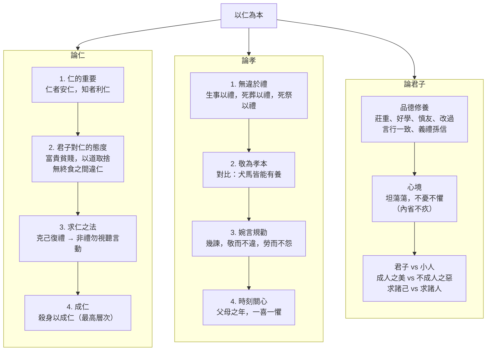

## 目錄



>[!NOTE]主旨  
>本篇輯錄《論語》中與「仁」、「孝」、「君子」相關的條目：闡述<mark>仁的總綱、細目和行仁之法</mark>；說明<mark>行孝的應有態度和表現</mark>；以及指出<mark>君子的品德、修為，君子與小人之別</mark>。

## 原文

### 論仁

子曰：「不仁者，不可以久處約，不可以長處樂。仁者安仁，知者利仁。」（《里仁》第四）
>孔子說：「沒有仁德的人，沒有辦法長期處在窮困的環境中（會受不了而胡作非為），也沒有辦法長期處在安樂的環境中（會得意忘形而驕奢淫逸）。有仁德的人，很自然地安於實行仁德；有智慧的人，則是因為知道仁德的好處而去實行它。」

子曰：「富與貴，是人之所欲也；不以其道得之，不處也。貧與賤，是人之所惡也；不以其道得之，不去也。君子去仁，惡乎成名？君子無終食之間違仁，造次必於是，顛沛必於是。」（《里仁》第四）
>孔子說：「財富和高貴的地位，是人們都想要的；但如果不是用正當的方法得到它，君子是不會接受的。貧窮和卑賤的地位，是人們都討厭的；但如果不是用正當的方法來擺脫它，君子是不會逃避的。君子如果捨棄了仁德，還怎麼能成就君子的名聲呢？所以君子在任何時候，即使是吃一頓飯那麼短的時間，也不會違背仁德；在匆忙倉促的時候必定堅守著仁，在困頓潦倒的時候也必定堅守著仁。」

顏淵問仁。子曰：「克己復禮為仁。一日克己復禮，天下歸仁焉。為仁由己，而由人乎哉？」（《顏淵》第十二）
>顏淵請問什麼是「仁」。孔子說：「能夠克制自己的私慾，使言行都回歸到禮的規範上，這就是仁。一旦做到了克己復禮，天下的人都會稱許他是有仁德的人。實踐仁德要靠自己，難道是靠別人嗎？」

顏淵曰：「請問其目。」子曰：「非禮勿視，非禮勿聽，非禮勿言，非禮勿動。」顏淵曰：「回雖不敏，請事斯語矣。」
>顏淵說：「請問實踐的具體條目是什麼？」孔子說：「不合於禮的不要看，不合於禮的不要聽，不合於禮的不要說，不合於禮的不要動。」顏淵說：「我（顏回）雖然不夠聰明，但我會努力遵照這些話去實踐。」

子曰：「志士仁人，無求生以害仁，有殺身以成仁。」（《衞靈公》第十五）
>孔子說：「有志向、有仁德的人，絕對不會為了苟且偷生而損害仁德，反而會在必要時犧牲自己的生命來成全仁德。」

### 論孝

孟懿子問孝。子曰：「無違。」（《為政》第二）
>孟懿子問如何是孝。孔子說：「不要違背禮節。」

樊遲御，子告之曰：「孟孫問孝於我，我對曰，無違。」樊遲曰：「何謂也？」子曰：「生，事之以禮；死，葬之以禮，祭之以禮。」
>樊遲替孔子駕車，孔子告訴他說：「孟孫問我盡孝之道，我回答說，不要違背禮節。」樊遲說：「這是甚麼意思呢？」孔子說：「父母健在時，依規定的禮節侍奉他們；父母去世，依規定的禮節安葬他們、祭祀他們。」

子游問孝。子曰：「今之孝者，是謂能養。至於犬馬，皆能有養；不敬，何以別乎！」（《為政》第二）
>孔子說：「現在所謂的孝子，只說能事奉供養父母。至於狗、馬，都能夠得到食物來飼養，如果對父母不敬，這跟飼養狗、馬有甚麼分別呢？」

子曰：「事父母幾諫，見志不從，又敬不違，勞而不怨。」（《里仁》第四）
>孔子說：「侍奉父母，如果父母有不對的地方，要婉言勸諫；看到自己的規勸沒有獲得父母接納，仍要恭敬地對待他們，不冒犯他們；因多次勸諫父母而勞苦，但不會怨恨。」

子曰：「父母之年，不可不知也。一則以喜，一則以懼。」（《里仁》第四）
>孔子說：「父母的年齡，不能夠不時時刻刻記掛心上。一方面因父母長壽而高興，一方面因父母年事已高而恐懼。」

### 論君子

子曰：「君子不重則不威；學則不固。主忠信。無友不如己者。過則勿憚改。」（《學而》第一）
>孔子說：「君子如果不莊重，就沒有威儀；學習的知識也就不會牢固。為人處事應以忠誠和信實為主要原則。不要結交品德不如自己的人。有了過錯，就不要害怕改正。」

子曰：「君子坦蕩蕩，小人長戚戚。」（《述而》第七）
>孔子說：「君子心胸寬廣，神態安詳；小人則經常憂心忡忡，斤斤計較。」

司馬牛問君子。子曰：「君子不憂不懼。」曰：「不憂不懼，斯謂之君子已乎？」子曰：「內省不疚，夫何憂何懼？」（《顏淵》第十二）
>司馬牛問什麼是君子。孔子說：「君子不憂愁，不恐懼。」司馬牛說：「不憂愁，不恐懼，這樣就能稱得上是君子了嗎？」孔子說：「反省自己的內心，如果問心無愧，那還有什麼好憂愁、好恐懼的呢？」

子曰：「君子成人之美，不成人之惡。小人反是。」（《顏淵》第十二）
>孔子說：「君子樂於成全別人的好事，不助長別人的壞事。小人的作為則與此完全相反。」

子曰：「君子恥其言而過其行。」（《憲問》第十四）
>孔子說：「君子為自己說的話超過了自己所做的事而感到羞恥。」（意即君子認為言過其實是可恥的。）

子曰：「君子義以為質，禮以行之，孫以出之，信以成之。君子哉！」（《衞靈公》第十五）
>孔子說：「君子以道義作為根本，用禮節來實踐它，用謙遜的言辭來表達它，用誠信的態度來完成它。這樣才真是個君子啊！」

子曰：「君子病無能焉，不病人之不己知也。」（《衞靈公》第十五）
>孔子說：「君子只擔心自己沒有才能，不擔心別人不知道自己（的才能）。」

子曰：「君子求諸己，小人求諸人。」（《衞靈公》第十五）
>孔子說：「君子要求的是自己，小人要求的是別人。」（意指君子凡事反躬自省，檢討自己；小人則只會苛求他人，諉過於人。）

## 分析

### 論仁

>[!TIP]原文  
>子曰：「不仁者，不可以久處約，不可以長處樂。仁者安仁，知者利仁。」

- 語譯：沒有仁德的人，沒有辦法長期處在窮困的環境中，也沒有辦法長期處在安樂的環境中。有仁德的人，很自然地安於實行仁德；有智慧的人，則是因為知道仁德的好處而去實行它。
- 分析：
	- 闡述「仁」的重要，指出仁者和智者對仁的不同態度。
	- <mark>仁者安仁</mark>：仁者實行仁德便心安，不實行仁德便不安，故安於行仁，這是發自內心的道德自覺。
	- <mark>知者利仁</mark>：智者認識到仁德對他有長遠而巨大的利益，故願意實行仁德，這是基於理性的判斷。
	- 對比仁者、智者兩種行仁的動機，說明無論內在自覺或理智抉擇，都應以仁為依歸。

---

>[!TIP]原文  
>子曰：「富與貴，是人之所欲也；不以其道得之，不處也。貧與賤，是人之所惡也；不以其道得之，不去也。君子去仁，惡乎成名？君子無終食之間違仁，造次必於是，顛沛必於是。」

- 語譯：財富和高貴的地位，是人們都想要的；但如果不是用正當的方法得到它，君子是不會接受的。貧窮和卑賤的地位，是人們都討厭的；但如果不是用正當的方法來擺脫它，君子是不會逃避的。君子如果捨棄了仁德，還怎麼能成就君子的名聲呢？所以君子即使吃一頓飯那麼短的時間，也不會違背仁德；在匆忙倉促的時候必定堅守著仁，在困頓潦倒的時候也必定堅守著仁。
- 分析：
	- 闡述君子對「富貴」、「貧賤」應有的態度：取捨都要合乎正道（「義」），否則寧可不受、不去。
	- 「君子去仁，惡乎成名」以反問指出：離開仁德便不成其為君子，可見仁是君子的根本。
	- 強調君子<mark>時刻實踐仁德，片刻不離</mark>：無論在倉卒匆忙（造次）還是困頓挫折（顛沛）之際，都與仁同在。

---

>[!TIP]原文  
>顏淵問仁。子曰：「克己復禮為仁。一日克己復禮，天下歸仁焉。為仁由己，而由人乎哉？」顏淵曰：「請問其目。」子曰：「非禮勿視，非禮勿聽，非禮勿言，非禮勿動。」

- 語譯：顏淵請問什麼是「仁」。孔子說：「克制自己的私慾，使言行都回歸到禮的規範上，這就是仁。一旦做到了克己復禮，天下的人都會稱許他是有仁德的人。實踐仁德要靠自己，難道是靠別人嗎？」顏淵問實踐的具體條目，孔子說：「不合於禮的不要看，不合於禮的不要聽，不合於禮的不要說，不合於禮的不要動。」
- 分析：
	- 點出<mark>求仁之方：「克己復禮」</mark>，即克制一己私欲，使視、聽、言、動都合於禮，這是「仁」的總綱。
	- 「為仁由己，而由人乎哉」以反問強調行仁全靠自己的道德實踐，不假外求。
	- 「非禮勿視，非禮勿聽，非禮勿言，非禮勿動」是「克己復禮」的<mark>細目</mark>，以排比句式具體說明實踐方法。
	- 本章採「領起分述」結構：先領出關鍵詞「克己復禮」，下文再就着它逐一解釋，論述對象明確。

---

>[!TIP]原文  
>子曰：「志士仁人，無求生以害仁，有殺身以成仁。」

- 語譯：有志向、有仁德的人，絕對不會為了苟且偷生而損害仁德，反而會在必要時犧牲自己的生命來成全仁德。
- 分析：
	- 講「成仁」，是仁德修養的<mark>最高層次</mark>：為了成全仁德，有時要作出犧牲，甚至獻出生命。
	- 「求生以害仁」與「殺身以成仁」對舉，以對偶句式突出仁重於生的價值觀。
	- 綜合論仁四章：仁者安貧處樂，無失本心，無時無刻堅持實踐仁德，不因求生而害仁，反能殺身成仁。

---

### 論孝

>[!TIP]原文  
>孟懿子問孝。子曰：「無違。」樊遲御，子告之曰：「孟孫問孝於我，我對曰，無違。」樊遲曰：「何謂也？」子曰：「生，事之以禮；死，葬之以禮，祭之以禮。」

- 語譯：孟懿子問如何是孝。孔子說：「不要違背禮節。」樊遲替孔子駕車，孔子告訴他說：「孟孫問我盡孝之道，我回答說，不要違背禮節。」樊遲問是甚麼意思，孔子說：「父母健在時，依規定的禮節侍奉他們；父母去世，依規定的禮節安葬他們、祭祀他們。」
- 分析：
	- 論「孝」與「禮」的關係：<mark>無違於禮就是孝</mark>。
	- 「生，事之以禮；死，葬之以禮，祭之以禮」：對待父母的生與死，都依禮而行，始終如一。
	- 本章同樣是「領起分述」：先以「無違」領起，再透過孔子對樊遲的解說闡述其內涵。

---

>[!TIP]原文  
>子游問孝。子曰：「今之孝者，是謂能養。至於犬馬，皆能有養；不敬，何以別乎！」

- 語譯：孔子說：「現在所謂的孝子，只說能事奉供養父母。至於狗、馬，都能夠得到食物來飼養，如果對父母不敬，這跟飼養狗、馬有甚麼分別呢？」
- 分析：
	- 指出<mark>「敬」是孝最重要的表現</mark>：孝不止是物質上的供養，更要發自內心的尊敬。
	- 以飼養犬馬與侍奉父母作對比：若供養父母而無敬意，便與飼養犬馬無異，有力地突顯「敬」的關鍵。
	- 以反問「何以別乎」收結，語氣強烈，發人深省。

---

>[!TIP]原文  
>子曰：「事父母幾諫，見志不從，又敬不違，勞而不怨。」

- 語譯：侍奉父母，如果父母有不對的地方，要婉言勸諫；看到自己的規勸沒有獲得父母接納，仍要恭敬地對待他們，不冒犯他們；因多次勸諫父母而勞苦，但不會怨恨。
- 分析：
	- 論盡孝時面對父母過失的應有態度：要<mark>婉轉規勸（幾諫）</mark>，不能一味順從，也不可激烈冒犯。
	- 即使父母不接納勸諫，仍要恭敬不違、勞而不怨，可見孝道的堅持與包容。

---

>[!TIP]原文  
>子曰：「父母之年，不可不知也。一則以喜，一則以懼。」

- 語譯：父母的年齡，不能夠不時時刻刻記掛心上。一方面因父母長壽而高興，一方面因父母年事已高而恐懼。
- 分析：
	- 論孝的另一表現：要將父母時刻記在心上，關心他們的年紀。
	- 「一則以喜，一則以懼」：既為父母長壽而高興，也為他們逐漸衰老而憂懼，對偶句式寫出複雜而真摯的情感。
	- 綜合論孝四章，行孝的表現包括：事親而不違禮（生事以禮、死葬以禮、死祭以禮）；對父母心懷敬意；父母有過失必委婉規勸；對父母時刻關心。

---

### 論君子

>[!TIP]原文  
>子曰：「君子不重則不威；學則不固。主忠信。無友不如己者。過則勿憚改。」

- 語譯：君子如果不莊重，就沒有威儀；學習的知識也就不會牢固。為人處事應以忠誠和信實為主要原則。不要結交品德不如自己的人。有了過錯，就不要害怕改正。
- 分析：
	- 提出君子應有的<mark>四種品德</mark>：莊重威嚴、認真學習、慎擇朋友、過而能改。
	- 「無友不如己者」有兩解：一是不會跟不及自己的人交朋友（以勝己者為學習對象）；一是不會跟與自己不同道的人交朋友。
	- 「過則勿憚改」體現君子知過能改、勇於改過的修養。

---

>[!TIP]原文  
>子曰：「君子坦蕩蕩，小人長戚戚。」

- 語譯：君子心胸寬廣，神態安詳；小人則經常憂心忡忡，斤斤計較。
- 分析：
	- 以<mark>對偶句對比君子與小人的心境</mark>：君子心胸舒坦寬廣，小人則經常局促憂愁。
	- 「坦蕩蕩」、「長戚戚」疊字相對，音節鏗鏘，形象鮮明。

---

>[!TIP]原文  
>司馬牛問君子。子曰：「君子不憂不懼。」曰：「不憂不懼，斯謂之君子已乎？」子曰：「內省不疚，夫何憂何懼？」

- 語譯：司馬牛問什麼是君子。孔子說：「君子不憂愁，不恐懼。」司馬牛說：「不憂愁，不恐懼，這樣就能稱得上是君子了嗎？」孔子說：「反省自己的內心，如果問心無愧，那還有什麼好憂愁、好恐懼的呢？」
- 分析：
	- 君子的「不憂不懼」並非無知無覺，而是因為行事光明磊落、<mark>自我反省而問心無愧</mark>。
	- 「內省不疚，夫何憂何懼」以反問收結，語氣肯定。

---

>[!TIP]原文  
>子曰：「君子成人之美，不成人之惡。小人反是。」

- 語譯：君子樂於成全別人的好事，不助長別人的壞事。小人的作為則與此完全相反。
- 分析：
	- 論君子與小人在待人之別：君子成全別人的好事，小人卻促成別人的壞事。
	- 末句「小人反是」一語點破，對比鮮明。

---

>[!TIP]原文  
>子曰：「君子恥其言而過其行。」

- 語譯：君子為自己說的話超過了自己所做的事而感到羞恥。
- 分析：
	- 論君子應少說話、多做事，以「說得多、做得少」為恥，強調<mark>言行一致</mark>。

---

>[!TIP]原文  
>子曰：「君子義以為質，禮以行之，孫以出之，信以成之。君子哉！」

- 語譯：君子以道義作為根本，用禮節來實踐它，用謙遜的言辭來表達它，用誠信的態度來完成它。
- 分析：
	- 概括君子處事的完整原則：以「義」為本質，依「禮」實行，以謙遜的言語（孫，通「遜」）表達，用誠信完成。
	- 四句結構整齊，層層推進，末以「君子哉」讚歎作結，情感充沛。

---

>[!TIP]原文  
>子曰：「君子病無能焉，不病人之不己知也。」

- 語譯：君子只擔心自己沒有才能，不擔心別人不知道自己（的才能）。
- 分析：
	- 君子愧於自己沒有能力，卻不埋怨別人不了解自己，體現君子<mark>嚴以律己、專注進德</mark>的修養。

---

>[!TIP]原文  
>子曰：「君子求諸己，小人求諸人。」

- 語譯：君子要求的是自己，小人要求的是別人。
- 分析：
	- 論君子與小人之別：君子凡事反躬自省，檢討自己；小人則只會苛求他人，諉過於人。
	- 綜合論君子八章：君子處事莊重認真，知錯能改；為人謙遜誠實，言行一致，堅守禮義；律己以嚴，時加反省；待人以寬，成人之美；內心坦蕩舒泰，不憂不懼。

---

## 課文結構圖

## 寫作手法表

### 1. 語錄體

- 內容：本篇以語錄和對話形式寫成，輯錄孔子及其弟子的言行。
- 分析：所載對話生動真實，富現場感，可信度高，令讀者如親聞孔子教誨。人物形象鮮明，如顏淵的謙遜好學（「回雖不敏，請事斯語矣」）、司馬牛的追問質疑。

### 2. 領起分述

- 內容：「顏淵問仁。子曰：『克己復禮為仁。』」下文就「克己復禮」進行解釋；「孟懿子問孝。子曰：『無違。』」下文即闡述甚麼是「無違」。
- 分析：先引領出關鍵詞語，再進行論述，論述對象明確，一目了然，使讀者容易掌握。

### 3. 文字簡煉，言簡意賅

- 內容：每章文字不多，但內涵豐富，如「君子坦蕩蕩，小人長戚戚」一句已寫出君子、小人截然不同的心境。
- 分析：語言精煉，以最少的文字表達深刻道理，體現《論語》「微言大義」的特色。

## 篇章手法表

### 1. 對偶

- 內容：
	- 無求生以害仁，有殺身以成仁。
	- 君子坦蕩蕩，小人長戚戚。
	- 生，事之以禮；死，葬之以禮，祭之以禮。
	- 一則以喜，一則以懼。
	- 君子成人之美，不成人之惡。
	- 君子求諸己，小人求諸人。
- 分析：句式整齊對稱，增強文字的對稱美及節奏感，突出對比雙方，令觀點鮮明。

### 2. 排比

- 內容：非禮勿視，非禮勿聽，非禮勿言，非禮勿動。
- 分析：四句結構相同，一氣呵成，具體說明「克己復禮」的細目，增強氣勢。

### 3. 反問

- 內容：君子去仁，惡乎成名？／為仁由己，而由人乎哉？／內省不疚，夫何憂何懼？
- 分析：以疑問形式表達肯定意思，語氣強烈，加強說服力。

### 4. 對比

- 內容：
	- 君子對「富與貴」和「貧與賤」應有態度的對比。
	- 「今之孝者，是謂能養。至於犬馬，皆能有養；不敬，何以別乎」中飼養犬馬與侍奉父母的對比。
	- 「君子成人之美，不成人之惡。小人反是」中君子與小人操行的對比。
	- 「君子求諸己」與「小人求諸人」的對比。
- 分析：以對比說理是《論語》的特點，通過正反、相對的事物互相映照，讓讀者更了解孔子的主張。

## 文言知識

- 通假字：
	- 「知者利仁」：知，通「智」，智慧。
	- 「孫以出之」：孫，通「遜」，謙遜。
- 一字多義：
	- 處：不可以久處約（處於、居於）／不以其道得之，不處也（接受）。
	- 惡：貧與賤，是人之所惡也（厭惡，動詞）／君子去仁，惡乎成名（怎麼、如何，疑問詞）。
	- 養：是謂能養（供養）／皆能有養（飼養）。
	- 固：學則不固（鞏固／固陋，兩解）。
	- 如：無友不如己者（及、類似，或解作不同道）。

## 可混搭出題的篇章

### 憂樂觀／君子心境

- **本文：** 君子坦蕩蕩，不憂不懼；內省不疚，夫何憂何懼。
- **相關篇章：** 《岳陽樓記》：「古仁人」不以物喜，不以己悲，先天下之憂而憂，後天下之樂而樂——兩種「不以得失動心」的修養境界。

### 志士仁人／捨生取義

- **本文：** 志士仁人，無求生以害仁，有殺身以成仁。
- **相關篇章：** 《魚我所欲也》：生與義不可兼得，捨生而取義——面對生死抉擇時，兩者同樣以道義為先。

### 義利之辨

- **本文：** 富與貴，不以其道得之，不處也；君子義以為質。
- **相關篇章：** 《魚我所欲也》：萬鍾則不辯禮義而受之，為宮室之美、妻妾之奉、所識窮乏者得我而失其本心——同是辨析義與利的取捨。

### 學習

- **本文：** 學則不固；主忠信。
- **相關篇章：** 《勸學》：「學不可以已」，博學而日參省乎己；《師說》：「古之學者必有師」——儒家重視學習修養的傳統一脈相承。

## 附錄：EDB 賞析  

教育局官方賞析 PDF（原文、注釋、作者簡介、背景資料、賞析重點）。  

[KS4_03.pdf](https://www.edb.gov.hk/attachment/tc/curriculum-development/kla/chi-edu/recommended-passages/KS4_03.pdf)  

官方頁面：[建議篇章配套資料 第四學習階段](https://www.edb.gov.hk/tc/curriculum-development/kla/chi-edu/key-stage4.html)  

最後檢查日期：02/09/2026（每月自動檢查更新）
