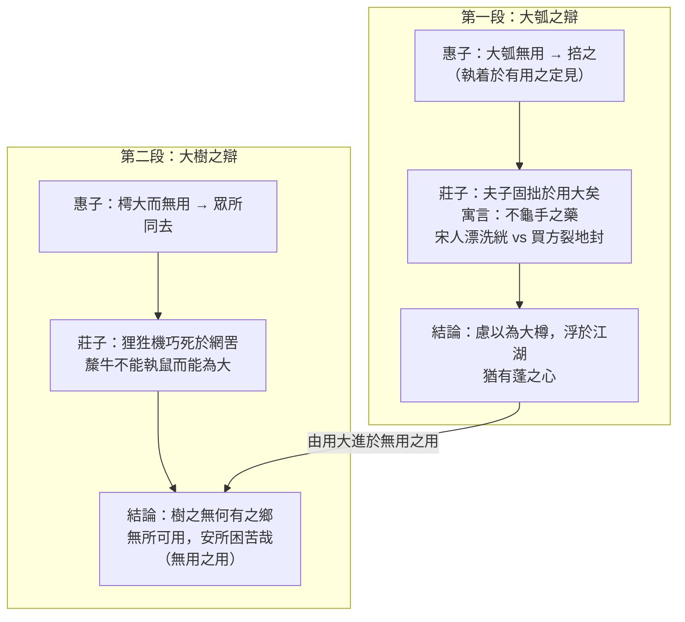

## 目錄



>[!NOTE]主旨  
>本文節錄自《莊子‧逍遙遊》，透過莊子與惠子關於「大瓠」和「大樹」的兩次辯論，批評惠子執着於「有用無用」的定見而<mark>拙於用大</mark>，帶出<mark>「無用之用」</mark>的道理：要破除成心定見，順應自然，靈活變通，才能全身遠害，獲得精神上的逍遙自在。

## 原文

惠子謂莊子曰：「魏王貽我大瓠之種，我樹之成而實五石。以盛水漿，其堅不能自舉也。剖之以為瓢，則瓠落無所容。非不呺然大也，吾為其無用而掊之。」莊子曰：「夫子固拙於用大矣！宋人有善為不龜手之藥者，世世以洴澼絖為事。客聞之，請買其方百金。聚族而謀曰：『我世世為洴澼絖，不過數金；今一朝而鬻技百金，請與之。』客得之，以說吳王。越有難，吳王使之將，冬與越人水戰，大敗越人，裂地而封之。能不龜手一也；或以封，或不免於洴澼絖，則所用之異也。今子有五石之瓠，何不慮以為大樽而浮於江湖，而憂其瓠落無所容，則夫子猶有蓬之心也夫！」
>惠子對莊子說：「魏王送給我大葫蘆的種子，我種植它，結成的果實有五石之大。用它盛水漿，它的質地不夠堅硬，無法把它拿起來。把它剖開做瓢，卻又大又平淺，容不下東西。不是它不夠虛空巨大，而是我因為它沒有用處，就把它打碎了。」莊子說：「先生實在不善於利用大的東西啊！宋國有人善於製造使手不龜裂的藥，世世代代以漂洗棉絮為業。有個客人聽說了，願意用百金買他的藥方。他聚集族人商量說：『我們世世代代漂洗棉絮，所得不過數金；現在一旦賣出藥方就可以獲得百金，就賣給他吧。』客人得到了藥方，便去遊說吳王。越國入侵，吳王派他領兵，冬天與越人水戰，大敗越人，吳王便割地封賞他。同樣是一條使手不龜裂的藥方，有人因此獲得封賞，有人卻只免不了漂洗棉絮，這是因為用法不同的緣故啊。現在你有五石大的葫蘆，為什麼不考慮把它繫在腰間當作腰舟，浮游於江湖之上，卻要憂慮它大而無處容納呢？可見先生的心思還是閉塞不通啊！」

惠子謂莊子曰：「吾有大樹，人謂之樗；其大本擁腫而不中繩墨，其小枝卷曲而不中規矩。立之塗，匠者不顧。今子之言，大而無用，眾所同去也。」莊子曰：「子獨不見狸狌乎？卑身而伏，以候敖者；東西跳梁，不辟高下，中於機辟，死於罔罟。今夫斄牛，其大若垂天之雲；此能為大矣，而不能執鼠。今子有大樹，患其無用，何不樹之於無何有之鄉，廣莫之野，彷徨乎無為其側，逍遙乎寢卧其下；不夭斤斧，物無害者。無所可用，安所困苦哉？」
>惠子對莊子說：「我有一棵大樹，人們叫它做『樗』；它的樹幹盤結腫大，不合繩墨，小枝彎彎曲曲，不合規矩。生長在路上，木匠也不屑一顧。現在您的言論，大而無用，是大家都會離棄的。」莊子說：「你難道沒有見過野貓和黃鼠狼嗎？牠們卑伏着身子，等待出遊的小動物；東西跳躍，不避高低，卻踏中了捕獸的機關，死在羅網之中。再說那斄牛，牠的身軀大得像垂在天邊的雲；這算是能擔當大事了，卻不能捕捉老鼠。現在你有大樹，卻擔憂它沒有用處，為什麼不把它種在虛無的鄉土、廣闊的曠野上，隨意地在樹旁徜徉，自在地在樹下躺卧？它不會遭受斧頭砍伐，也沒有東西來侵害它。它沒有什麼用處，又有什麼艱難困苦呢？」

## 分析

>[!TIP]原文  
>惠子謂莊子曰：「魏王貽我大瓠之種……吾為其無用而掊之。」

- 語譯：惠子得到大葫蘆的種子，種出的葫蘆有五石之大，盛水不堅、剖瓢無用，便因它無用而把它打碎。
- 分析：
	- 惠子以「大瓠無用」為喻，暗諷莊子的言論大而無用，帶出「有用與無用」的辯題。
	- 惠子執着於「有用」的定見，只懂把大瓠當盛器、瓢用，卻不知因物之性而用其大，可見其「拙於用大」。

---

>[!TIP]原文  
>莊子曰：「夫子固拙於用大矣！宋人有善為不龜手之藥者……則所用之異也。」

- 語譯：莊子指出惠子不善於用大，並講述宋人賣「不龜手之藥」的故事：同一藥方，宋人只用來漂洗棉絮，客人買去獻給吳王，助吳國水戰大勝越軍，獲裂地封賞。
- 分析：
	- 以「不龜手之藥」的寓言說明：同一事物，用法不同，效果迥異——宋人「世世以洴澼絖為事，不過數金」，買方卻「裂地而封之」，一拙一巧，對比強烈。
	- 對話中再加插對話（宋人「聚族而謀」），寫出宋人鄭重其事卻只換百金，凸顯其「拙於用大」，增加故事的現場感與趣味。

---

>[!TIP]原文  
>今子有五石之瓠，何不慮以為大樽而浮於江湖，而憂其瓠落無所容，則夫子猶有蓬之心也夫！

- 語譯：莊子建議惠子把大瓠繫在腰間當腰舟，浮游江湖；惠子憂慮它無處容納，是因為心思閉塞不通。
- 分析：
	- 莊子提出善用大瓠之法——「以為大樽而浮於江湖」，順應大瓠「大而虛」的特性，令「無用」之物轉為「大用」。
	- 「有蓬之心」斥惠子心思如蓬草般閉塞迂曲，不能變通，呼應「拙於用大」之評。

---

>[!TIP]原文  
>惠子謂莊子曰：「吾有大樹，人謂之樗……今子之言，大而無用，眾所同去也。」

- 語譯：惠子以「樗」樹自況其言：樹幹盤結不合繩墨，小枝卷曲不合規矩，木匠不屑一顧，大而無用，人人離棄。
- 分析：
	- 惠子再以「樗」樹比喻莊子的言論大而無用，把辯論推進一層：由「物之無用」轉為「言之無用」。

---

>[!TIP]原文  
>莊子曰：「子獨不見狸狌乎？……今夫斄牛，其大若垂天之雲；此能為大矣，而不能執鼠。」

- 語譯：莊子反駁：野貓、黃鼠狼機巧跳躍，卻死於羅網；斄牛身大如垂天之雲，不能捕鼠，卻能擔當大事。
- 分析：
	- 以「狸狌」與「斄牛」作對比：狸狌機巧而終死於網罟，比喻自恃小聰明者反遭禍患；斄牛「不能執鼠」卻「能為大」，比喻看似無用之物實有大用。
	- 指出「有用」的限制與危險、「無用」的平安與趣味，破除世俗以「有用」為尚的成見。

---

>[!TIP]原文  
>今子有大樹，患其無用，何不樹之於無何有之鄉，廣莫之野，彷徨乎無為其側，逍遙乎寢卧其下；不夭斤斧，物無害者。無所可用，安所困苦哉？

- 語譯：莊子建議惠子把大樹種在虛無的鄉土、廣闊的曠野，隨意徜徉其旁、躺卧其下；樹不遭斧砍，也無物侵害。它沒有用處，又有什麼困苦呢？
- 分析：
	- 點出全篇主旨——<mark>「無用之用」</mark>：大樹因「無所可用」而不遭砍伐，得以保全；人若能順應自然、不強求有用，便能全身遠害。
	- 「彷徨乎無為其側，逍遙乎寢卧其下」寫出精神上的優游自在，正是「逍遙遊」的境界；末句「安所困苦哉」以反問收結，意味深長。
	- 綜合兩段：莊子批評惠子拙於用大，並指出善於用大的重要；更深一層是領悟「無用之用」，破除成心定見，順應自然，靈活變通，才能獲得精神上的逍遙。

---

## 課文結構圖

## 寫作手法表

### 1. 寓言說理

- 內容：「大瓠」與「不龜手之藥」的寓言、「大樹（樗）」與「狸狌、斄牛」的比喻。
- 分析：善用寓言，把抽象道理寄寓於具體故事，內容豐富、故事性強，讓讀者留下深刻印象，同時引發深思，達到有效的說理效果。

### 2. 善用對話

- 內容：兩段文字各由惠子與莊子的一次對話構成；莊子講「不龜手之藥」時，又在對話中加插宋人「聚族而謀」的對話。
- 分析：對話安排增加故事的可讀性和現場感，令讀者如親歷辯論過程；對話中套對話，更能側寫宋人拙於用大的形象，與買方形成強烈對比。

### 3. 比喻與誇張的高度結合

- 內容：「樹之成而實五石」的大瓠（誇張）、「其大若垂天之雲」的斄牛（誇張）；以大瓠喻莊子言論大而無用、以斄牛喻大而有用之言論。
- 分析：誇張使形象鮮明突出，比喻化抽象為具體，兩者結合，既令說理透徹，又使平凡之物變成雄奇形象，加強感染力。

### 4. 多用對偶，駢散結合

- 內容：「其大本擁腫而不中繩墨，其小枝卷曲而不中規矩」；「中於機辟，死於罔罟」；「彷徨乎無為其側，逍遙乎寢卧其下」。
- 分析：對偶使文字產生對稱美，與整篇以散文為主的文字相配，形成駢散結合的自然效果。

## 篇章手法表

### 1. 比喻

- 內容與分析：
	- 大瓠、樗樹：比喻莊子的言論大而無用（惠子所持）。
	- 不龜手之藥：比喻同一事物因用法不同而效果迥異。
	- 狸狌：比喻自恃機巧、結果陷於禍患的世人。
	- 斄牛：比喻看似無用、實有大用之物（言論）。
	- 大樽（腰舟）：比喻順應物性、化無用為大用。

### 2. 誇張

- 內容：「我樹之成而實五石」、「其大若垂天之雲」。
- 分析：葫蘆果實五石之大、斄牛身大如垂天之雲，皆世上所無，以誇張突出事物之「大」，加強感染力。

### 3. 對比

- 內容：宋人「世世為洴澼絖，不過數金」vs 買方「裂地而封之」；狸狌「中於機辟，死於罔罟」vs 斄牛「能為大而不能執鼠」；「有用」之物反遭禍患 vs 「無用」之樹得以保全。
- 分析：以相反事物互相映照，突出「善用大」與「拙於用大」的分別，帶出「無用之用」的道理。

### 4. 對偶

- 內容：其大本擁腫而不中繩墨，其小枝卷曲而不中規矩；中於機辟，死於罔罟；彷徨乎無為其側，逍遙乎寢卧其下。
- 分析：句式整齊對稱，文字產生對稱美，節奏鏗鏘。

### 5. 反問

- 內容：「何不慮以為大樽而浮於江湖」；「安所困苦哉？」
- 分析：以疑問形式表達肯定意思，語氣強烈，引人深思。

## 文言知識

- 通假字：
	- 「不龜手之藥」：龜，通「皸」，皮膚凍裂。
	- 「其大本擁腫」：擁，通「臃」。
	- 「立之塗」：塗，通「途」，道路。
	- 「以候敖者」：敖，通「遨」，出遊。
	- 「不辟高下」：辟，通「避」。
	- 「死於罔罟」：罔，通「網」。
	- 「東西跳梁」：梁，通「踉」，跳躍。
	- 「廣莫之野」：莫，通「漠」，廣闊。
- 詞類活用：
	- 其堅不能自舉也（堅，形容詞作名詞，硬度）；拙於用大（大，形容詞作名詞，大物）；吳王使之將（將，名詞作動詞，領兵）；何不樹之於無何有之鄉（樹，名詞作動詞，種植）。

## 可混搭出題的篇章

### 精神境界／物我兩忘

- **本文：** 彷徨乎無為其側，逍遙乎寢卧其下；無所可用，安所困苦哉——順應自然，破除成見，達至逍遙之境。
- **相關篇章：** 《始得西山宴遊記》：「心凝形釋，與萬化冥合」，與造物者遊（語出《莊子》）；柳宗元登西山而領悟物我兩忘——同是道家式的精神解放。

### 小大之辯／相對觀點

- **本文：** 惠子執着於「有用無用」的定見，莊子以「大瓠」、「樗樹」破其成見——大小、有用無用都是相對的，在乎觀點與角度。
- **相關篇章：** 《始得西山宴遊記》：「尺寸千里」——本來千里之大的數州土壤，遠看只有尺寸之小，正是莊子「小大之辯」的寫照。

### 寓言說理

- **本文：** 以寓言和比喻說理，具體生動。
- **相關篇章：** 《勸學》：「聯類博喻」，以生活事物設喻說明學習道理——兩篇同樣善用比喻說理，可比較其手法與效果。
