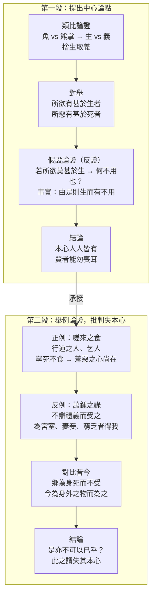

## 目錄



>[!NOTE]主旨  
>孟子從生活例子切入，以魚和熊掌比喻生和義之間的抉擇，闡明<mark>義比生命更珍貴</mark>，當二者不可兼得時，寧可<mark>捨生取義</mark>；並指出重義之心是與生俱來的，人人皆有，只是有些人受物欲誘惑而失去了這「<mark>本心</mark>」。

## 原文

孟子曰：「魚，我所欲也，熊掌，亦我所欲也；二者不可得兼，舍魚而取熊掌者也。生亦我所欲也，義亦我所欲也；二者不可得兼，舍生而取義者也。
>孟子說：「魚是我想要的，熊掌也是我想要的；如果這兩樣東西不能同時得到，我就會捨棄魚而選擇熊掌。生命也是我想要的，道義也是我想要的；如果這兩者不能同時兼得，我就會犧牲生命而選擇道義。

生亦我所欲，所欲有甚於生者，故不為苟得也；死亦我所惡，所惡有甚於死者，故患有所不辟也。
>生命固然是我想要的，但還有比生命更重要的東西（指道義），所以我不會苟且偷生；死亡固然是我厭惡的，但還有比死亡更令人厭惡的事情（指不義），所以有些災禍我不會躲避。

如使人之所欲莫甚於生，則凡可以得生者，何不用也？使人之所惡莫甚於死者，則凡可以辟患者，何不為也？
>假如人們所追求的沒有比生命更重要的，那麼任何可以求得生存的方法，為什麼不用呢？假如人們所厭惡的沒有比死亡更可怕的，那麼任何可以躲避災禍的手段，為什麼不去做呢？

由是則生而有不用也，由是則可以辟患而有不為也，是故所欲有甚於生者，所惡有甚於死者。
>（然而事實上）有人會因為堅持原則，寧可放棄某些求生的方法；有人會因為堅守道義，寧可不去做某些避禍的事。所以說，人心裡有比生命更嚮往的追求，也有比死亡更厭惡的事物。

非獨賢者有是心也，人皆有之，賢者能勿喪耳。」
>不僅僅是賢能的人才有這種心，而是人人都有的，只是賢能的人能夠保持住它，不讓它喪失罷了。」

一簞食，一豆羹，得之則生，弗得則死。嘑爾而與之，行道之人弗受；蹴爾而與之，乞人不屑也；
>（舉個例子）一碗飯，一碗湯，得到就能活下去，得不到就會餓死。如果用吆喝喝斥的無禮態度施捨給人，即使是路邊的饑民也不會接受；如果用腳踐踏過再給人，即使是乞丐也會不屑一顧。

萬鍾則不辯禮義而受之。萬鍾於我何加焉？為宮室之美、妻妾之奉、所識窮乏者得我與？
>然而，換作是萬鍾的優厚俸祿，有的人卻不分辨是否合乎禮義就接受了。這優厚的俸祿對我來說，究竟增添了什麼呢？難道是為了追求華美的宮殿房舍、享受妻妾的侍奉，或是為了讓我所認識的窮苦人感激我嗎？

鄉為身死而不受，今為宮室之美為之；鄉為身死而不受，今為妻妾之奉為之；鄉為身死而不受，今為所識窮乏者得我而為之，是亦不可以已乎？此之謂失其本心。」
>從前，（為了一點食物的侮辱）寧可餓死也不願接受，現在卻為了華美的宮殿房舍而接受了（不義的俸祿）；從前，寧可餓死也不願接受，現在卻為了妻妾的侍奉而接受了；從前，寧可餓死也不願接受，現在卻為了讓所認識的窮困者感戴自己而接受了。像這樣的行為，難道還不能停止嗎？這就叫做喪失了他原本固有的善心（本心）。」

## 分析

>[!TIP]原文  
>孟子曰：「魚，我所欲也，熊掌，亦我所欲也；二者不可得兼，舍魚而取熊掌者也。生亦我所欲也，義亦我所欲也；二者不可得兼，舍生而取義者也。

- 語譯：魚是我想要的，熊掌也是我想要的；如果不能同時得到，就捨棄魚而選擇熊掌。生命是我想要的，道義也是我想要的；如果不能同時兼得，就犧牲生命而選擇道義。
- 分析：
	- 以<mark>類比論證</mark>開篇：以「魚」喻「生」、以「熊掌」喻「義」，用一般人較易感知的食物取捨，類比生命與道義的抉擇。
	- 「能近取譬」，取例於生活，化抽象為具體，貼切而易明，帶出全文中心論點「捨生取義」。

---

>[!TIP]原文  
>生亦我所欲，所欲有甚於生者，故不為苟得也；死亦我所惡，所惡有甚於死者，故患有所不辟也。

- 語譯：生命固然是我想要的，但還有比生命更重要的東西，所以我不會苟且偷生；死亡固然是我厭惡的，但還有比死亡更令人厭惡的事情，所以有些災禍我不會躲避。
- 分析：
	- 正面說明人心中有所欲、所惡更甚於生死者——即「義」重於生死。
	- 以「生」與「死」、「欲」與「惡」兩兩對舉，對比鮮明，邏輯嚴密。

---

>[!TIP]原文  
>如使人之所欲莫甚於生，則凡可以得生者，何不用也？使人之所惡莫甚於死者，則凡可以辟患者，何不為也？由是則生而有不用也，由是則可以辟患而有不為也，是故所欲有甚於生者，所惡有甚於死者。

- 語譯：假如人們所追求的沒有比生命更重要的，那麼任何可以求得生存的方法，為什麼不用呢？假如人們所厭惡的沒有比死亡更可怕的，那麼任何可以躲避災禍的手段，為什麼不去做呢？然而事實上，有人會因為堅持原則，寧可放棄某些求生的方法；有人會因為堅守道義，寧可不去做某些避禍的事。所以說，人心裡有比生命更嚮往的追求，也有比死亡更厭惡的事物。
- 分析：
	- 運用<mark>假設論證（正反申論）</mark>：先假設「所欲莫甚於生」，則人必無所不用其極求生；再以現實中「由是則生而有不用」的事實反證，推出「所欲有甚於生者」的結論。
	- 兩個反問句（「何不用也」、「何不為也」）加強語氣，層層逼進，論證嚴謹有力。

---

>[!TIP]原文  
>非獨賢者有是心也，人皆有之，賢者能勿喪耳。」

- 語譯：不僅僅是賢能的人才有這種心，而是人人都有的，只是賢能的人能夠保持住它，不讓它喪失罷了。
- 分析：
	- 指出<mark>「本心」（重義之心）人人與生俱來</mark>，並非賢者獨有；賢者與眾人的分別，只在於能否堅持而不喪失。
	- 收束第一段，為下文「失其本心」的批判埋下伏筆。

---

>[!TIP]原文  
>一簞食，一豆羹，得之則生，弗得則死。嘑爾而與之，行道之人弗受；蹴爾而與之，乞人不屑也；

- 語譯：一碗飯，一碗湯，得到就能活下去，得不到就會餓死。如果用吆喝喝斥的無禮態度施捨給人，即使是路邊的饑民也不會接受；如果用腳踐踏過再給人，即使是乞丐也會不屑一顧。
- 分析：
	- 以「嗟來之食」的典故作<mark>舉例論證（正例）</mark>：連瀕死的路人、乞丐都不肯接受侮辱性的施捨，證明人皆有羞惡之心，寧死也不失尊嚴。
	- 「得之則生，弗得則死」先營造生死攸關的處境，愈顯「不受」之可貴，對比下文萬鍾之受，震撼人心。

---

>[!TIP]原文  
>萬鍾則不辯禮義而受之。萬鍾於我何加焉？為宮室之美、妻妾之奉、所識窮乏者得我與？

- 語譯：然而，換作是萬鍾的優厚俸祿，有的人卻不分辨是否合乎禮義就接受了。這優厚的俸祿對我來說，究竟增添了什麼呢？難道是為了追求華美的宮殿房舍、享受妻妾的侍奉，或是為了讓我所認識的窮苦人感激我嗎？
- 分析：
	- 以不辨禮義而受萬鍾的官僚作<mark>反面例子</mark>，與「不食嗟來之食」的飢者形成強烈對比，凸顯其連乞丐也不如。
	- 「萬鍾於我何加焉」以<mark>反問</mark>戳破受祿的虛妄；再以「為宮室之美、妻妾之奉、所識窮乏者得我與」的<mark>設問</mark>，列舉世俗誘惑：物質享受、妻妾侍奉、人際虛榮，層層揭示見利忘義的根源。

---

>[!TIP]原文  
>鄉為身死而不受，今為宮室之美為之；鄉為身死而不受，今為妻妾之奉為之；鄉為身死而不受，今為所識窮乏者得我而為之，是亦不可以已乎？此之謂失其本心。」

- 語譯：從前，寧可餓死也不願接受，現在卻為了華美的宮殿房舍而接受了；從前，寧可餓死也不願接受，現在卻為了妻妾的侍奉而接受了；從前，寧可餓死也不願接受，現在卻為了讓所認識的窮困者感戴自己而接受了。像這樣的行為，難道還不能停止嗎？這就叫做喪失了他原本固有的善心。
- 分析：
	- 以「鄉」與「今」作<mark>時間對比</mark>：昔者寧死不食不義之食，今者為身外之物而失節，突顯人物墮落之深。
	- 三句排比句式整齊，一氣呵成，如連珠炮發，咄咄逼人，氣勢磅礴。
	- 「是亦不可以已乎」以反問作最後詰問；「此之謂失其本心」點題作結，筆力千鈞，指出見利忘義正是喪失與生俱來的本心。

---

## 課文結構圖

## 寫作手法表

### 1. 類比論證（能近取譬）

- 內容：以「魚」與「熊掌」的取捨，類比「生」與「義」的抉擇。
- 分析：取例於日常生活，以具體事物說明抽象道理，貼切而具說服力；由淺入深，推論嚴謹。

### 2. 舉例論證

- 內容：舉「不食嗟來之食」的路人、乞丐為正例；舉「不辯禮義而受萬鍾」的官僚為反例。
- 分析：一正一反，例證典型鮮明，證明人皆有羞惡之心，也揭示有人因誘惑而喪失本心。

### 3. 假設論證（正反申論）

- 內容：「如使人之所欲莫甚於生，則凡可以得生者，何不用也？……由是則生而有不用也。」
- 分析：先假設反面情況推論其結果，再以事實反駁，從正反兩面申論，證明「所欲有甚於生者」。

### 4. 對比論證

- 內容：飢者「不食嗟來之食」與官僚「不辯禮義而受萬鍾」對比；「鄉為身死而不受」與「今為……為之」對比。
- 分析：以對比突出君子與小人的分野，褒貶分明，是非立判，加強批判的力度。

### 5. 文氣磅礴

- 內容：全文一氣呵成，多用反問、設問、排比，句子奇偶相生、長短互見。
- 分析：體現孟子「善養浩然之氣」的文章風格，氣盛言宜，說理具有不容置辯的氣勢。

## 篇章手法表

### 1. 比喻

- 內容：魚、熊掌。
- 分析：以魚喻生命，以熊掌喻道義，藉食物取捨說明抽象的人生抉擇。

### 2. 對比

- 內容：行道之人、乞人不受嗟來之食 vs 官員不辨禮義而受萬鍾；鄉為身死而不受 vs 今為宮室之美、妻妾之奉、所識窮乏者得我而為之。
- 分析：以正反人物、今昔行為對比，突出捨生取義之可貴與見利忘義之可恥。

### 3. 排比

- 內容：鄉為身死而不受，今為宮室之美為之；鄉為身死而不受，今為妻妾之奉為之；鄉為身死而不受，今為所識窮乏者得我而為之。
- 分析：三句結構相同，層層推進，增強語勢，突顯今昔行為的強烈反差。

### 4. 反問

- 內容：則凡可以得生者，何不用也？／萬鍾於我何加焉？／是亦不可以已乎？
- 分析：以疑問形式表達肯定意思，語氣強烈，加強說服力和批判力。

### 5. 設問

- 內容：為宮室之美、妻妾之奉、所識窮乏者得我與？
- 分析：自問自答（答案在於列舉的種種誘惑），引起讀者思考，揭露受萬鍾者的真實動機。

## 文言知識

- 通假字：
	- 「舍魚而取熊掌」：舍，通「捨」，放棄。
	- 「故患有所不辟也」：辟，通「避」。
	- 「弗得則死」：弗，通「不」。
	- 「嘑爾而與之」：嘑，同「呼」，大聲呼叱。
	- 「萬鍾則不辯禮義而受之」：辯，通「辨」，分辨。
	- 「所識窮乏者得我與」：得，通「德」，感激；與，通「歟」，句末疑問詞。
	- 「鄉為身死而不受」：鄉，通「向」，過往。

## 可混搭出題的篇章

### 捨生取義／生死抉擇

- **本文：** 生與義不可得兼，捨生而取義；所欲有甚於生者。
- **相關篇章：** 《論仁、論孝、論君子》：「志士仁人，無求生以害仁，有殺身以成仁」——同樣以道義凌駕於生命之上，可互相比較兩者對「義」、「仁」的闡發。

### 義利之辨

- **本文：** 萬鍾則不辯禮義而受之，為宮室之美、妻妾之奉、所識窮乏者得我而失其本心。
- **相關篇章：** 《論仁、論孝、論君子》：「富與貴，是人之所欲也；不以其道得之，不處也」——儒家對富貴利祿一貫主張「取之有道」。

### 人性論

- **本文：** 非獨賢者有是心也，人皆有之，賢者能勿喪耳——孟子主張性善，本心人人固有。
- **相關篇章：** 《勸學》：「君子生非異也，善假於物也」——荀子主張性惡，強調後天學習改造本性；兩者對「人如何向善」的取徑不同，可作比較。

### 尊嚴／不食嗟來之食

- **本文：** 行道之人、乞人不屑於嗟來之食。
- **相關篇章：** 可聯繫現實生活討論「廉者不受嗟來之食」的精神，或與《廉頗藺相如列傳》中藺相如寧以死維護趙國尊嚴的行徑對讀。
