## 偽代碼及流程圖

### 1. 開始／結束算法

**偽代碼：**  
不適用

**流程圖：**


---

### 2. 處理／賦值

**偽代碼：**

- A ← 21
- B ← A
- B ← B + 1

**流程圖：**

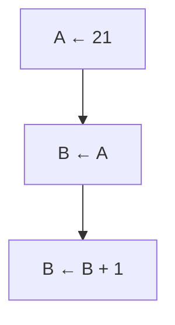

---

### 3. 輸入／輸出

**偽代碼：**  
輸入 A, B

**流程圖：**

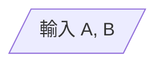

---

### 4. 決策

**偽代碼：**  
如果 A = B 則  
...  
否則  
...

**流程圖：**

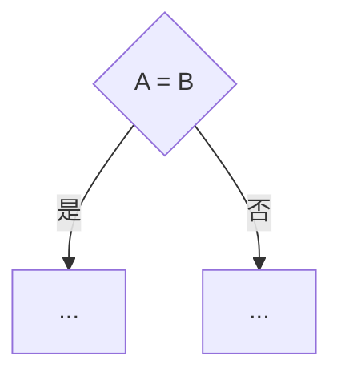

---

### 5. 模組

**偽代碼：**  
調用 ProcedureABC

**流程圖：**

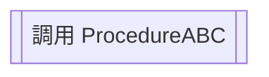

## 基本控制結構

在電腦算法中有三類基本的**控制結構 (control structure)**，當中包括**序列 (sequence)**、**選擇 (selection)** 及**迭代 (iteration)**。

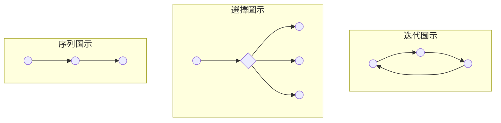

---

### A. 序列 (Sequence)

序列控制結構讓程式根據編寫次序來順序執行語句。例如 BMI 計算器算法就是使用了序列控制結構。

#### 序列結構通用流程圖

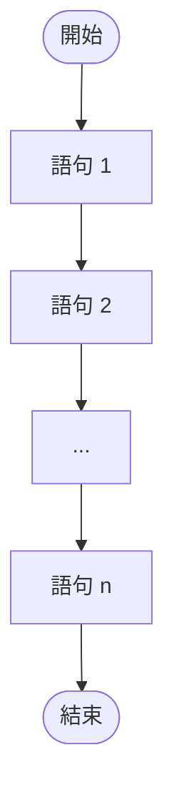

---

### 對分選擇 (Binary Selection)

對分選擇利用布爾算式作為**判斷條件 (condition)**，其邏輯結果將決定程式應執行哪些語句。

#### 1. 「如果...則」 (if...then) 條件語句

當條件的判斷結果為「真」，即條件成立，「則」部分便會執行；相反，當條件的判斷結果為「假」，即條件不成立，「則」部分便會被忽略，此條件語句結束。

**偽代碼：**

```text
如果 {條件 (布爾算式)} 則
    { 「則」部分 }
```

**通用流程圖：**

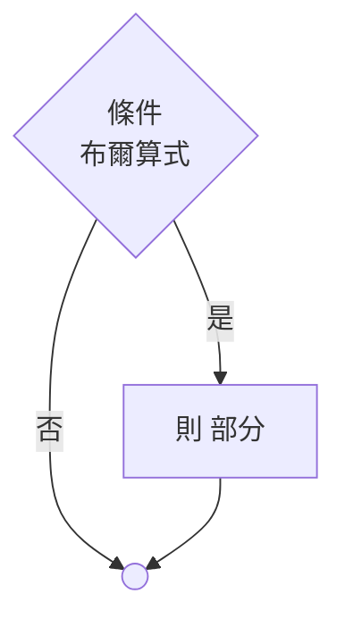

---

#### 2. 「如果...則...否則」 (if...then...else) 條件語句

同樣地，當條件的判斷結果為「真」，即條件成立，「則」部分便會執行；相反，當條件的判斷結果為「假」，「則」部分同樣會被忽略，但會執行「否則」部分，然後此條件語句結束。

**偽代碼：**

```text
如果 {條件 (布爾算式)} 則
    { 「則」部分 }
否則
    { 「否則」部分 }
```

**通用流程圖：**

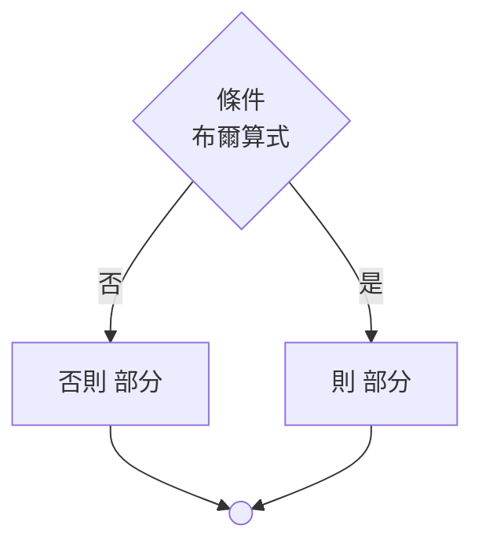

---

### 多向選擇 (Multi-way Selection)

當需要在多於兩項的選擇中做決定時，可於對分選擇內增加選擇分支，構成多向選擇控制結構。

#### 嵌套條件語句 (Nested Condition Structure)

將一個結構放入另一個結構內稱為**嵌套結構 (nested structure)**。條件語句也可以嵌套在另一個條件語句的分支中。

##### 例子 1：在「則」分支內嵌套

**流程圖 1 邏輯：**

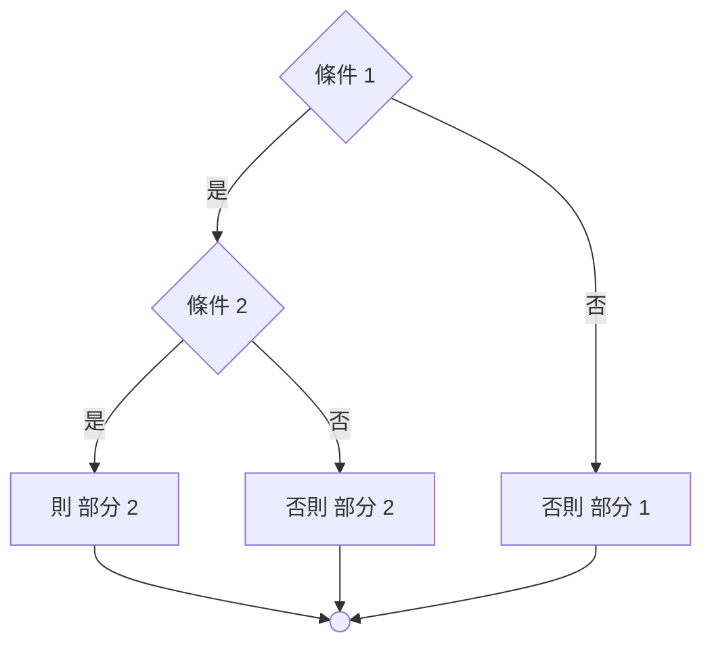

##### 例子 2：在「否則」分支內嵌套

**流程圖 2 邏輯：**

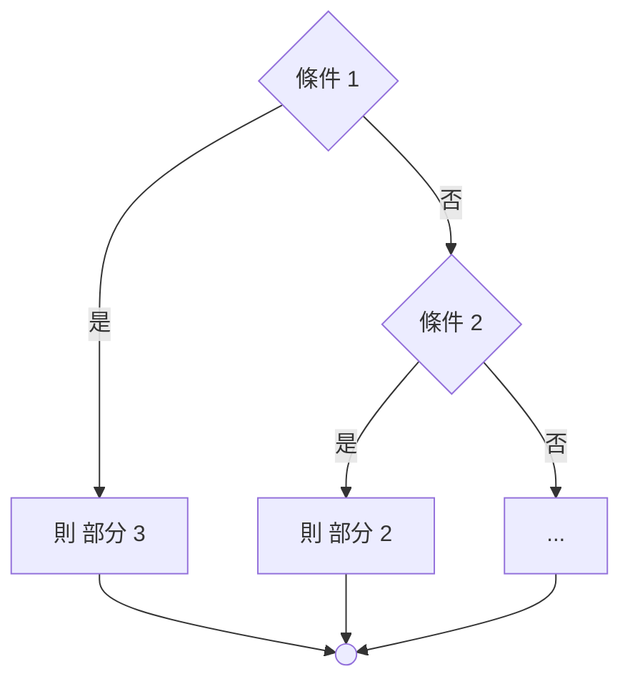

## 循環

### 1. for 循環

**偽代碼：**

```text
設 {變量} 由 {起始值} 至 {最終值}
    {循環體}
```

**流程圖：**

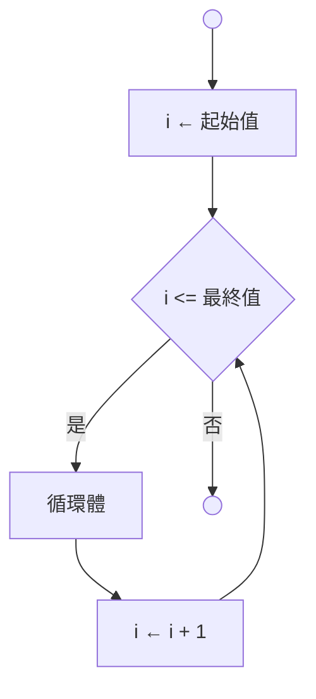

---

### 2. while 循環

**偽代碼：**

```text
當 {條件}
    {循環體}
```

**流程圖：**

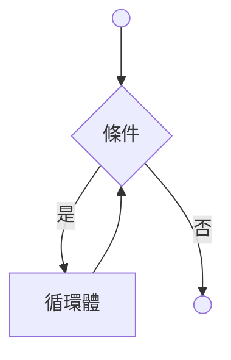

---

### 3. 「執行...當」循環 (do...while)

**偽代碼：**

```text
執行
    {循環體}
當 {條件}
```

**流程圖：**

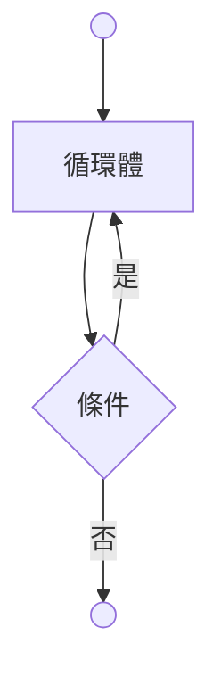

---

### 4. 「重複...直至」循環 (repeat...until)

**偽代碼：**

```text
重複
    {循環體}
直至 {條件}
```

**流程圖：**

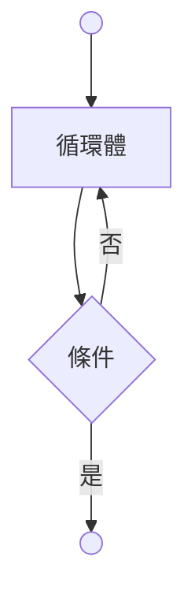
