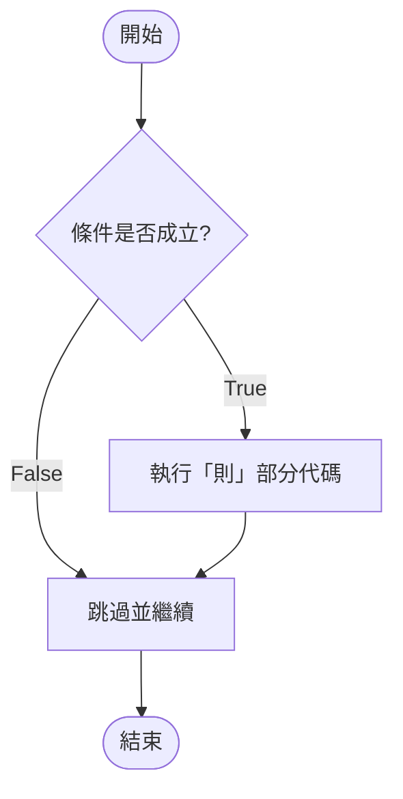
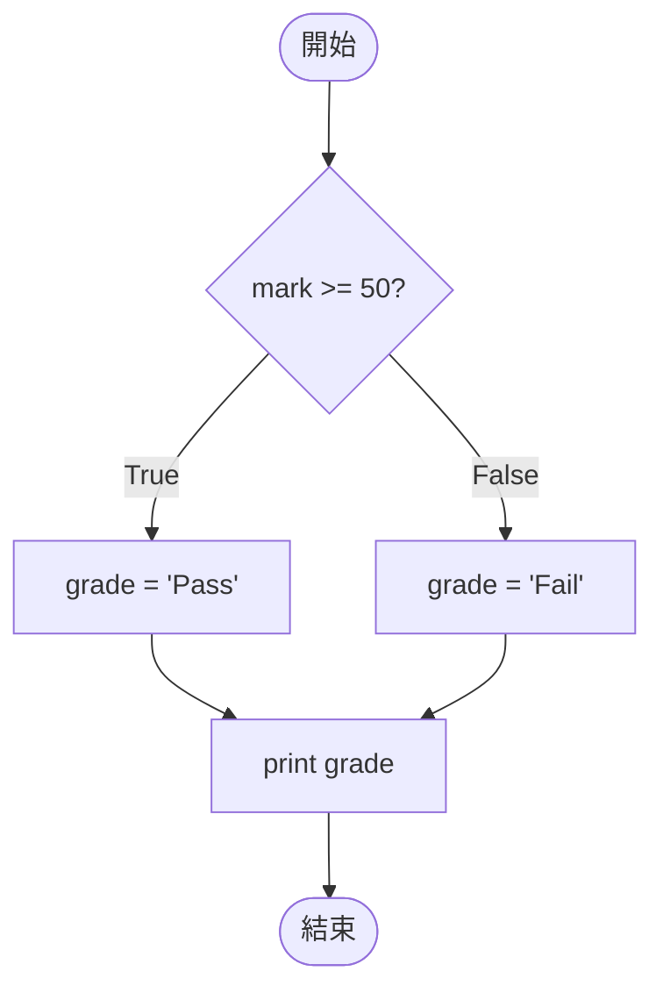
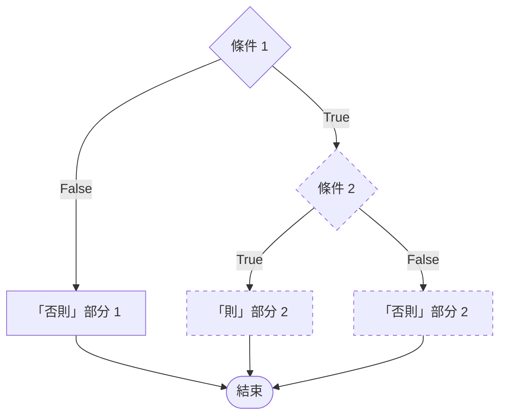
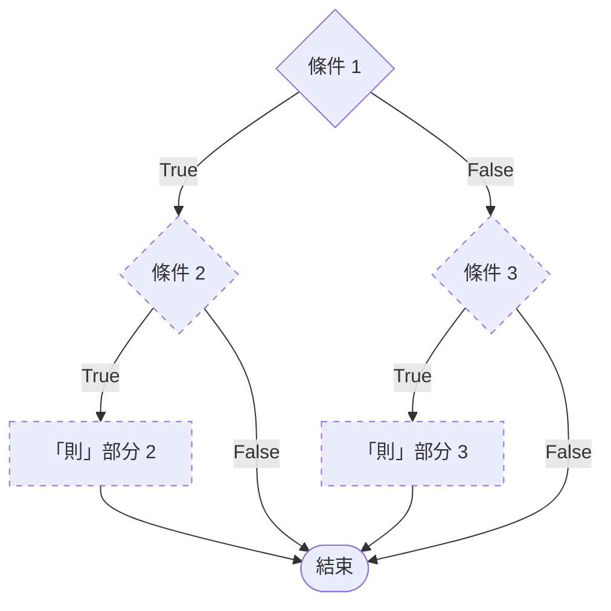
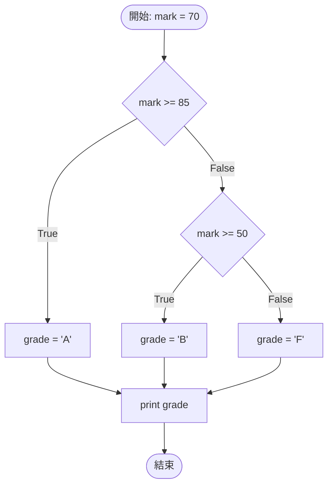
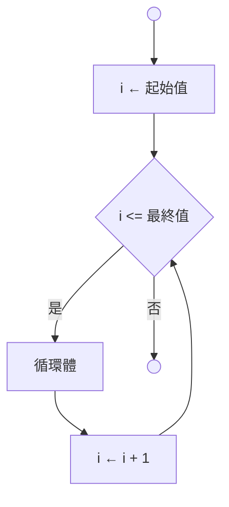
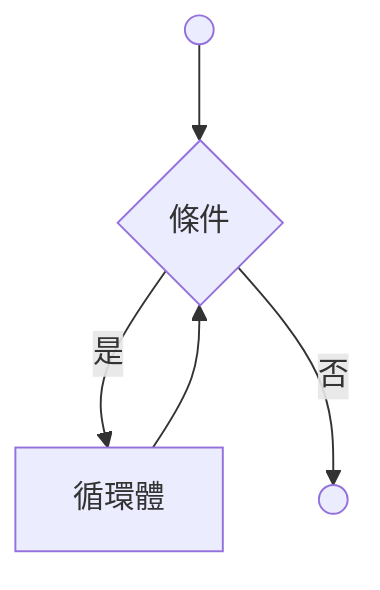

## 變量

- 整數 (int)
- 浮點數 (float)
- 布爾 (boot)
- 字串 (str)

## 內置函數 (Built-in Functions)

這些函數無需額外導入即可直接使用，是 Python 預設提供的常用功能。

| 內置函數      | 描述                             | 例句                                             | 變量 $y$ 的值       |
| ------------- | -------------------------------- | ------------------------------------------------ | ------------------- |
| `abs(x)`      | 傳回數字 $x$ 的絕對值            | `y = abs(-10)`<br><br>`y = abs(20)`              | 10<br><br>20        |
| `round(x, y)` | 將數字 $x$ 四捨五入到 $y$ 位小數 | `y = round(10/3, 2)`<br><br>`y = round(10/3, 5)` | 3.33<br><br>3.33333 |

## 數學函數庫 (math Library)

若需要額外的數學功能，必須先使用 `import math` 語句匯入函數庫。

> **提示：** 函數庫在每個程式中只需匯入一次，且須在使用相關函數前匯入。

| 數學函數  | 描述                              | 例句                                     | 變量 $y$ 的值    |
| --------- | --------------------------------- | ---------------------------------------- | ---------------- |
| `sqrt(x)` | 計算 $x$ 的平方根                 | `import math`<br><br>`y = math.sqrt(16)` | 4.0              |
| `sin(x)`  | 計算 $x$ radian 的正弦值 (sine)   | `import math`<br><br>`y = math.sin(90)`  | 0.89399666360... |
| `cos(x)`  | 計算 $x$ radian 的餘弦值 (cosine) | `import math`<br><br>`y = math.cos(90)`  | -0.4480736161... |
| `exp(x)`  | 計算自然指數函數 ($e^x$)          | `import math`<br><br>`y = math.exp(10)`  | 22026.4657948... |

## 「如果...則」（if...then）條件語句

當條件判斷為 `True`（成立）時，程式才會執行「則」部分的代碼；若為 `False`，則直接跳過。

**Python 語法結構：**

```python
if 條件:
    ## 執行內容
```

**流程示意：**



## 「如果...則...否則」（if...then...else）條件語句

這是一種二選一的邏輯。當條件為 `True` 時執行「則」部分；當條件為 `False` 時，則會執行「否則」部分。

**Python 語法結構：**

```python
if 條件:
    ## 執行「則」部分
else:
    ## 執行「否則」部分

```

**範例解析：**

```python
mark = 70
if mark >= 50:
    grade = "Pass"
else:
    grade = "Fail"
print(grade)

```

**流程示意：**



## 多向選擇

當需要在多於兩項的選擇中做決定時，可於對分選擇內增加選擇分支，構成多向選擇控制結構。

### 嵌套條件語句

將一個結構放進另一個結構內稱為**嵌套結構（nested structure）**。  
條件語句也可以嵌套在另一個條件語句內的分支，嵌套條件語句會根據前一個條件的判斷結果，再決定會否進入另一個條件語句。以下是嵌套條件語句結構的例子：

#### 範例 1：在 `if` 分支中嵌套

##### Python 程式碼

```python
if {條件 1}:
    ## 嵌套結構 1
    if {條件 2}:
        {「則」部分 2}
    else:
        {「否則」部分 2}
else:
    {「否則」部分 1}

```

##### 流程圖



---

#### 範例 2：在 `if` 與 `else` 分支中同時嵌套

##### Python 程式碼

```python
if {條件 1}:
    ## 嵌套結構 1
    if {條件 2}:
        {「則」部分 2}
else:
    ## 嵌套結構 2
    if {條件 3}:
        {「則」部分 3}

```

##### 流程圖



---

### 「如果...否則如果...」（if...elif...）條件語句

##### 1. 偽代碼

```text
mark ← 70
如果 mark >= 85 則
    grade ← "A"
否則如果 mark >= 50 則
    grade ← "B"
否則
    grade ← "F"
輸出 grade

```

##### 2. Python 程式碼

```python
mark = 70
if mark >= 85:
    grade = "A"
elif mark >= 50:
    grade = "B"
else:
    grade = "F"
print(grade)

```

##### 3. 流程圖



## 循環

### 1. for 循環

**偽代碼：**

```python
for {變量} in range({起始值}, {最終值}):
    {循環體}
```

**流程圖：**



---

### 2. while 循環

**偽代碼：**

```python
while {條件}:
    {循環體}
```

**流程圖：**


